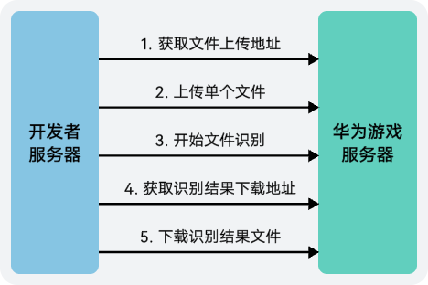

除自动送检方式外，游戏多媒体服务提供了使用REST API人工送检的方式，支持手动批量上传实时信令文本消息进行内容检测。

## 前提条件

* [下载csv文档模板](/docs/dev/game-dev/games-gamemme-riskcontrol-agc-0000002304504622#ZH-CN_TOPIC_0000002348293780__zh-cn_topic_0000001625726597_li393713505914)，并按照模板填写相关内容后保存。
* 当前仅支持API客户端方式访问，在访问前需获取服务端授权，包括[创建API客户端](/docs/dev/game-dev/games-appendix-api-client-0000002304729552)和[获取认证Token](https://developer.huawei.com/consumer/cn/doc/games-references/gamemme-obtaintoken-restapi-0000002358963836)。

## 接入步骤

| No. | 接口 | 说明 |
| --- | --- | --- |
| 1 | [获取文件上传地址](https://developer.huawei.com/consumer/cn/doc/games-references/gamemme-obtaining-upload-address-restapi-0000002392643865) | 申请上传文件并获取待检测文件的上传地址。 |
| 2 | [上传单个文件](https://developer.huawei.com/consumer/cn/doc/games-references/gamemme-uploading-file-restapi-0000002359123732) | 上传待检测文件。 |
| 3 | [开始文件识别](https://developer.huawei.com/consumer/cn/doc/games-references/gamemme-start-identifying-restapi-0000002392723717) | 待检测文件上传成功后，开始进行广告识别。 |
| 4 | [获取识别结果下载地址](https://developer.huawei.com/consumer/cn/doc/games-references/gamemme-obtaining-download-address-restapi-0000002358963840) | 识别成功后，需获取识别结果文件的下载地址。  说明：  根据上传的待检测文件大小，文件广告识别任务完成时间会有所不同。如识别内容较多，建议您每半小时调用该接口查询一次任务是否完成。 |
| 5 | [下载识别结果文件](https://developer.huawei.com/consumer/cn/doc/games-references/gamemme-download-result-restapi-0000002392643869) | 获取识别结果下载地址后，可下载查看识别结果文件。 |
