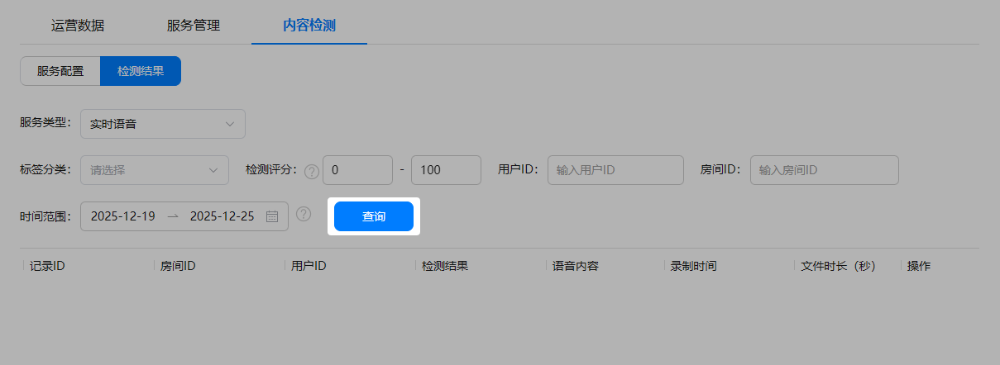
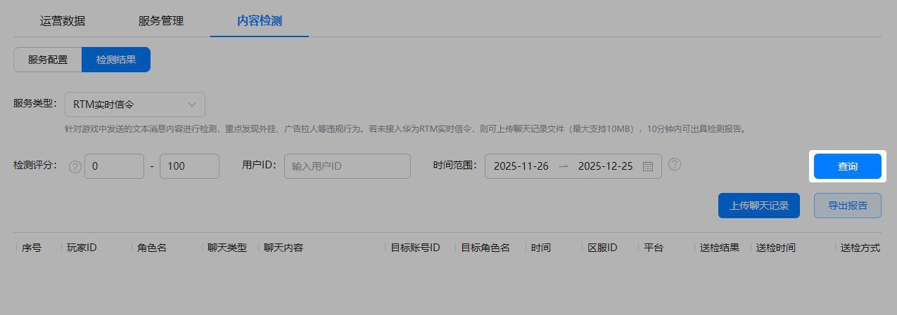
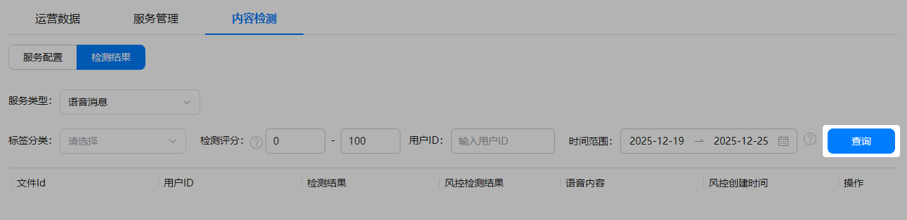
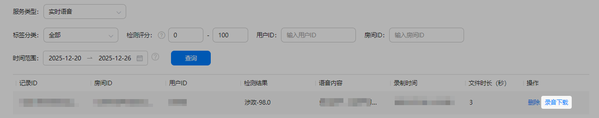
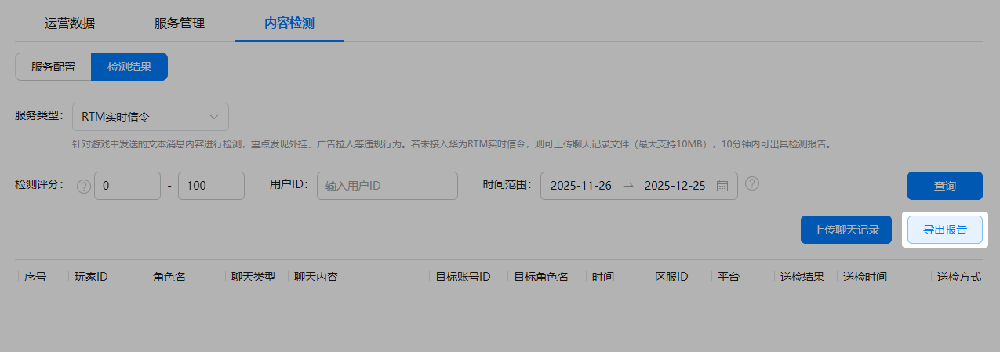
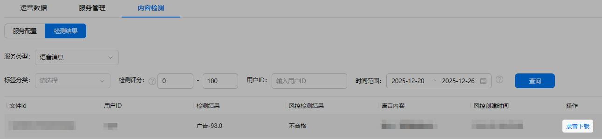

实时语音、实时信令文本消息和语音消息内容送检后，您可在AGC控制台查看到疑似违规的检测结果，并可根据使用需要下载录音或导出文本消息内容进行人工复审，以确保风控的审核准确率。

## 前提条件

* 您已[开启内容检测](https://developer.huawei.com/consumer/cn/doc/games-guides/games-gamemme-console-servicemanagement-0000002338391901#section17288256144510)功能。
* 您已通过自动送检或人工送检方式进行内容送检。

## 操作步骤

1. 点击“内容检测 &gt; 检测结果”，并选择“服务类型”，设置筛选条件（如标签分类、检测评分、用户ID、房间ID等），点击“查询”可查看30天（最长存储时长）内的检测结果详情。

   

   “检测评分”是置信度的概念，得分越高表示检测结果的置信度越高。

   * 服务类型一：实时语音

     
   * 服务类型二：RTM实时信令

     

     “RTM实时信令”服务类型的内容检测，可针对游戏中的文本消息内容进行检测，帮助您重点发现外挂、广告拉人等违规行为。

     
   * 服务类型三：语音消息

     
2. 如对检测结果存疑或需要人工复审，您还可以进行下载录音或导出检测报告等操作。
   * 实时语音：点击语音流切片检测结果列表对应“操作”列的“录音下载”，可将指定语音流切片下载到本地进行二次审核。

     
   * RTM实时信令：点击“导出报告”，可将文本消息内容的检测结果下载到本地进行查看。

     
   * 语音消息：点击语音消息检测结果列表对应“操作”列的“录音下载”，可将指定语音消息文件下载到本地进行二次审核。

     
