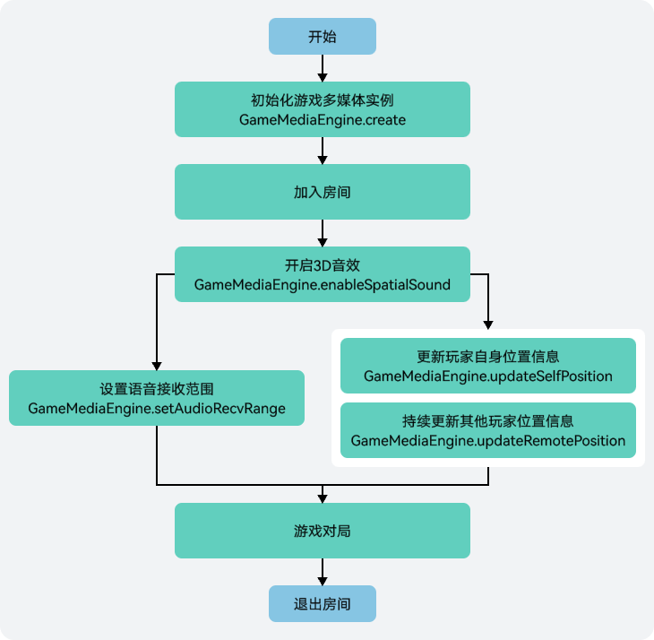

3D音效可将一定空间范围内无方位感的声音进行方位和距离衰减的效果渲染，使之听起来更有沉浸感。同时您还需要了解的是，3D音效属于端侧的音频渲染能力，开启后会增加额外的功耗。

## 接口调用流程



## 前提条件

* 您已[集成游戏多媒体基础SDK、实时语音和3D音效模块](https://developer.huawei.com/consumer/cn/doc/games-guides/games-gamemme-integratingsdk-harmonyos-0000002304632332#ZH-CN_TOPIC_0000002382173737__zh-cn_topic_0000001717945166_li16904125719267)。
* 您已[创建游戏多媒体实例](https://developer.huawei.com/consumer/cn/doc/games-guides/games-gamemme-engine-harmonyos-0000002304472616#section1093713161034)。
* 您已[加入房间](https://developer.huawei.com/consumer/cn/doc/games-guides/games-gamemme-voice-joinroom-roomid-harmonyos-0000002393661673)。

## 开启/关闭3D音效

调用[GameMediaEngine.enableSpatialSound](https://developer.huawei.com/consumer/cn/doc/games-references/gamemme-gamemediaengine-harmonyos-0000002392643485#section155573113218)方法开启/关闭3D音效。

```
gameMediaEngine.enableSpatialSound(roomId, true); // roomId：自定义的房间ID
```

## 设置语音接收范围

语音接收范围主要用于限制房间内收听者对音频的最大接收距离（空间距离），根据收听者与发声者的位置信息，收听者可收听到一定范围内的声音。

调用[GameMediaEngine.setAudioRecvRange](https://developer.huawei.com/consumer/cn/doc/games-references/gamemme-gamemediaengine-harmonyos-0000002392643485#section35878131182)方法设置语音接收范围。

```
gameMediaEngine.setAudioRecvRange(range); // range为语音接收范围, 大于等于0
```

## 更新/清理位置

进入房间后，在3D音效场景下，玩家通常需要先更新一下自身在世界坐标系中的坐标和朝向信息。当自身或其他玩家位置等信息不断发生变化时，可通过接口持续上报变更。同时，还可以根据场景变化，清理指定或全部玩家的位置缓存信息。

### 更新自身位置

1. 构建自身位置信息。

   ```
   let forward: number = 11.0;
   let right: number = 12.0;
   let up: number = 13.0;
   let playerPosition: PlayerPosition = {
     forward: forward,
     right: right,
     up: up
   };
   let axisForward: number[] = [0, 1.0, 0];
   let axisRight: number[] = [1.0, 0, 0];
   let axisUp: number[] = [0, 0, 1.0];
   let playerAxis: PlayerAxis = {
     forward: axisForward,
     right: axisRight,
     up: axisUp
   }

   let selfPosition: SelfPosition = {
     position: playerPosition,
     axis: playerAxis
   }
   ```
2. 调用[GameMediaEngine.updateSelfPosition](https://developer.huawei.com/consumer/cn/doc/games-references/gamemme-gamemediaengine-harmonyos-0000002392643485#section11572124810519)方法设置自身的位置（即坐标和方向）信息。

   ```
   gameMediaEngine.updateSelfPosition(selfPosition);
   ```

### 更新其他玩家位置

1. 构建其他玩家位置信息。

   ```
   let positions: RemotePlayerPosition[] = [];
   let remotePlayer1Position: PlayerPosition = {
     forward: 10.0,
     right: 11.1,
     up: 12.2
   };
   let remotePlayer1: RemotePlayerPosition = {
     openId: 'user1',
     position: remotePlayer1Position
   }
   positions.push(remotePlayer1);

   let remotePlayer2Position: PlayerPosition = {
     forward: 15.0,
     right: 16.1,
     up: 18.2
   };
   let remotePlayer2: RemotePlayerPosition = {
     openId: 'user2',
     position: remotePlayer2Position
   }
   positions.push(remotePlayer2);
   ```
2. 调用[GameMediaEngine.updateRemotePosition](https://developer.huawei.com/consumer/cn/doc/games-references/gamemme-gamemediaengine-harmonyos-0000002392643485#section3976836369)方法更新其他玩家的位置信息。

   ```
   gameMediaEngine.updateRemotePosition(positions);
   ```

### 清理其他玩家位置

* 调用[GameMediaEngine.clearRemotePlayerPosition](https://developer.huawei.com/consumer/cn/doc/games-references/gamemme-gamemediaengine-harmonyos-0000002392643485#section185619282094)方法可清理指定玩家的位置信息。例如，清理已离开房间的其他玩家位置缓存信息。

  ```
  gameMediaEngine.clearRemotePlayerPosition(openId);
  ```
* 调用[GameMediaEngine.clearAllRemotePositions](https://developer.huawei.com/consumer/cn/doc/games-references/gamemme-gamemediaengine-harmonyos-0000002392643485#section859216551087)方法可清理其他所有玩家的位置信息。例如，当重新开始一局游戏时，清理其他所有人的位置缓存信息。

  ```
  gameMediaEngine.clearAllRemotePositions();
  ```

## 查询3D音效开启状态

如需查询3D音效是否已开启，可通过调用[GameMediaEngine.isEnableSpatialSound](https://developer.huawei.com/consumer/cn/doc/games-references/gamemme-gamemediaengine-harmonyos-0000002392643485#section7584611355)方法获取3D音效的状态。

```
const status: boolean = gameMediaEngine.isEnableSpatialSound(roomId); // roomId：自定义的房间ID
```
