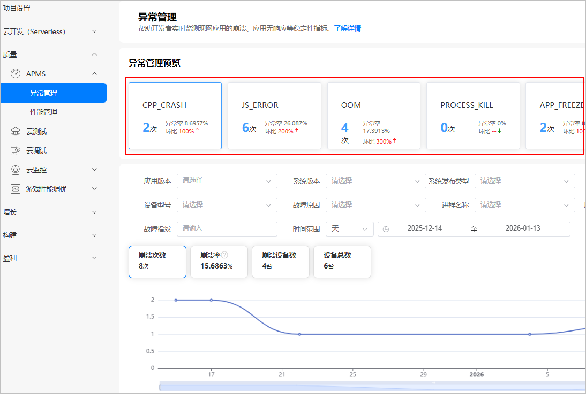
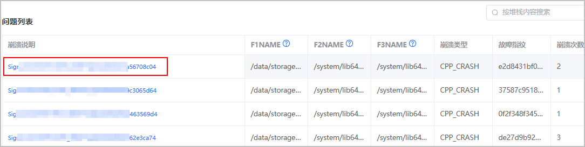
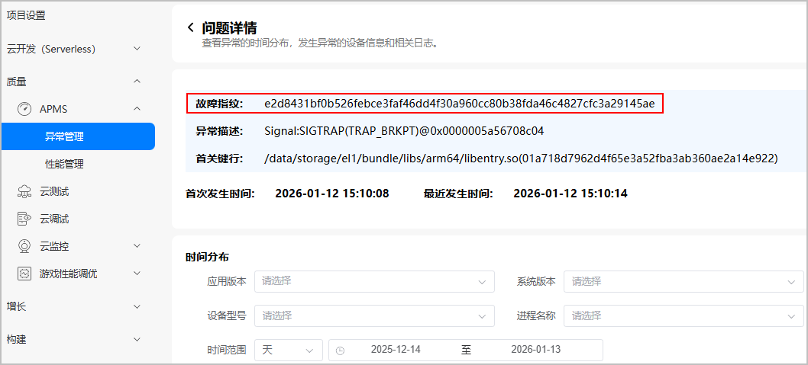
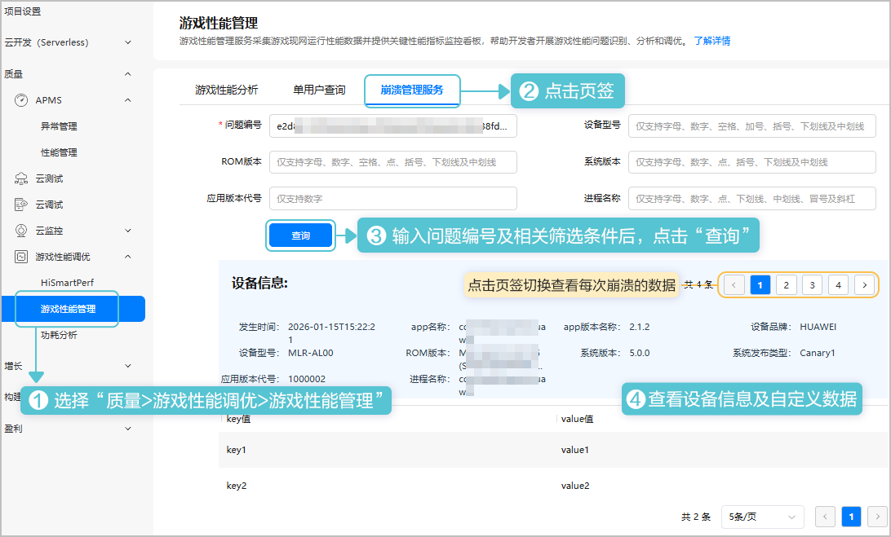

自定义数据上报是崩溃监控重要的数据来源，您可在此处查看您上报的游戏自定义崩溃数据，并对其进行分析。

该功能仅HarmonyOS 5.0及以上平台支持。

## 前提条件

您已[上报游戏自定义崩溃数据](/docs/dev/game-dev/games-gpm-development-guide-0000002332905597#ZH-CN_TOPIC_0000002348293680__zh-cn_topic_0000001805743909_li1588819439233)。

## 获取问题编号

1. 登录[AppGallery Connect](https://developer.huawei.com/consumer/cn/service/josp/agc/index.html)， 点击“开发与服务”，在项目卡片列表选择项目及项目下的游戏。
2. 点击“质量 &gt; APMS &gt; 异常管理”，进入异常管理页面。
3. 根据崩溃事件类型点击对应卡片，页面展示该类型崩溃问题统计数据。

   
4. 在“问题列表”区域点击“崩溃说明”列的异常描述，进入崩溃问题详情页面。

   
5. 在问题详情页面记录下故障指纹供后续使用。

   

## 查询崩溃数据

1. 登录[AppGallery Connect](https://developer.huawei.com/consumer/cn/service/josp/agc/index.html)， 点击“开发与服务”，在项目卡片列表选择项目及项目下的游戏。
2. 通过问题编号（即前面步骤获取的“故障指纹”）和其它筛选条件查询崩溃数据。

   
