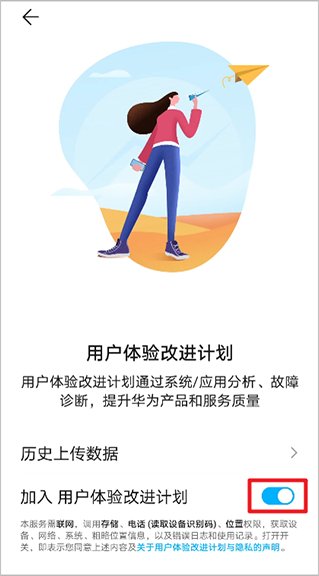

HarmonyOS 5.0及以上系统游戏无需集成SDK，用户**必须**在启动游戏前打开“手机设置 &gt; 系统和更新 &gt; 用户体验改进计划”开关，即可自动采集现网游戏数据并上报至AGC控制台。


请勿在游戏过程中关闭“用户体验改进计划”开关，否则将不采集游戏性能数据。



若想采集大厅、团战等不同游戏场景下的性能数据，需要集成游戏场景感知功能。场景感知功能通过接口调用的方式快速获取游戏的场景信息，并将信息整合上报至AGC控制台。游戏场景感知的详细介绍请参考[游戏场景感知](/docs/dev/app-dev/application-services/game-service-kit-guide/gameservice-gameperformance-dev)。集成游戏场景感知的开发步骤如下。

1. 在游戏中导入Game Service Kit模块。

   ```
   import { gamePerformance } from '@kit.GameServiceKit';
   ```
2. 调用[gamePerformance.init](https://developer.huawei.com/consumer/cn/doc/harmonyos-references/gameservice-gameperformance#gameperformanceinit)接口初始化游戏场景感知功能。

   ```
   let gamePackageInfo: gamePerformance.GamePackageInfo = {
       messageType: 0,
       bundleName: 'hz.pgs.gameTurbo.demo', // 替换为实际包名
       appVersion: '1.0',
   };
   try {
     gamePerformance.init(gamePackageInfo).then(() => {
       // 初始化成功
     });
   } catch (err) {
     // 初始化失败
   }
   ```
3. 调用[gamePerformance.updateGameInfo](https://developer.huawei.com/consumer/cn/doc/harmonyos-references/gameservice-gameperformance#gameperformanceupdategameinfo)接口上报游戏场景信息[GameSceneInfo](https://developer.huawei.com/consumer/cn/doc/harmonyos-references/gameservice-gameperformance#gamesceneinfo)。

   ```
   // 上报游戏场景信息
   let gameSceneInfo: gamePerformance.GameSceneInfo = {
       messageType: 2,
       sceneID: 7,
       importanceLevel: 4
   };
   try {
       gamePerformance.updateGameInfo(gameSceneInfo).then(() => {
           // 上报游戏场景信息成功
       });
   } catch (err) {
       // 上报游戏场景信息失败
   }
   ```

   

   游戏场景信息[GameSceneInfo](https://developer.huawei.com/consumer/cn/doc/harmonyos-references/gameservice-gameperformance#gamesceneinfo)中的**subDescription**参数值建议唯一，否则可能影响业务呈现。
4. （可选）如在游戏场景中匹配玩家ID信息，建议调用[gamePerformance.updateGameInfo](https://developer.huawei.com/consumer/cn/doc/harmonyos-references/gameservice-gameperformance#gameperformanceupdategameinfo)接口额外上报游戏玩家信息[GamePlayerInfo](https://developer.huawei.com/consumer/cn/doc/harmonyos-references/gameservice-gameperformance#gameplayerinfo)。

   ```
   // 上报游戏玩家信息
   let gamePlayerInfo: gamePerformance.GamePlayerInfo = {
     messageType: 4,
     gamePlayerId: '43JIOdok743***980sd9453',
     teamPlayerId: 's2546dgs3***9374dgwa5g3'
   };
   try {
       gamePerformance.updateGameInfo(gamePlayerInfo).then(() => {
           // 上报游戏玩家信息成功
       });
   } catch (err) {
       // 上报游戏玩家信息失败
   }
   ```
5. （可选）如需收集不同场景下的游戏配置信息，调用[gamePerformance.updateGameInfo](https://developer.huawei.com/consumer/cn/doc/harmonyos-references/gameservice-gameperformance#gameperformanceupdategameinfo)接口上报游戏配置信息[GameConfigInfo](https://developer.huawei.com/consumer/cn/doc/harmonyos-references/gameservice-gameperformance#gameconfiginfo)。

   ```
   // 上报游戏设置信息
   let gameConfigInfo: gamePerformance.GameConfigInfo = {
     messageType: 1,
     maxPictureQualityLevel: 1,
     currentPictureQualityLevel: 1,
     maxFrameRate: 1,
     currentFrameRate: 1,
     maxResolution: '1920',
     currentResolution: '720',
     antiAliasing: false,
     shadow: false,
     multithreading: false,
     particle: false,
     hdMode: false
   };
   try {
       gamePerformance.updateGameInfo(gameConfigInfo).then(() => {
           // 上报游戏设置信息成功
       });
   } catch (err) {
       // 上报游戏设置信息失败
   }
   ```
6. （可选）如需上报游戏自定义崩溃数据，调用[addGameCustomData](https://developer.huawei.com/consumer/cn/doc/harmonyos-references/gameservice-gameperformance#gameperformanceaddgamecustomdata)接口。

   ```
   // 上报带崩溃标签的游戏自定义数据
   try {
     let data:Record<string, string> = {'custom':'gaming'};
     gamePerformance.addGameCustomData(data, gamePerformance.GameCustomTag.CRASH);
   } catch (error) {
     // 上报自定义数据失败
     let err = error as BusinessError;
     hilog.error(0x0001, 'demo', `Failed to add custom data. Code: ${err.code}, message: ${err.message}`);
   }
   ```
