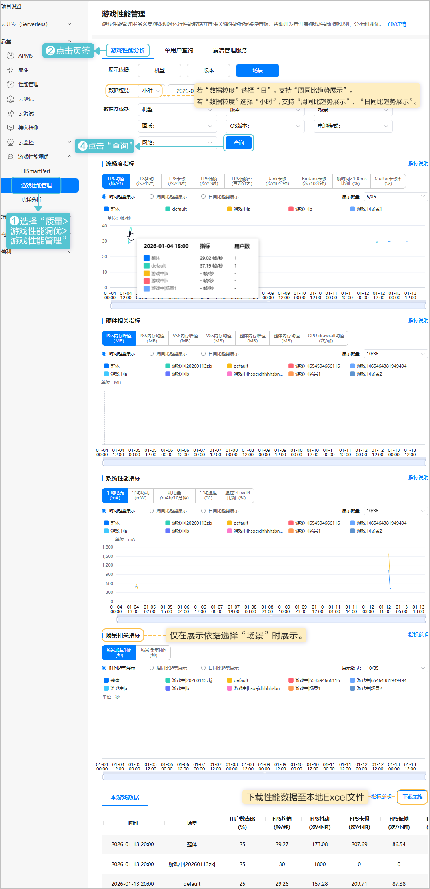

您可切换机型、版本、场景为展示依据，查看各性能指标的统计图表。通过配置具体数据粒度，可查看各指标时间趋势、周同比趋势及日同比趋势折线图，同时支持按机型、版本等条件筛选过滤数据。

1. 登录[AppGallery Connect](https://developer.huawei.com/consumer/cn/service/josp/agc/index.html)， 点击“开发与服务”，在项目卡片列表选择项目及项目下的游戏。
2. 按条件筛选查看性能数据图表，页面展示及指标说明如下。

HarmonyOS 5.0及以上平台若想查看大厅、团战等不同游戏场景下的性能数据，需要提前集成[游戏场景感知功能](https://developer.huawei.com/consumer/cn/doc/AppGallery-connect-Guides/gpm-gameperformance-0000001805743909#ZH-CN_TOPIC_0000001805743909__li1820790174814)。

| 分类 | 数据项 | 说明 |
| --- | --- | --- |
| - | 用户数占比（%） | 用户数为全部游玩用户数通过均匀采样后数据，非实际游玩用户数。   * 展示依据选择“机型”：同一用户可能存在多个机型，故筛选后的各机型用户数占比之和可能大于整体的用户数占比。 * 展示依据选择“版本”：同一用户在不同时间段内可能玩过多个版本，故筛选后的各版本用户数占比之和可能大于整体的用户数占比。 * 展示依据选择“场景”：同一用户在不同时间段内可能游玩多个场景，故筛选后的各场景用户数占比之和可能大于整体的用户数占比。 |
| 流畅度指标 | FPS均值（帧/秒） | 总帧数除以总时间（秒）。每秒帧数FPS（frame per second）= 1000ms/帧生成时间（毫秒）。 |
| FPS抖动（次/小时） | 抖动次数总计×3600/总时间（秒）。默认当相邻两点的FPS差值大于等于8，记为一次抖动。 |
| FPS卡顿（次/小时） | 卡顿次数总计×3600/总时间（秒）。默认当相邻两帧之间的帧时间差大于100毫秒，记为一次卡顿。 |
| FPS低帧（次/小时） | 低帧数总计×3600/总时间（秒）。默认当FPS低于18帧时，判定为低帧。 |
| FPS低帧率（百万分之） | FPS低帧×1000000/总帧数。 |
| Jank卡顿（次/10分钟） | 平均每10分钟的Jank卡顿次数。同时满足以下两条件，则认为是一次Jank卡顿：   * 帧时间&gt;前三帧平均耗时2倍。 * 帧时间&gt;两帧电影帧耗时 (1000ms/24\*2≈83.33毫秒)。 |
| BigJank卡顿（次/10分钟） | 平均每10分钟的BigJank卡顿次数。同时满足以下两条件，则认为是一次严重卡顿BigJank：   * 帧时间 &gt;前三帧平均耗时2倍。 * 帧时间 &gt;三帧电影帧耗时(1000ms/24\*3=125毫秒)。 |
| 帧时间&gt;100ms比例（%） | 帧时间&gt;100ms帧数/总帧数×100%。 |
| Stutter卡顿率（%） | Jank卡顿时长/总时长。 |
| 硬件相关指标 | PSS内存峰值（MB） | Android/HarmonyOS PSS内存每用户峰值的平均值。 |
| PSS内存均值（MB） | Android/HarmonyOS PSS内存占用数据的平均值。 |
| VSS内存峰值（MB） | Android/HarmonyOS VSS内存每用户峰值的平均值。 |
| VSS内存均值（MB） | Android/HarmonyOS VSS内存占用数据的平均值。 |
| 整体内存峰值（MB） | 整体内存每用户占用峰值的平均值。 |
| 整体内存均值（MB） | 整体内存占用平均值。 |
| GPU drawcall均值（次/帧） | 每帧的drawcall调用次数平均值。 |
| 系统性能指标 | 平均电流（mA） | 所有电流上报点的算数平均值。 |
| 平均功耗（mW） | 所有功耗上报点的算数平均值。 |
| 耗电量（mAh/10分钟） | 每10分钟耗电量（mAh）=平均电流\*（600/3600）。 |
| 平均温度（°C） | 所有采样点温度的平均值。 |
| 温控≥Level4比例（%）  说明：  仅限HarmonyOS 5.0及以上平台采集该指标数据。 | 手机温控档位达到4档及以上的用户数/总的用户数 \*100%。 |
| 场景相关指标 | 场景加载时间（秒） | 计算单个或多个场景加载时间的平均值。 |
| 场景持续时间（秒） | 计算单个或多个场景持续时间的平均值。 |
