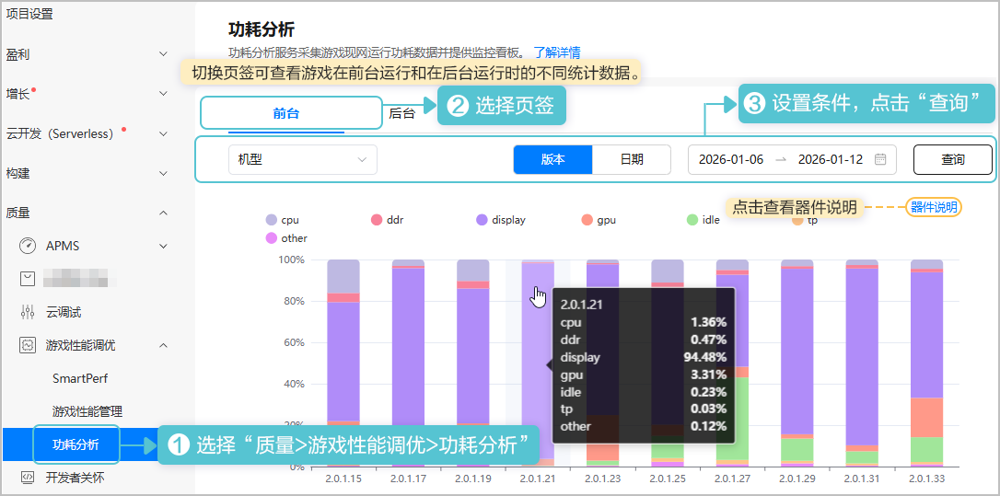

游戏性能管理服务采集游戏现网运行功耗数据，为开发者提供专业功耗分析报表，以不同维度展示各器件功耗统计图表，帮助开发者识别、分析游戏性能问题。

该功能仅HarmonyOS 5.0及以上平台支持。

1. 登录[AppGallery Connect](https://developer.huawei.com/consumer/cn/service/josp/agc/index.html)， 点击“开发与服务”，在项目卡片列表选择项目及项目下的游戏。
2. 查询功耗分析报表。

   

   支持切换游戏版本或者日期维度展示数据。

   * 按照版本维度展示时，时间控件可选近3个月内任意连续时间，页面展示所选时间范围内最新10个版本的数据。
   * 按照日期维度展示时，时间控件可选近3个月内任意最多连续15天。

   
