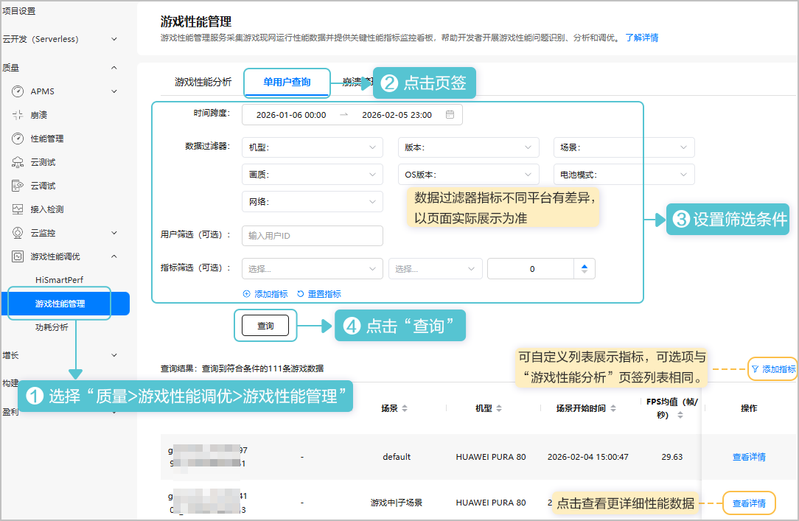
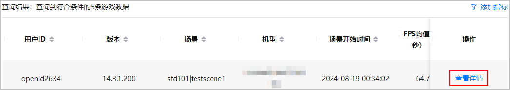
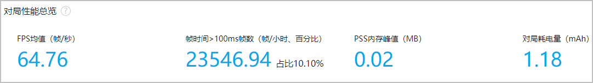
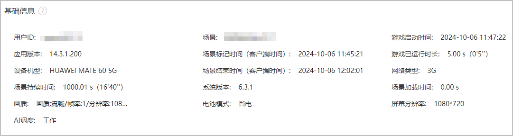
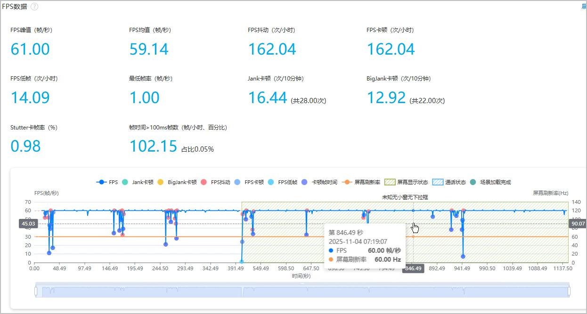
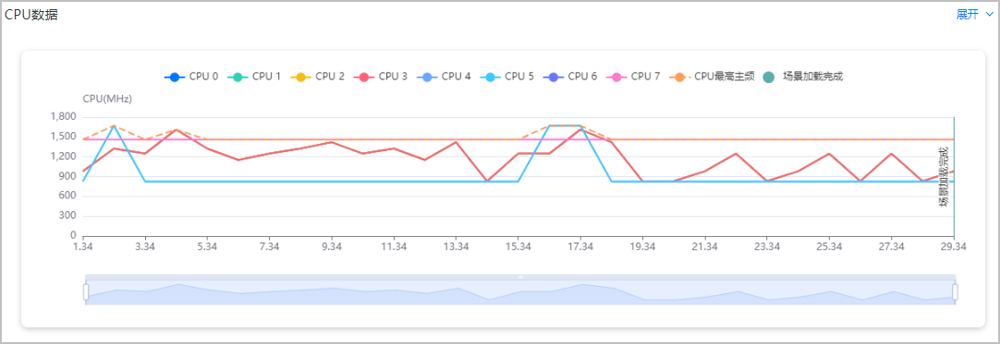
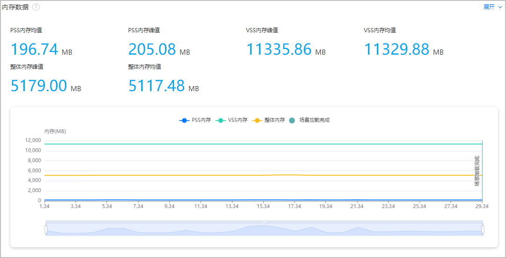
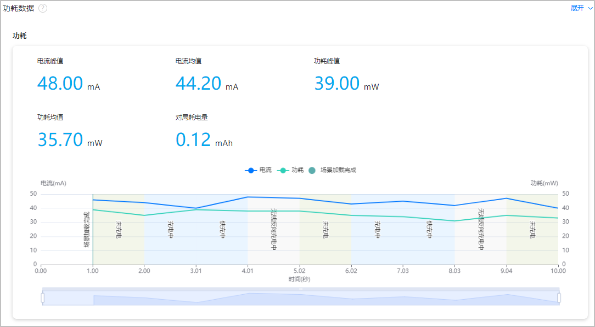
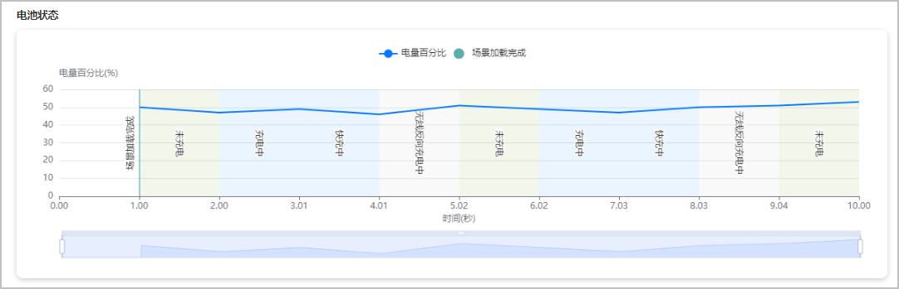
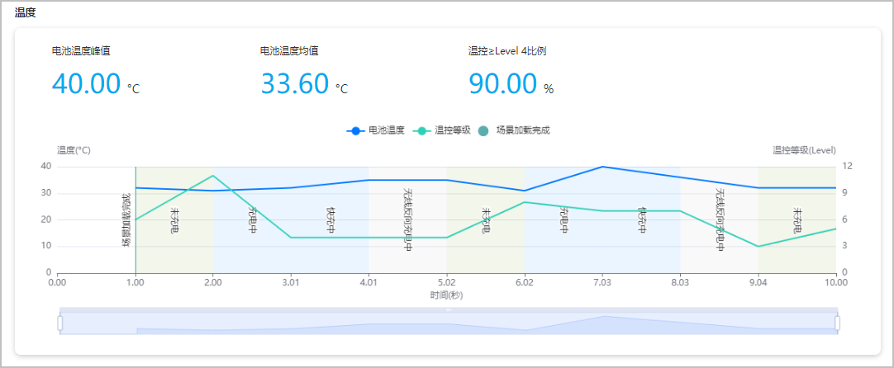

您可在此处查看用户维度的性能数据，支持设置时间跨度，具体用户ID，指标范围及机型、版本等条件筛选过滤数据。同时每条数据提供详情页展示详细性能数据。

客户端采集上报数据后3小时左右可在该页面查看性能数据。

## 查询单用户数据

1. 登录[AppGallery Connect](https://developer.huawei.com/consumer/cn/service/josp/agc/index.html)， 点击“开发与服务”，在项目卡片列表选择项目及项目下的游戏。
2. 按条件查询数据。

   

## 查看详情

在单用户查询列表点击“操作”列“查看详情”，可进入详情页查看该条记录更详细性能统计数据。

详情页包括对局性能总览，基础信息，FPS数据，CPU数据，内存数据，功耗数据六个模块。各模块页面展示及指标说明见下文。

鼠标悬停折线图上任一点，您可查看该坐标点各指标的具体数值。

### 对局性能总览

当前对局数据速览，详细数据可在下面每个模块中查看。

| 数据项 | 说明 |
| --- | --- |
| FPS均值（帧/秒） | 总帧数除以总时间（秒）。每秒帧数FPS（frame per second）= 1000ms/帧生成时间（毫秒）。 |
| 帧时间&gt;100ms帧数（帧/小时、百分比） | 帧/小时：平均每小时帧时间&gt;100ms的次数；百分比：帧时间&gt;100ms帧数/总帧数×100%。 |
| PSS内存峰值(MB) | Android/HarmonyOS PSS内存每用户峰值的平均值。 |
| 对局耗电量（mAh） | 每10分钟耗电量（mAh）=平均电流 \*（600/3600）。 |

### 基础信息

本次对局数据的基本信息。

### FPS数据

* “屏幕展示状态”为“全屏无小窗无下拉框”时不展示阴影。
* “通话状态”为“通话”时展示阴影。

| 数据项 | 说明 |
| --- | --- |
| FPS峰值（帧/秒） | 采集时间内帧数的峰值。 |
| FPS均值（帧/秒） | 总帧数除以总时间（秒）。每秒帧数FPS（frame per second）= 1000ms/帧生成时间（毫秒）。 |
| FPS抖动（次/小时） | 抖动次数总计×3600/总时间（秒）。默认当相邻两点的FPS差值大于等于8，记为一次抖动。 |
| FPS卡顿（次/小时） | 卡顿次数总计×3600/总时间（秒）。默认当相邻两帧之间的帧时间差大于100毫秒，记为一次卡顿。 |
| FPS低帧（次/小时） | 低帧数总计×3600/总时间（秒）。默认当FPS低于18帧时，判定为低帧。 |
| 最低帧率（帧/秒） | 采集时间内帧数最低值。 |
| Jank卡顿（次/10分钟） | 平均每10分钟的Jank卡顿次数。同时满足以下两条件，则认为是一次Jank卡顿：   * 帧时间&gt;前三帧平均耗时2倍。 * 帧时间&gt;两帧电影帧耗时 (1000ms/24\*2≈83.33毫秒)。 |
| BigJank卡顿（次/10分钟） | 平均每10分钟的BigJank卡顿次数。同时满足以下两条件，则认为是一次严重卡顿BigJank：   * 帧时间 &gt;前三帧平均耗时2倍。 * 帧时间 &gt;三帧电影帧耗时(1000ms/24\*3=125毫秒)。 |
| 帧时间&gt;100ms帧数（帧/小时、百分比） | 帧/小时：平均每小时帧时间&gt;100ms的次数；百分比：帧时间&gt;100ms帧数/总帧数×100%。 |
| Stutter卡顿率（%） | Jank卡顿时长/总时长。 |

### CPU数据

### 内存数据

| 数据项 | 说明 |
| --- | --- |
| PSS内存峰值（MB） | Android/HarmonyOS PSS内存占用数据的峰值。 |
| PSS内存均值（MB） | Android/HarmonyOS PSS内存占用数据的平均值。 |
| VSS内存峰值（MB） | Android/HarmonyOS VSS内存占用数据的峰值。 |
| VSS内存均值（MB） | Android/HarmonyOS VSS内存占用数据的平均值。 |
| 整体内存峰值（MB） | 整体内存占用峰值。 |
| 整体内存均值（MB） | 整体内存占用平均值。 |

### 功耗数据

包括功耗、电池状态和温度数据。

充电时电流、功耗不会采集计算。

* 功耗

  

  | 数据项 | 说明 |
  | --- | --- |
  | 电流峰值（mA） | 所有电流上报点的峰值。 |
  | 电流均值（mA） | 所有电流上报点的算术平均值。 |
  | 功耗峰值（mW） | 所有功耗上报点的峰值。 |
  | 功耗均值（mW） | 所有功耗上报点的算术平均值。 |
  | 对局耗电量（mAh） | 每10分钟耗电量（mAh）=平均电流 \*（600/3600）。 |

* 电池状态

  
* 温度

  

  | 数据项 | 说明 |
  | --- | --- |
  | 电池温度峰值（℃） | 所有采样点电池温度的峰值。 |
  | 电池温度均值（℃） | 所有采样点电池温度的平均值。 |
  | 温控 \&gt;= Level 4比例（%）  说明：  仅限HarmonyOS 5.0及以上平台采集该指标数据。 | 手机温控档位达到4档及以上的用户数/总的用户数 \*100%。 |
