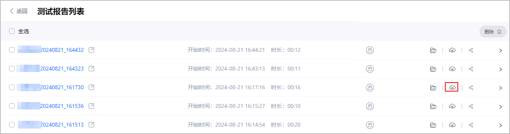
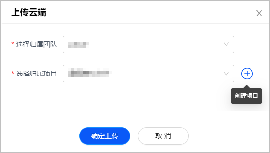
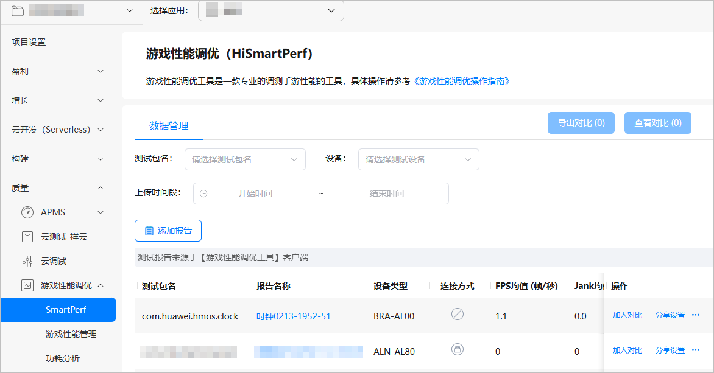
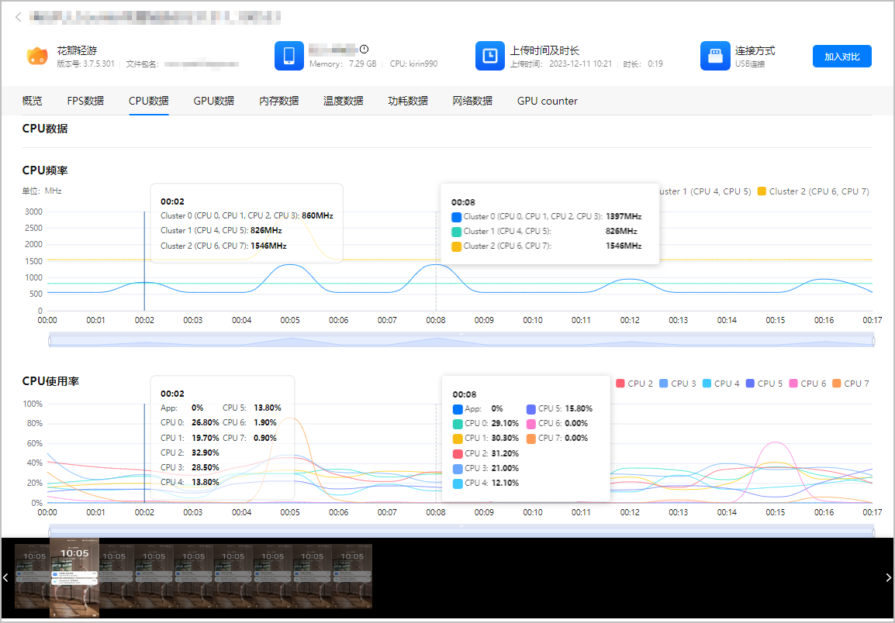

将本地测试报告上传至云端后，团队账号可共同查看测试报告。

测试报告中的**CPU trace**数据不支持上传云端。

## 上传报告

不同的[上传云端设置](https://developer.huawei.com/consumer/cn/doc/games-guides/games-hismartperf-setting-0000002321517289#section54291923471)，上传操作有所不同：

* 若选择“自动上传”至云端，测试报告生成后将自动上传至云端指定的团队和项目下。
* 若选择“询问上传”至云端，您可在报告生成后弹出的窗口中指定团队和项目，或点击“+”前往AGC控制台[创建项目和应用](https://developer.huawei.com/consumer/cn/doc/games-guides/games-hismartperf-preparation-0000002286788020#section05061127182614)。

  
* 若选择“不上传”至云端，您可在报告列表中，点击报告右侧的“上传”图标。

  

  在弹出的窗口中选择归属团队和归属项目，或点击“+”前往AGC控制台[创建项目和应用](https://developer.huawei.com/consumer/cn/doc/games-guides/games-hismartperf-preparation-0000002286788020#section05061127182614)。

  

## 查看报告

1. 登录[AppGallery Connect](https://developer.huawei.com/consumer/cn/service/josp/agc/index.html)， 点击“开发与服务”，在项目卡片列表选择项目及项目下的游戏。
2. 选择“质量 &gt; 游戏性能调优 &gt; SmartPerf”，在“数据管理”页签下，您可以根据筛选条件查看已上传的报告。

   
3. 在测试报告详情页，您可以点击页签查看数据项，数据项的详细解析请参见[数据解析](https://developer.huawei.com/consumer/cn/doc/games-guides/games-hismartperf-system-data-0000002321404217)。为了方便您对齐报告上、下曲线图的数据，您可以：
   * 随意悬停在任一曲线图的任一时间点查看数据，所有曲线图均会随之显示该时间点的数据，这样方便您纵向对比同一时间点的数据。
   * 左键点击任一曲线图的任一时间点，曲线图在该时间点会出现一条固定实线，您可以与悬停在其它时间点的数据进行横向对比。若想取消固定实线，您可以右键点击曲线图。
   * 框选任一曲线图的任一区间的数据后，支持展示该区间数据的平均值。
   * 拖动任一曲线图下方的时间轴，所有曲线图的时间轴随之变动。

   
