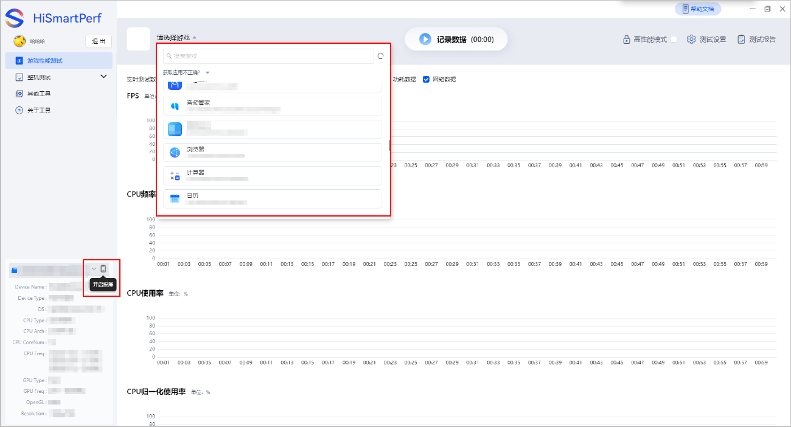
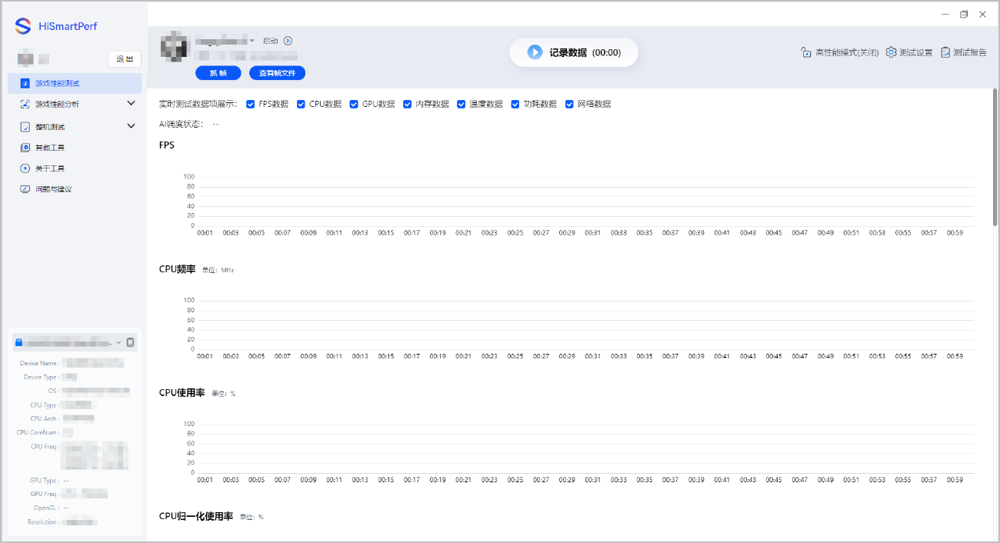
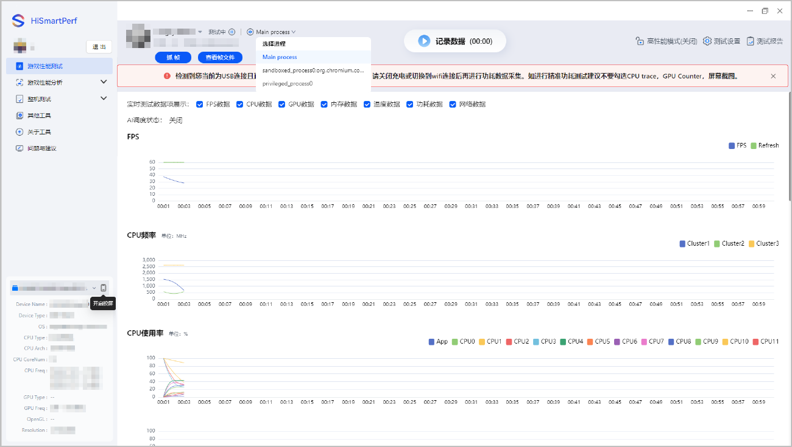
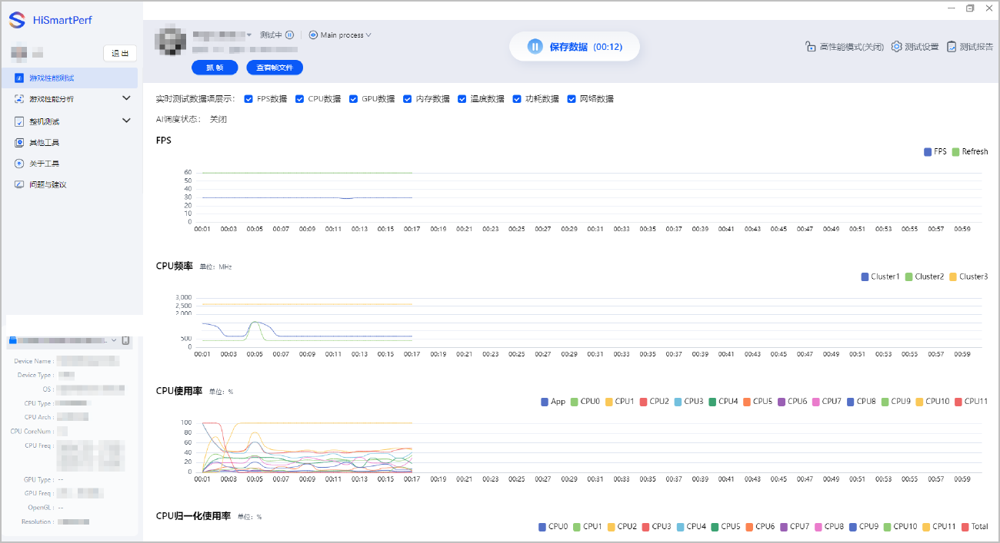
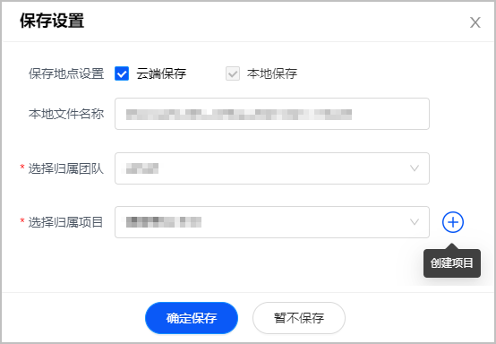

## 前提条件

游戏性能调优工具已[设置采集要求](https://developer.huawei.com/consumer/cn/doc/games-guides/games-hismartperf-setting-0000002321517289)。

## 操作步骤

1. 在HiSmartPerf-Editor主界面左侧导航点击“游戏性能测试”。
2. 工具识别到手机设备上安装的应用后，您可以在搜索框内搜索或下拉选择待采集数据的游戏。

   

   * 若工具未识别手机安装的游戏，建议点击右上角实时刷新。
   * 设备支持点击右下方开启手机投屏。

   
3. 点击“启动”，手机自动启动对应的游戏后，您可以手动进入到特定的游戏场景。

   
4. 确保启动状态为“测试中”，点击“记录数据”即可开始采集游戏数据。如需采集当前运行的不同进程的性能数据，点击进程下拉框，选择不同进程（默认为Main process）即可切换。

   

   * 测试过程中如需抓帧，点击“抓帧”按钮即可开始抓取，显示抓帧完成后，可点击“查看帧文件”进行查看及分析。
   * 查看帧文件需[测试设备连接Graphics Profiler工具](https://developer.huawei.com/consumer/cn/doc/Tools-Guides/frame-capture-0000001050701440#section53031221124)。

   
5. 采集数据的过程中，您需在手机上进行游戏操作。若想停止采集，请手动点击“保存数据”结束。若想结束测试，请手动点击“测试中”结束。

   

   * 在生成测试报告的过程中请保持手机和工具的连接顺畅，否则报告可能会生成失败。
   * 建议单次采集时长不超过30分钟，否则可能因为数据量过大造成报告生成失败。
   * 采集实时数据的过程中可监控数据变化，采集后台数据的过程中则无法查看数据变化及其测试报告。
   * 在测试过程中，您可以随时点击记录数据和保存数据来生成测试报告。

   
6. 若[通用设置](https://developer.huawei.com/consumer/cn/doc/games-guides/games-hismartperf-setting-0000002321517289#section54291923471)的测试报告保存设置为**自动保存****/自动上传**，采集到的**数据项**和**游戏截图**将自动保存至本地并自动上传至云端。若设置为**询问保存/询问上传**，您可以在弹出的“保存设置”窗口中决策是否保存至本地或上传至云端。

   
