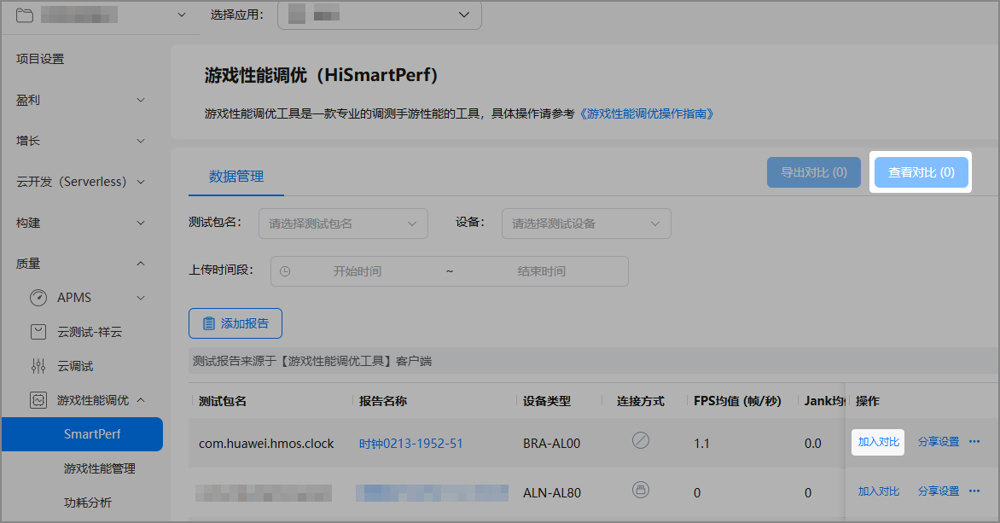
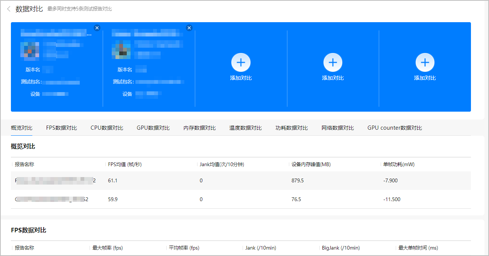

在游戏开发过程中，通常我们需要不断优化代码，或快速定位游戏性能异常等问题。因此，游戏性能调优服务提供了游戏性能数据对比功能，您可以在云端通过对比查看多个测试报告，更加直观地了解游戏代码优化前后及应用在不同设备上的性能差异，或者根据异常性能数据快速定位问题。当然，您还可以通过与竞品游戏进行数据对比，以了解性能差异与优化方向。

1. 登录[AppGallery Connect](https://developer.huawei.com/consumer/cn/service/josp/agc/index.html)， 点击“开发与服务”，在项目卡片列表选择项目及项目下的游戏。
2. 选择“质量 &gt; 游戏性能调优 &gt; SmartPerf”，查看已上传的报告。
3. 在测试报告列表中，点击不同测试报告“操作”列的“加入对比”，并点击右上角“查看对比”。

   

   目前，最多支持同时对比5条测试报告。

   
4. 在“数据对比”页面，可对比查看不同模块的性能数据。

   
