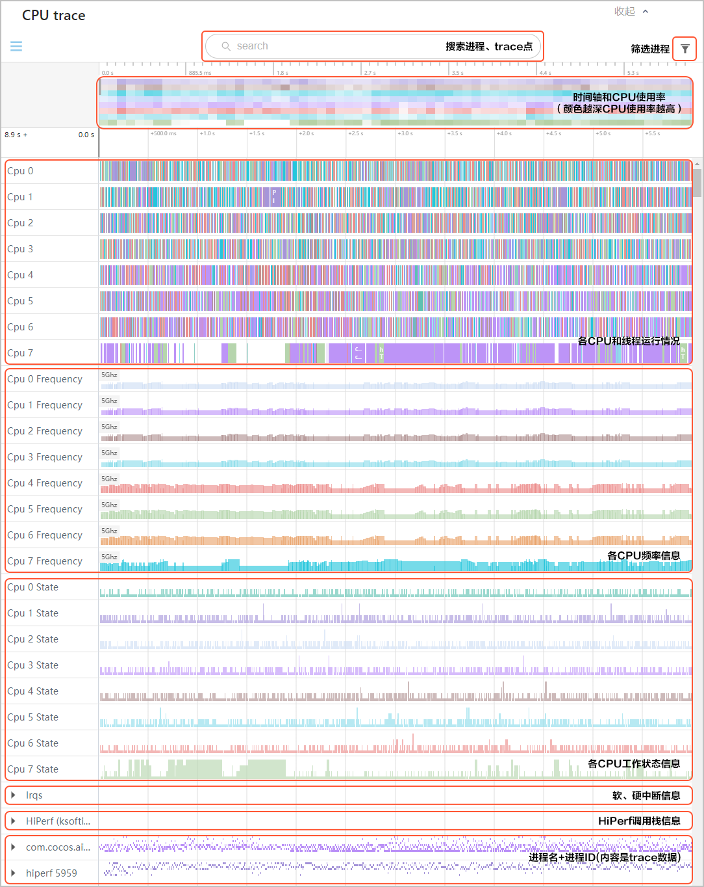
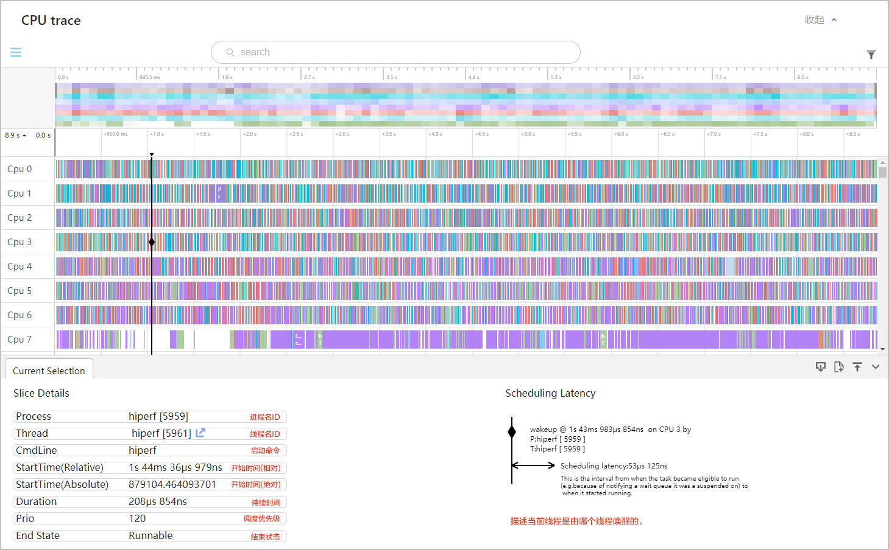
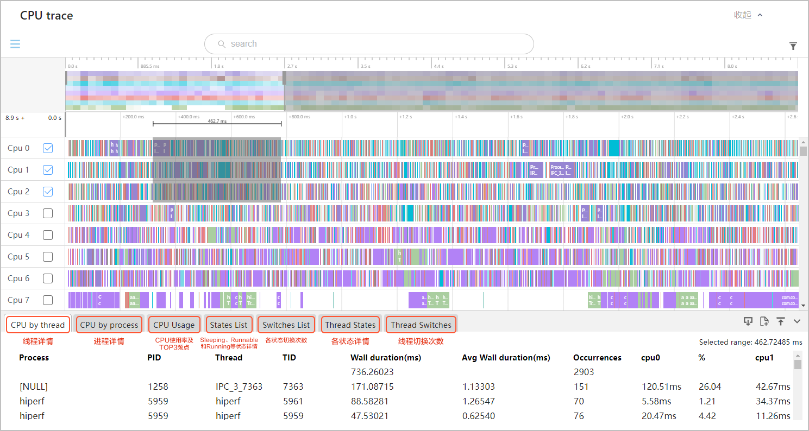
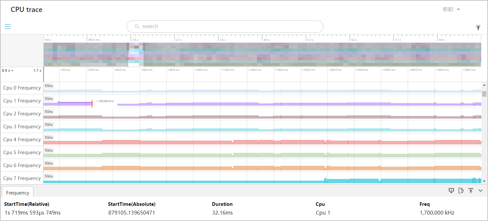
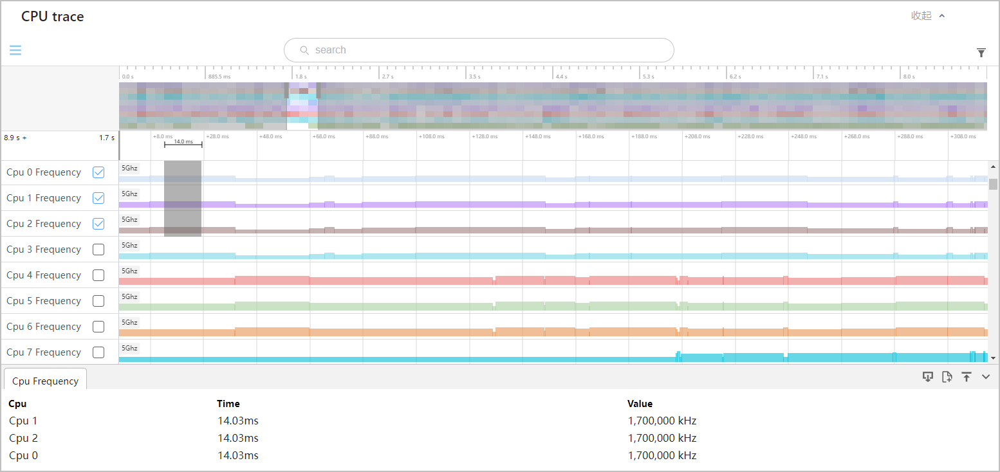
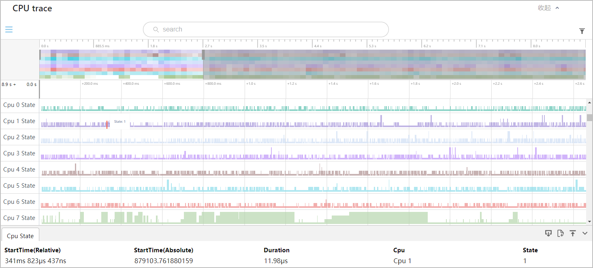
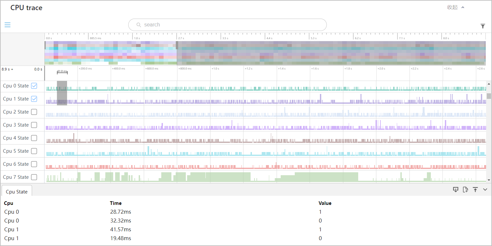
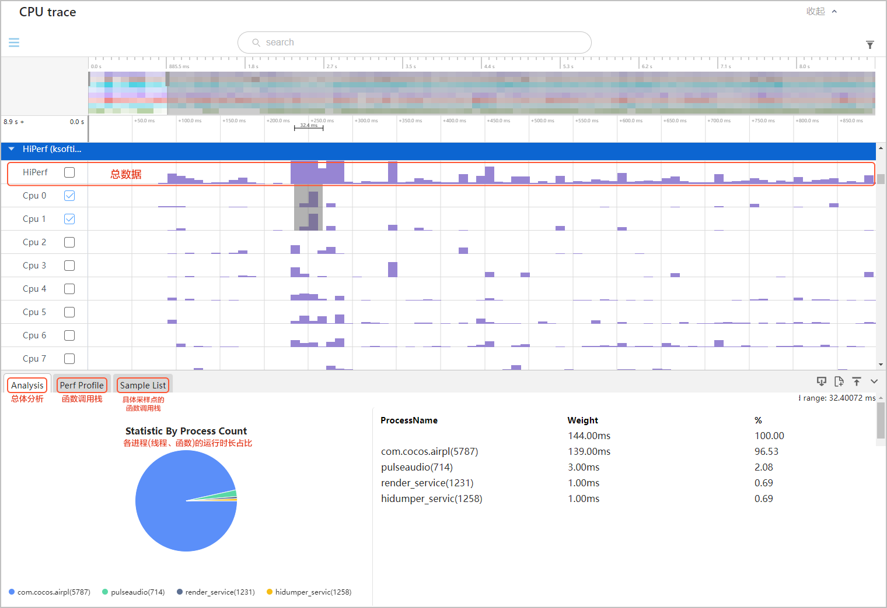
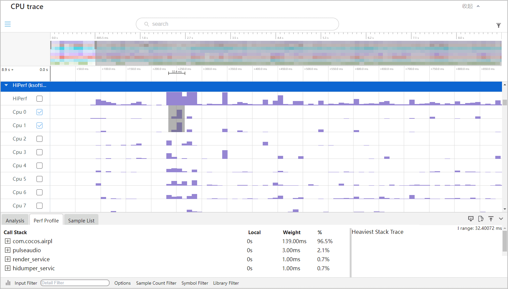

CPU trace展示CPU调度、频点、进程线程时间片、绘帧、perf等数据的性能功耗，展示方式为泳道图，支持图形用户界面GUI操作、分析数据。

## CPU使用情况

* 点击查看任一核心CPU上运行的总进程数，包括进程名和进程ID，也可以查看任一进程下的总线程数，包括线程名和线程ID。

  
* 框选查看多个核心CPU的统计数据。

  

## CPU频率信息

* 点击查看任一核心CPU的频率信息。若CPU进程长时间运行在低频的状态，建议优化。

  
* 框选查看多个核心CPU的频率。

  

## CPU工作状态

CPU的工作状态主要有“0”、“1”、“2”、“3”。“0”表示“工作中”；“1”、“2”、“3”表示“不在工作状态”，且数值越大代表CPU睡眠程度越深，功耗也越低。

* 查看任一核心CPU的idle状态信息。

  
* 框选多个CPU的idle状态。

  

## Hiperf数据

Hiperf性能数据体现了进程的函数调用情况，在测试过程中测试工具会每隔一段时间去访问CPU的运行栈。您可以框选查看Hiperf数据。

您也可以切换到火焰图进行可视化观察。观察调用函数的运行时长，若函数的实际运行时长偏离预估时长，建议优化。

