手机/平板设备成功连接电脑端的HiSmartPerf-Editor后，将自动安装HiSmartPerf-Device工具。工具操作简单，支持采集游戏基础的性能指标，例如FPS、功耗、温度、负载等。若想快速了解游戏的整体性能状况，建议优先考虑 HiSmartPerf-Device工具测试游戏性能。

## 采集性能数据

1. 在手机/平板端点击桌面SmartPerf应用图标打开HiSmartPerf-Device工具。
2. 设置采集要求。

   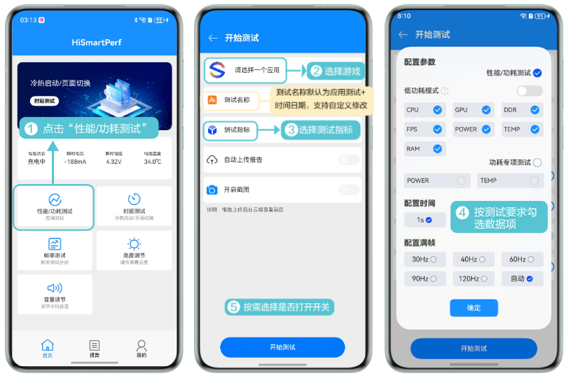
3. 采集性能数据。

   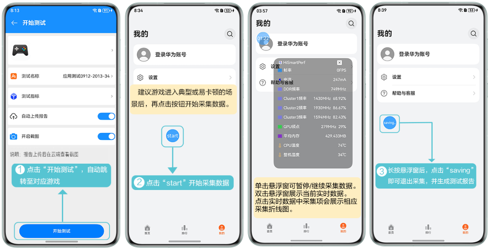

## 查看测试报告

测试报告生成后，您可以在测试报告列表中，点击报告并在详情页查看性能数据。

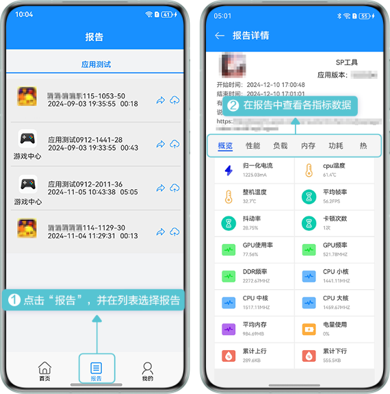

## 手动上传测试报告


* 上传测试报告有自动上传和手动上传两种操作。
* 在开始测试页面打开“自动上传报告”开关，采集结束后，报告会自动上传至云端。

首次使用上传测试报告功能，您需先登录华为开发者账号。

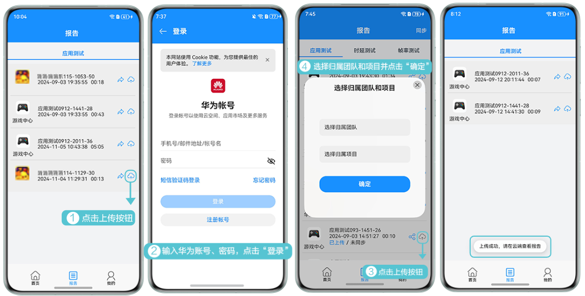

## 分享测试报告

您可以在测试报告列表页面，点击分享按钮分享测试报告。


测试报告必须上传云端后才能分享。


您可以通过复制网址链接或扫描二维码图片，在浏览器打开，查看其他用户分享的测试报告。

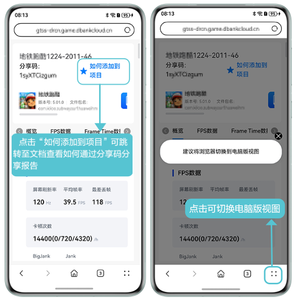

## 解析性能数据

### 概览

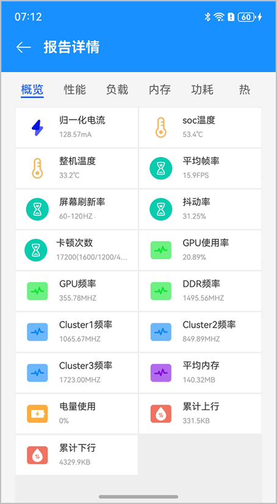

| 数据指标 | 单位 | 含义 | 说明 |
| --- | --- | --- | --- |
| 归一化电流 | mA | 3.8V电压下的电流使用情况。 | - |
| cpu温度 | ℃ | 采集过程中cpu温度的平均值。 | 数值越低越好。 |
| 整机温度 | ℃ | 采集过程中设备温度的平均值。 | 数值越低越好。 |
| 平均帧率 | FPS | 游戏画面在采集过程中平均每秒显示的帧数。 | 建议尽量达到屏幕刷新率。 |
| 屏幕刷新率 | Hz | 游戏画面在测试过程中采集的刷新次数范围。 | - |
| 抖动率 | - | 帧率变化的百分比。 | 数值越低越好。 |
| 卡顿次数（小卡顿/中卡顿/大卡顿） | 次/h | 平均每小时内出现的卡顿次数。（卡顿次数=小卡顿数+2\*中卡顿数+3\*大卡顿数。） | 数值越低越好。 |
| GPU使用率 | - | GPU的使用率。 | - |
| GPU频率 | MHz | GPU的工作频率。 | - |
| DDR频率 | FPS | DDR内存的工作频率。 | - |
| CPU 小核 | MHz | CPU小核的平均工作频率。 | 数值越低越好。 |
| CPU 中核 | MHz | CPU中核的平均工作频率。 | 数值越低越好。 |
| CPU 大核 | MHz | CPU大核的平均工作频率。 | 数值越低越好。 |
| 平均内存 | MB | 使用的平均内存空间。若未采集内存数据项，将固定展示“-1”。 | - |
| 电量使用 | - | 开始采集到结束采集电量差，显示百分比。 | - |
| 累计上行 | KB | 上传带宽累计之和。 | - |
| 累计下行 | KB | 下载带宽累计之和。 | - |

### 性能

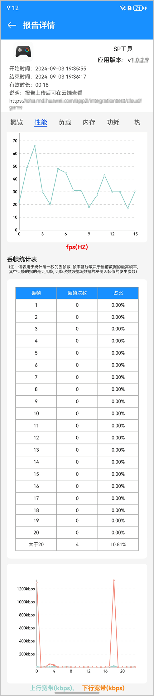

| 数据指标 | 单位 | 含义 | 说明 |
| --- | --- | --- | --- |
| fps | Hz | 每秒游戏画面最大的刷新次数。 | - |
| refreshRate | Hz | 游戏画面在测试过程中采集的刷新次数范围。 | - |
| 丢帧 | FPS | 测试期间各丢帧个数对应的次数与占比。 | 数值越低越好。 |
| 上行带宽 | kbps | 游戏上传带宽。 | - |
| 下行带宽 | kbps | 游戏下载带宽。 | - |

### 负载

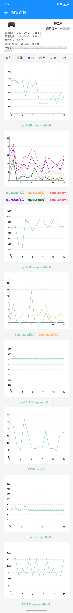

| 数据指标 | 单位 | 含义 |
| --- | --- | --- |
| CPU Frequency | MHz | CPU频率。 |
| CPU Load | - | CPU负载占比。 |
| GPU Load | - | GPU负载占比。 |
| GPU Frequency | MHz | GPU频率。 |
| DDR Frequency | MHz | DDR频率。 |

### 内存

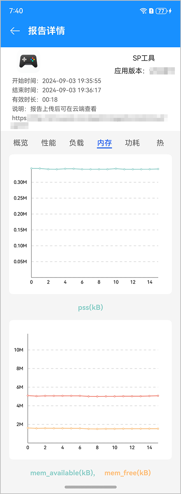

| 数据指标 | 单位 | 含义 |
| --- | --- | --- |
| pss | KB | 应用实际使用的物理内存。 |
| mem\_avaliable | KB | 整机可用内存。 |
| mem\_free | KB | 整机空闲内存。 |

### 功耗

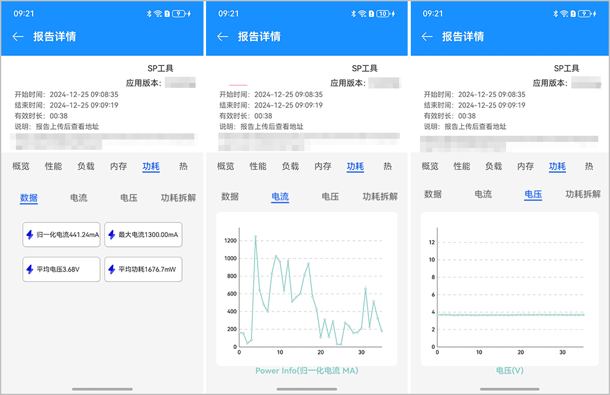

| 数据指标 | 单位 | 含义 |
| --- | --- | --- |
| 归一化电流 | mA | 有效时间内的归一化电流（电压\*电流/3.8）的绝对值之和除以时间。 |
| 最大电流 | mA | 有效时间内电流的最大值。 |
| 平均电压 | V | 有效时间内电压的平均值。 |
| 平均功率 | mW | 电流\*电压。 |

### 热

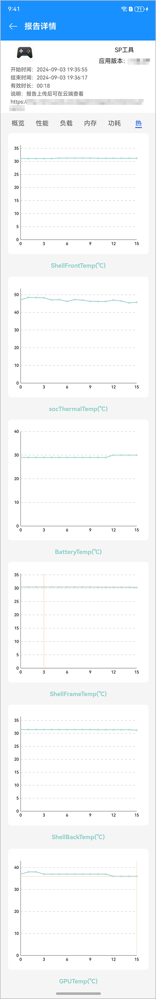

| 数据指标 | 单位 | 含义 | 说明 |
| --- | --- | --- | --- |
| ShellFrontTemp | ℃ | 采集过程中手机前壳的温度。 | 越低越好。 |
| socThermalTemp | ℃ | 采集过程中系统芯片温度的波动情况。 | 越低越好。 |
| BatteryTemp | ℃ | 采集过程中电池温度的波动情况。 | 越低越好。 |
| ShellFrameTemp | ℃ | 采集过程中手机壳的温度。 | 越低越好。 |
| ShellBackTemp | ℃ | 采集过程中手机后壳的温度。 | 越低越好。 |
| GPUTemp | ℃ | GPU温度的波动情况。 | 越低越好。 |

## 支持命令行形式调用Device

HiSmartPerf-Device 支持下载单独的安装包，您可以通过命令行形式调用Device，集成到自身的游戏性能看护流水线。

### 获取游戏信息

1. 登录[AppGallery Connect](https://developer.huawei.com/consumer/cn/service/josp/agc/index.html)，点击“开发与服务”，在项目列表中找到需要获取游戏参数的项目及项目下的游戏。
2. 在“项目设置 &gt; 常规”页面下记录 **Client ID、Client Secret**。

   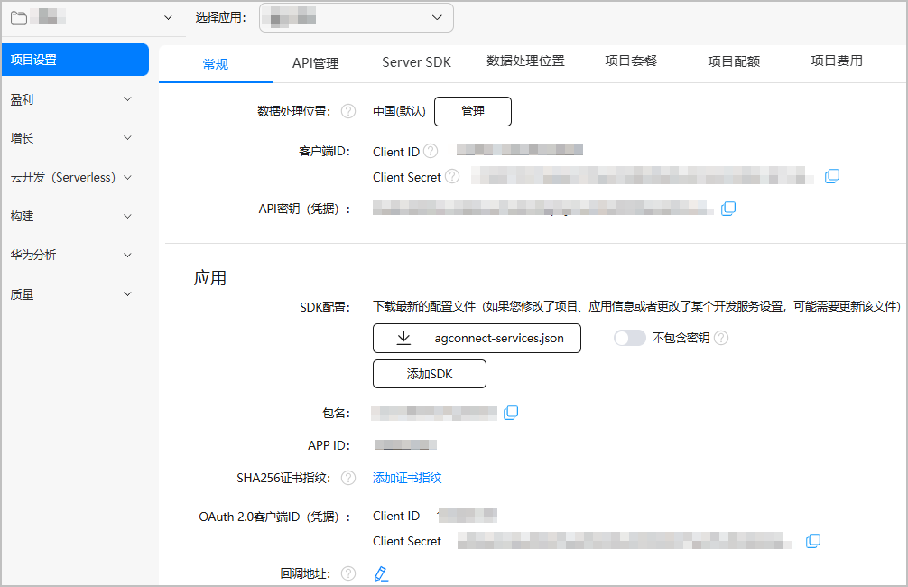

### 操作步骤

1. [下载HiSmartPerf-Device](https://developer.huawei.com/consumer/cn/doc/games-guides/games-hismartperf-download-0000002321404201)
2. （可选）安装 HiSmartPerf-Device

   输入以下命令在电脑端安装 HiSmartPerf-Device hap 包。

   ```
   hdc -t [connect-key] install [hap文件名]
   ```
3. 连接手机设备
   * USB 连接

     参考[手机设备如何成功连接电脑](https://developer.huawei.com/consumer/cn/doc/games-guides/games-hismartperf-faq-0000002286844742#section935516916145)连接工具和手机。
   * Wi-Fi 连接

     

     确保手机和电脑必须处于同一 Wi-Fi 下。

     1. 打开手机的“设置”应用，进入“关于手机”页面。
     2. 快速、连续、多次点击“软件版本”，直到提示“您正处于开发者模式！”或“您已处于开发者模式，无需进行此操作”，表示您已进入当前手机设备的开发者模式。
     3. 在“开发者选项”页面点击“无线调试”，查看IP地址和端口。

        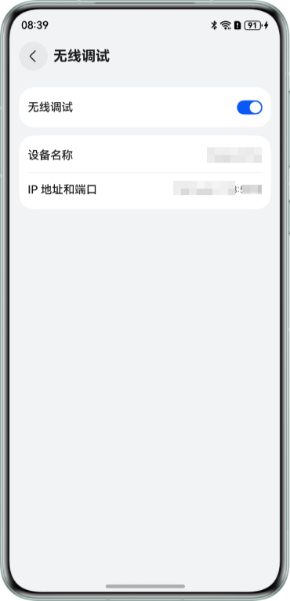
     4. 在电脑端执行以下命令

        ```
        hdc tconn ip:port
        ```
4. 确认手机设备已连接

   在电脑端执行以下命令查询已连接的设备列表信息，确保目标设备已连接。

   ```
   hdc list targets -v
   ```
5. 调用 python 脚本

### python 脚本说明

1. 初始化

   

   需联网操作。

   * 参数

     | 参数 | 必填（M）/选填（O） | 说明 |
     | --- | --- | --- |
     | taskName | M | 任务名。固定填init。 |
     | clientId | M | 客户端ID。具体获取参见[获取游戏信息](#section989492554518)。 |
     | clientSecret | M | 客户端Secret。具体获取参见[获取游戏信息](#section989492554518)。 |
     | connectkey | O | 目标设备的标识符。连接多个设备时，需指定该参数。 |
   * 示例代码（以windows 批处理为例）

     ```
     @REM 初始化
     set clientId=********
     set clientSecret=*********
     python %~dp0AutoTest.py init %clientId% %clientSecret%
     ```
   * 回调显示

     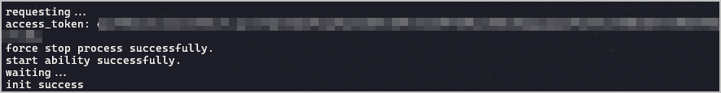
2. 开始采集
   * 参数

     | 参数 | 必填（M）/选填（O） | 说明 |
     | --- | --- | --- |
     | taskName | M | 任务名。固定填start。 |
     | bundleName | M | 待测试游戏的包名。 |
     | testname | O | 自定义保存的报告名称，报告名称不能包含中文和特殊字符。 |
     | connectkey | O | 目标设备的标识符。 |
   * 示例代码（以windows 批处理为例）

     ```
     @REM 开始采集
     set bundleName=**********
     python %~dp0AutoTest.py start %bundleName%
     ```
   * 回调显示

     
3. 结束采集
   * 参数

     | 参数 | 必填（M）/选填（O） | 说明 |
     | --- | --- | --- |
     | taskName | M | 任务名。固定填stop。 |
     | reportPath | M | 报告保存的目录。 |
     | connect-key | O | 目标设备的标识符。 |
   * 示例代码（以windows 批处理为例）

     ```
     @REM 采集停止
     set savePath=reports
     python %~dp0AutoTest.py stop %savePath%
     ```
   * 回调显示

     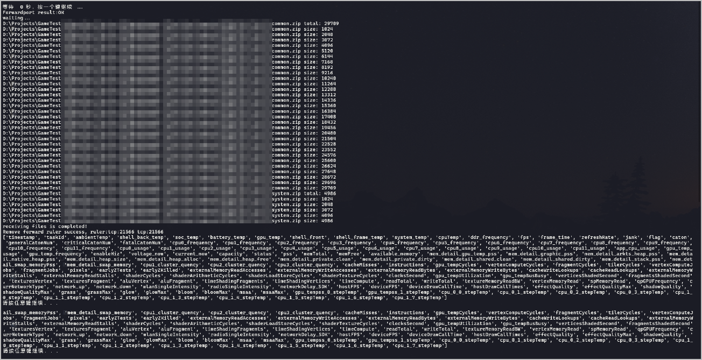
