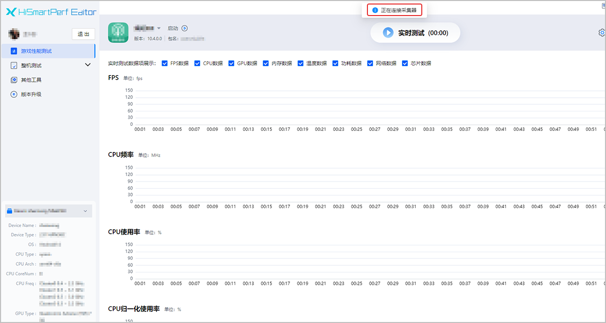
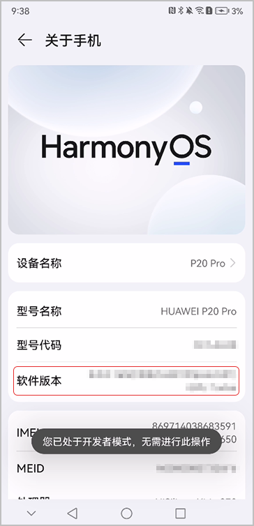
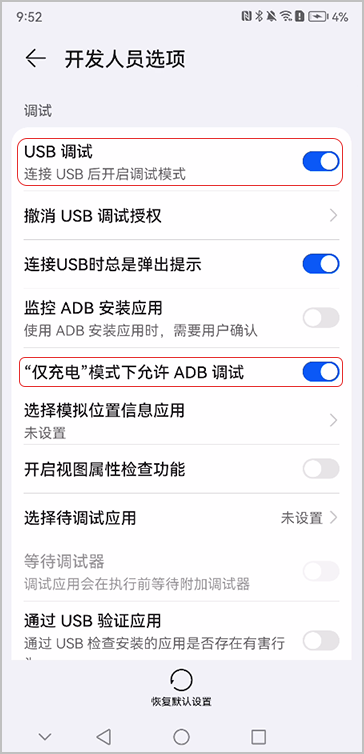
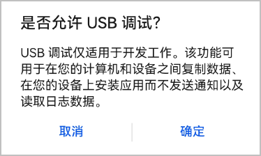
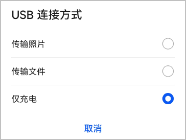
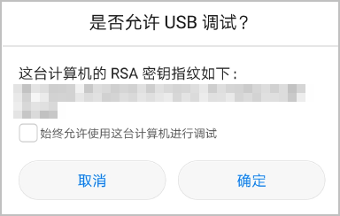

## 如何解决一直显示“正在连接采集器”

手机连接HiSmartPerf-Editor工具后，界面一直显示“正在连接采集器”，这是因为工具的安装路径可能有中文。您需要卸载工具重新安装，且保证安装路径中没有**中文**和**空格**。

## 手机设备如何成功连接电脑

1. 打开手机的“设置”应用，进入“关于手机”页面。
2. 快速、连续、多次点击“软件版本”，直到提示“您正处于开发者模式！”或“您已处于开发者模式，无需进行此操作”，表示您已进入当前手机设备的开发者模式。

   
3. 在“开发人员选项”页面打开“USB调试”、“仅充电模式下允许ADB调试”。

   
4. 在底部弹出的“是否允许USB调试？”窗口上点击“确定”。

   
5. 使用USB数据线连接手机与电脑，并在弹出的“USB连接方式”窗口上选择“仅充电”。

   
6. 继续在“是否允许USB调试？”窗口上点击“确定”。

   

## 如何解决无法读取RS树

使用Editor时建议使用设备自带的HDC工具。
