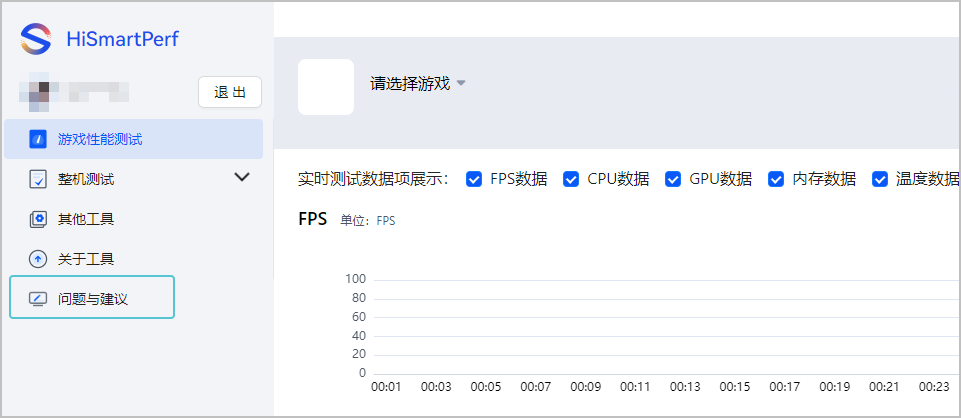
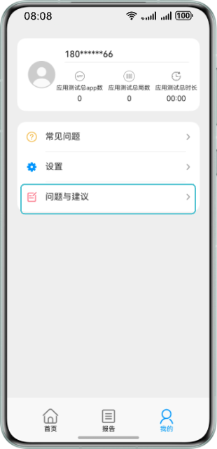
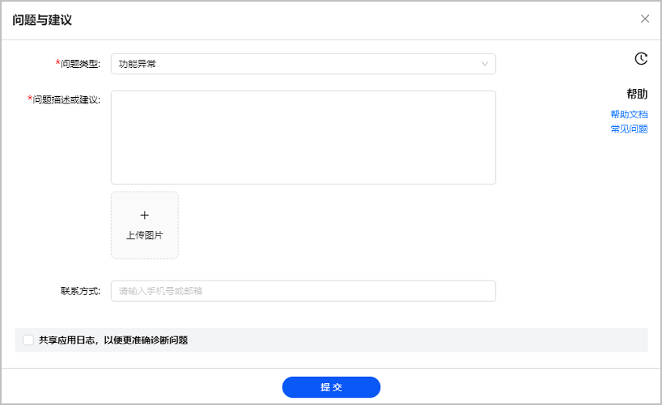

在使用游戏性能调优工具过程中遇到问题，您可以直接在工具中反馈问题或者提出对工具的建议。

1. 打开问题反馈界面。
   * Editor

     
   * Device

     
2. 在问题与建议界面反馈您的问题或者建议，并点击提交。

   

   * 点击可以查看历史反馈记录。
   * 勾选共享应用日志提交，以便更精准定位问题。
   * 点击常见问题跳转至文档[FAQ](/docs/dev/game-dev/games-hismartperf-faq-0000002286844742),查看常见问题以及解决方法

   

   | 配置项 | 说明 |
   | --- | --- |
   | 问题类型 | 下拉选择问题类型为“功能异常”或“意见与建议”。 |
   | 问题描述或建议 | 描述您在使用过程中遇到的问题或对于工具的建议，要求10-500个字符。 |
   | 上传图片（可选） | 您可以附上图片或者视频，直观展示问题，有助于问题快速解决，要求图片或视频不大于50MB。 |
   | 联系方式（可选） | 华为工作人员联系您的方式。您可以留下手机号或邮箱地址，方便运营人员联系您及时解决问题。 |
