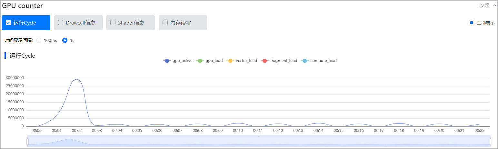
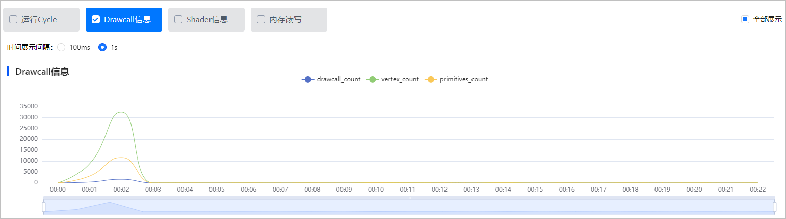
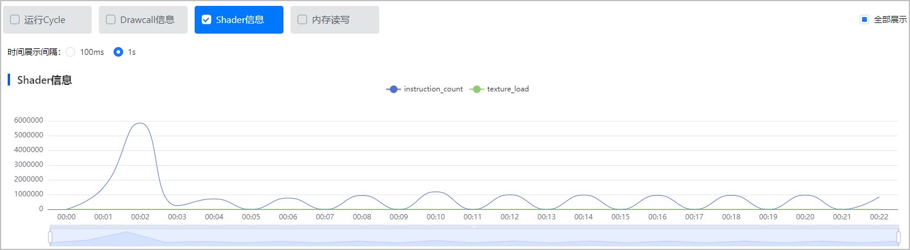
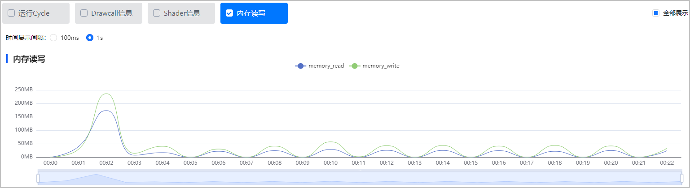
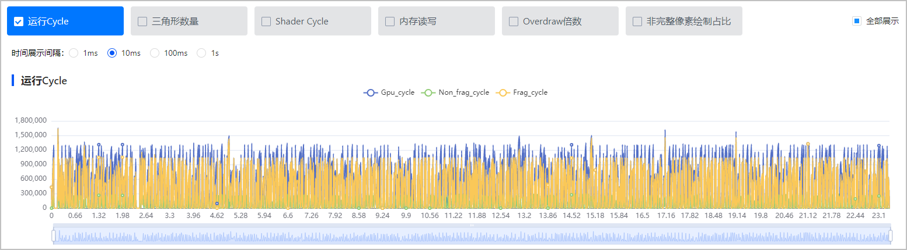
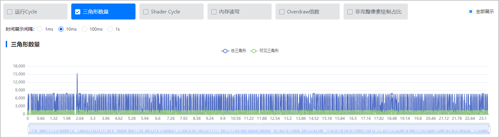
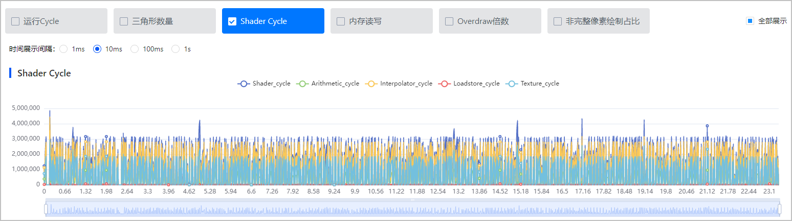
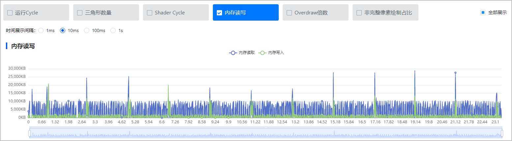
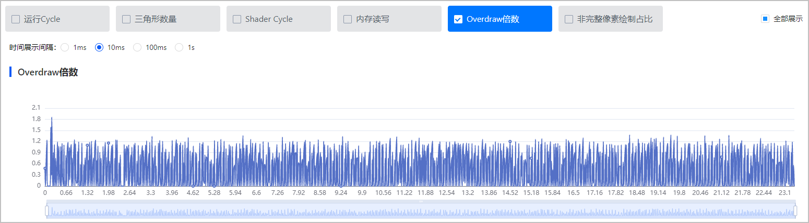
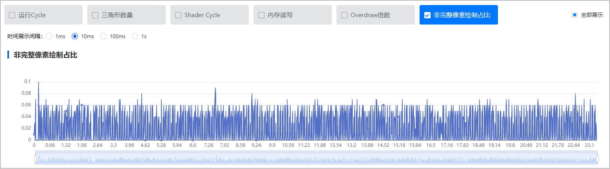

GPU counter是GPU硬件内部的计数，当前仅支持采集GPU Type为**ARMG76**、**G78**、**Maleoon**的数据项，不同**GPU Type**的华为手机将采集到不同的GPU counter数据项。您在测试报告查看数据项时，可以组合勾选GPU counter数据项，同时支持选择时间展示间隔（默认1s）。

## Maleoon

GPU Type为**Maleoon**的华为手机采集到的GPU counter数据项如下：

### 运行Cycle

运行Cycle，可以简单折算为运行时间。观察vertex\_load、fragment\_load和compute\_load，若存在较长的运行时间，建议优化对应的cycle。

### Drawcall信息

Drawcall是向GPU发送绘图请求，Drawcall数值较高，但游戏不卡顿时，您需要综合Drawcall所有数据一起分析。vertex\_count、primitives\_count如果数据过高，可能会引起vertex\_load数值过高。

### Shader信息

shader信息分别考察GPU指令数纹理采样负载。观察两种指令的执行时间，建议优化执行时间较长的指令类型。instruction\_count、texture\_load如果数值过高，可能会引起fragment\_load数值过高。

### 内存读写

考察GPU读取、写入的内存容量。分别观察读取、写入时的数值，若存在占用较大的内存容量，建议优化。

## ARMG76/G78

GPU Type为**ARMG76**、**G78**的华为手机采集到的GPU counter数据项如下：

### 运行Cycle

运行Cycle，可以简单折算为运行时间，主要包括GPU总cycle、执行非着色任务的时间Non\_frag\_cycle和着色任务的时间Frag\_cycle。观察Non\_frag\_cycle与Frag\_cycle，若存在较长的运行时间，建议优化对应的cycle。

### 三角形数量

三角形数量，标识GPU输入三角形的数量，主要包括总三角形和可见三角形。游戏体量应与三角形数量成正比，观察总三角形和可见三角形的数量，若比同类型程序的三角形数量多，建议简化模型和场景。

### Shader Cycle

shader core的执行cycle数，分别考察算术指令、插值计算、非纹理采样的内存读写、纹理采样的执行时间。观察四种指令的执行时间，建议优化执行时间较长的指令类型。

### 内存读写

考察GPU读取、写入的内存容量。分别观察读取、写入时的容量大小，若存在占用较大的内存容量，建议优化。

### Overdraw倍数

衡量绘制每个像素点的次数，即绘制的总像素点/分辨率。若存在像素点超过倍数过多的情况，建议优化。

### 非完整像素绘制占比

检测三角形未覆盖到完整像素点的占比情况。同类型游戏的非完整绘制占比相似，若出现非完整像素绘制占比较高的情况，说明小三角形过多、模型过于细致，建议将模型绘制得简单一些。

