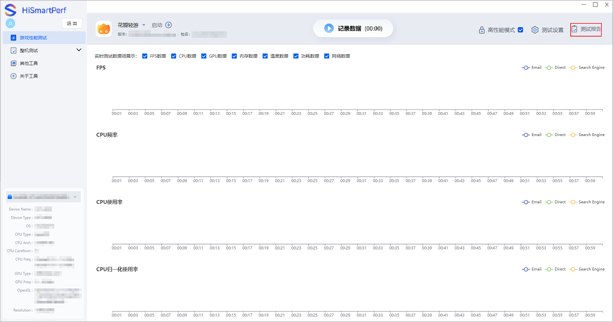
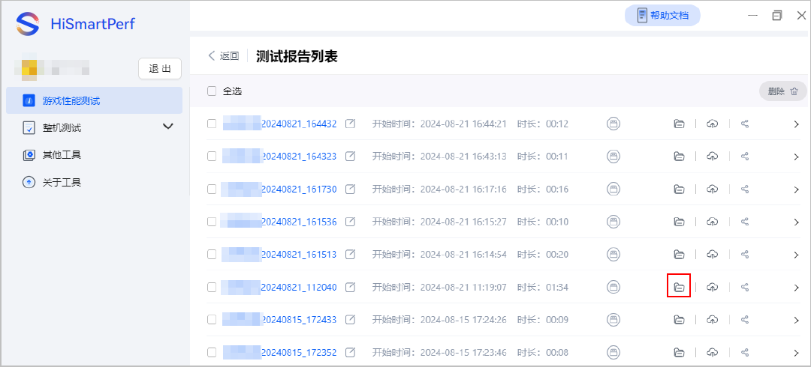
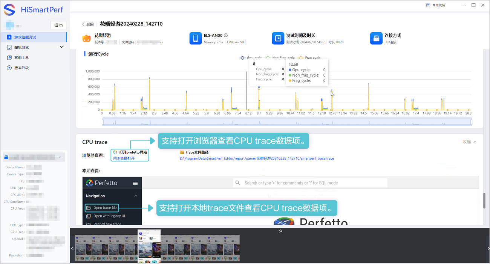
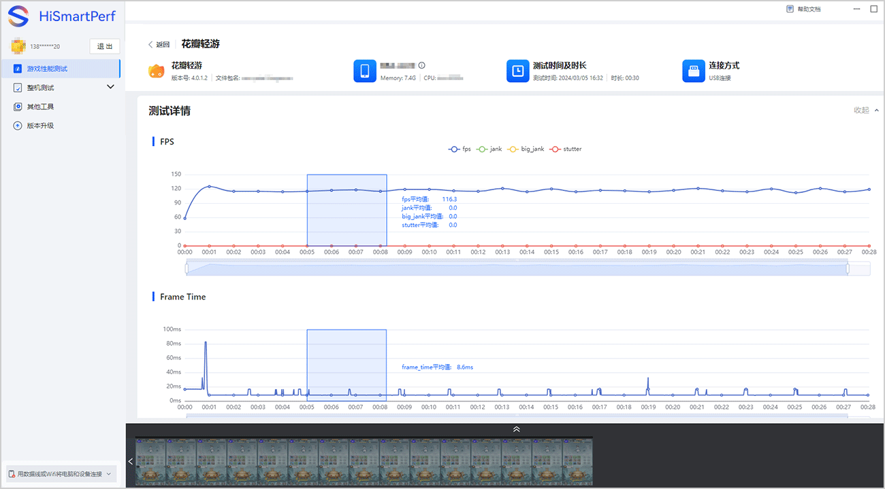

测试报告生成并保存到本地后，支持在报告列表中点击并在报告详情页查看相关数据。

1. 在主界面右侧点击“测试报告”进入报告列表页面。

   
2. 在报告列表页面，您可以将测试报告[上传至云端](/docs/dev/game-dev/games-hismartperf-cloudview-0000002321404213#section1365144213172)进行查看，同时还可以直接点击并打开查看。如需在本地查看数据测试报告，可打开对应报告文件夹查看保存在本地的Excel表格。

   
3. 在测试报告详情页，您可以查看采集到的数据项，数据项的详细解析请参见[数据解析](/docs/dev/game-dev/games-hismartperf-system-data-0000002321404217)。为了方便查看数据，在测试报告详情页支持如下操作：
   * 在“**测试详情**”、“**GPU counter**”版块，鼠标悬停曲线任一时间点，您可以查看数据项该时间点的数据。左键点击曲线出现固定实线，您可以横向对比数据，右键取消固定实线。拖动曲线下方时间轴，所有曲线的时间轴随之变动。

     
   * 在“**测试详情**”和“**GPU counter**”版块，框选曲线任一区间的数据后，支持展示该区间的平均值，也支持保存该区间的测试报告至本地或云端。

     
