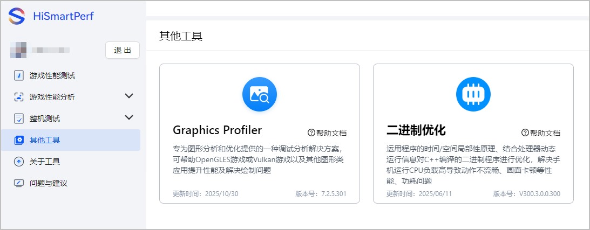

Mac版本的HiSmartPerf-Editor暂不支持其他辅助工具。

游戏性能调优工具还为您提供了其他辅助工具，为您进一步定位性能相关问题。

| 工具 | 说明 |
| --- | --- |
| Graphics Profiler | 专为图形分析和优化提供的一种调试分析解决方案，可帮助OpenGLES游戏或Vulkan游戏以及其他图形类应用提升性能及解决绘制问题。 |
| 二进制优化 | 运用程序的时间/空间局部性原理、结合处理器动态运行信息对C++编译的二进制程序（加壳/加密程序除外）进行优化，解决手机运行CPU负载高导致动作不流畅、画面卡顿等性能、功耗问题，具体可参见[业务介绍](https://developer.huawei.com/consumer/cn/doc/AppGallery-connect-Guides/binary-optimization-overview-0000001484225980)。 |

