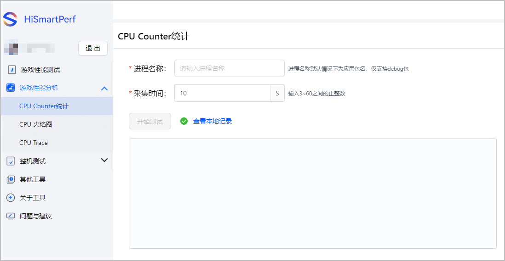
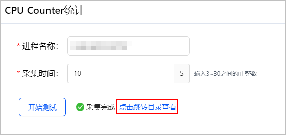
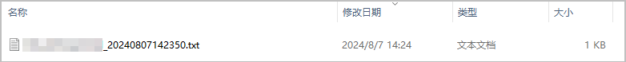
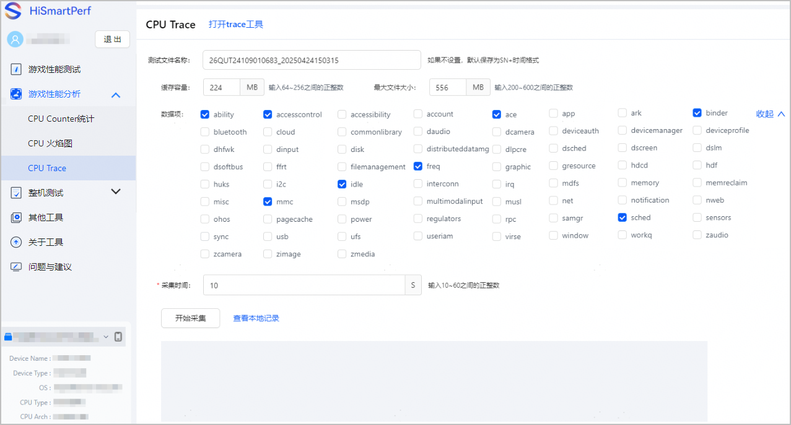
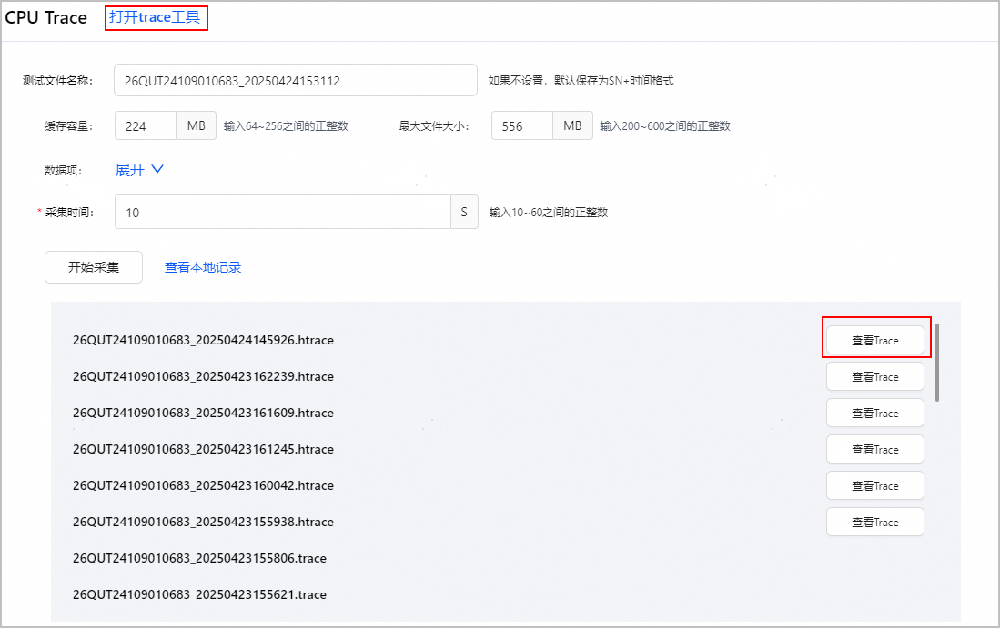

## CPU Counter统计

CPU Counter是CPU硬件内部的计数，其数据项可以用来监控和分析CPU的性能。您可以采集并查看CPU Counter统计数据。

1. 在主界面左侧选择“游戏性能分析 &gt; CPU Counter统计”，进入CPU Counter统计页面。

   
2. 填写需要采集的进程名称并设置采集时间。
3. 点击“开始测试”，进行采集。
4. 采集完成后界面如下，点击下方“点击跳转目录查看”可打开存放采集结果文件的本地文件夹。

   

   

## CPU trace

CPU trace展示CPU调度、频点、进程线程时间片、绘帧、perf等数据的性能功耗，展示方式为泳道图，支持图形用户界面GUI操作、分析数据。您可以单独采集并查看CPU trace数据，进行性能分析。

1. 在主界面左侧选择“游戏性能分析 &gt; CPU Trace”，进入CPU Trace页面。

   
2. 填写测试文件名称、缓存容量、最大文件大小并自定义配置采集的数据项。
3. 点击“开始采集”，进行采集。
4. 采集完成后，点击查看本地记录，可打开本地文件夹查看trace文件。

   

   * 后缀为“.trace”的文件，可以点击上方“打开trace工具”，在工具中查看trace页面。
   * 后缀为“.htrace”的文件，可以点击文件右侧“查看Trace”按钮直接查看trace页面。

   
