## 注册开发者账号

若您还没有实名认证的华为开发者账号，请前往华为开发者联盟网站注册开发者账号并完成实名认证，详细操作请参见[账号注册认证](https://developer.huawei.com/consumer/cn/doc/start/registration-and-verification-0000001053628148)。

## （可选）创建项目和应用

若仅在本地查看测试报告，您无需创建项目和应用。若将本地报告上传至AGC控制台，您需[创建项目](/docs/distribute/agc/agc-help-project-0000002270709469/agc-help-create-project-0000002242804048)并[在项目下添加应用](/docs/distribute/agc/agc-help-app-0000002235710234/agc-help-create-app-0000002247955506)。

若仅使用“游戏性能调优”服务，创建项目时请关闭“分析服务”开关。

## 安装工具

### Windows版

1. [下载工具](/docs/dev/game-dev/games-hismartperf-download-0000002321404201)至电脑后，解压缩并双击**HiSmartPerf-Editor.exe**文件。
2. 点击“下一步”正式进入安装过程。

   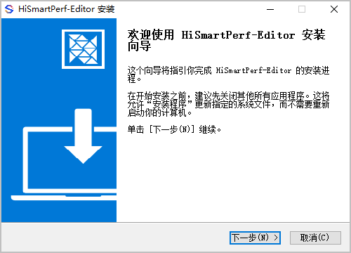
3. 选择HiSmartPerf-Editor工具的安装目录后，点击“下一步”。

   

   安装路径不能有**中文**和**空格**。

   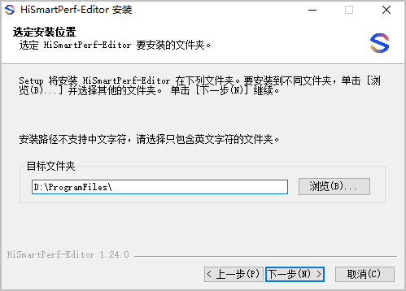
4. 选择用户数据的存储目录后，点击“安装”。

   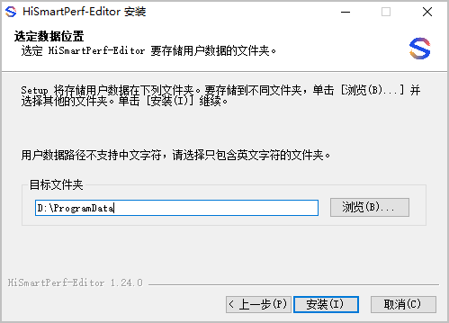
5. 请耐心等待安装过程，完成后点击“完成”。

   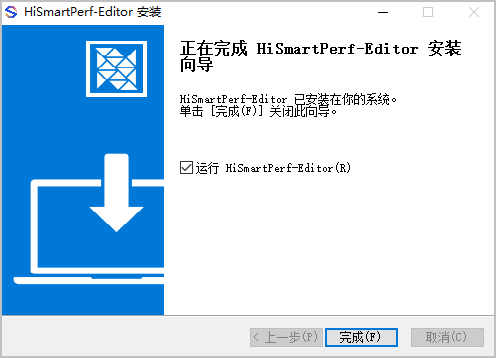

   安装成功后会在电脑桌面出现快捷图标。

   

### Mac版

1. [下载工具](/docs/dev/game-dev/games-hismartperf-download-0000002321404201)至电脑后，双击**HiSmartPerf-Editor.dmg**文件。
2. 将HiSmartPerf-Editor拖动到右边文件夹处。

   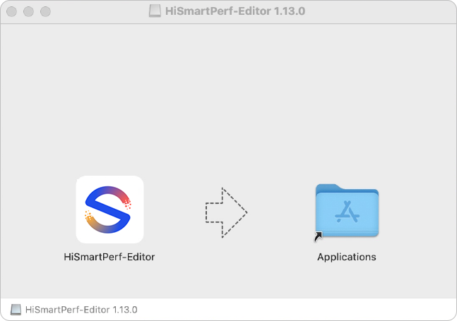
3. 安装成功后会在电脑桌面出现快捷图标。

   
4. 首次打开会弹出如下弹框，提示无法打开，需点击“取消”后进行如下操作。

   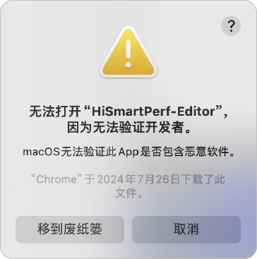

   1. 选择“系统设置 -&gt; 隐私与安全性”，“安全性”设置项处出现“已阻止使用HiSmartPerf-Editor，因为来自身份不明的开发者。”提示，点击“仍要打开”。

      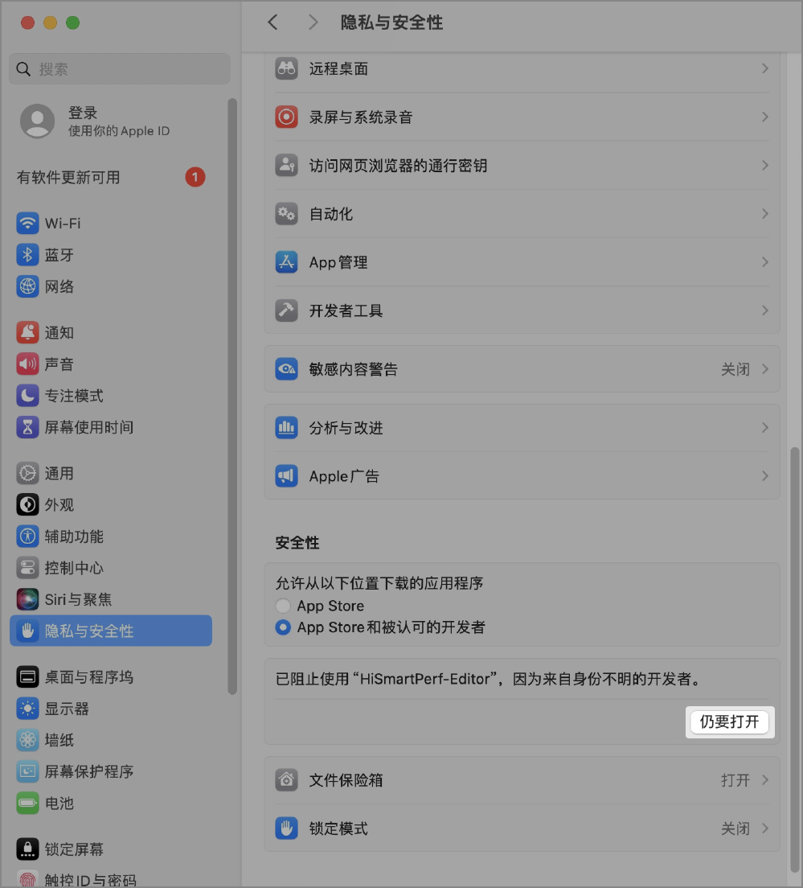
   2. 输入密码，解锁。

      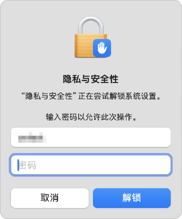
   3. 点击“打开”运行工具。

      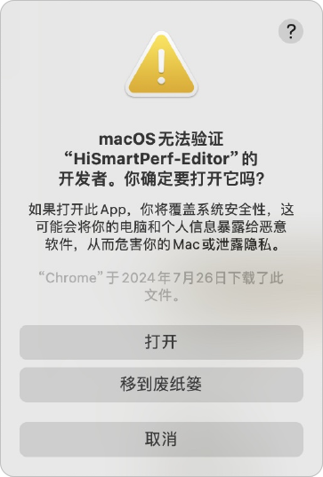

## 登录工具

1. 双击图标进入工具介绍页。点击“开始体验”前往登录页面。

   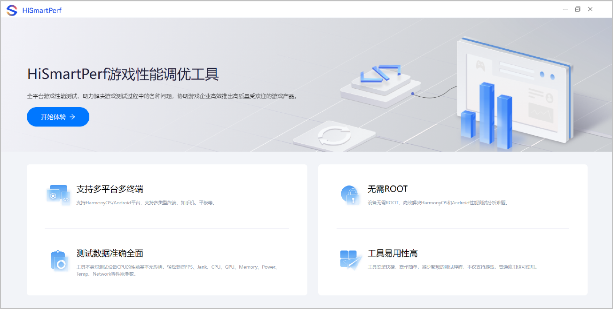
2. 若工具有新版本会有升级提示，请根据提示升级版本即可。若没有版本更新提示，本步骤可跳过。

   

   若弹窗出现如下告警信息，建议立即升级工具版本，否则可能影响工具的使用。

   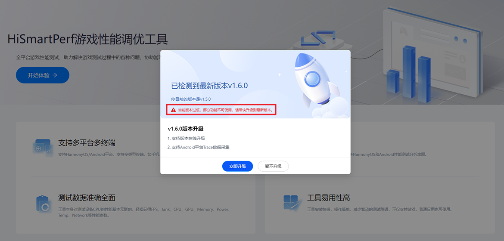
3. 使用实名认证的华为开发者账号登录。

   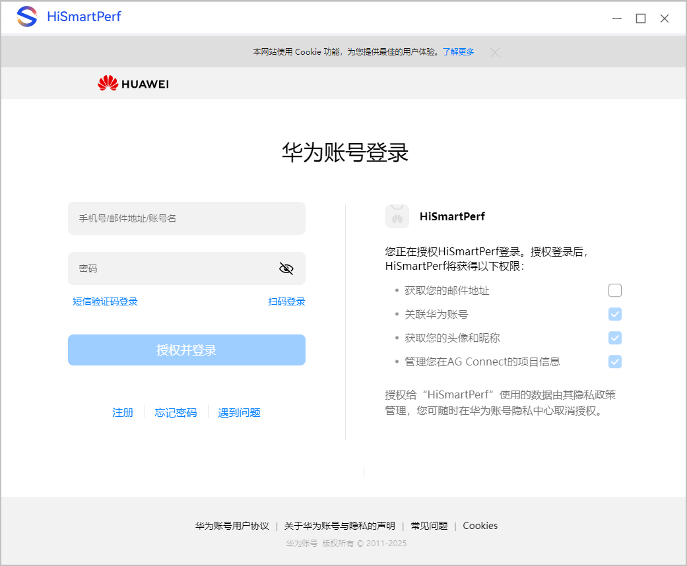
4. 由于游戏性能调优工具需要联网并收集设备的性能数据，首次使用时需要在弹出的隐私声明窗口，点击“同意”才可继续使用工具。

   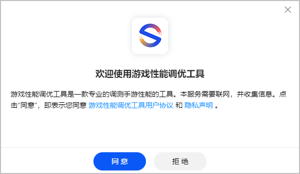

## 连接手机设备

Kirin系列芯片手机上的采集程序若长时间连接不上测试工具，可能是GPU Counter初始化异常导致的，建议重启手机后再尝试连接。

1. 打开HiSmartPerf-Editor，并准备合适的手机设备，优先推荐[适配机型](/docs/dev/game-dev/games-hismartperf-adapt-phone-0000002321404233)。
2. 参考[手机设备如何成功连接电脑](/docs/dev/game-dev/games-hismartperf-faq-0000002286844742#section935516916145)连接工具和手机。
3. 工具和手机成功连接后，手机设备将会自动安装**HiSmartPerf**应用，且工具将会默认使用 （**USB**）连接方式。

   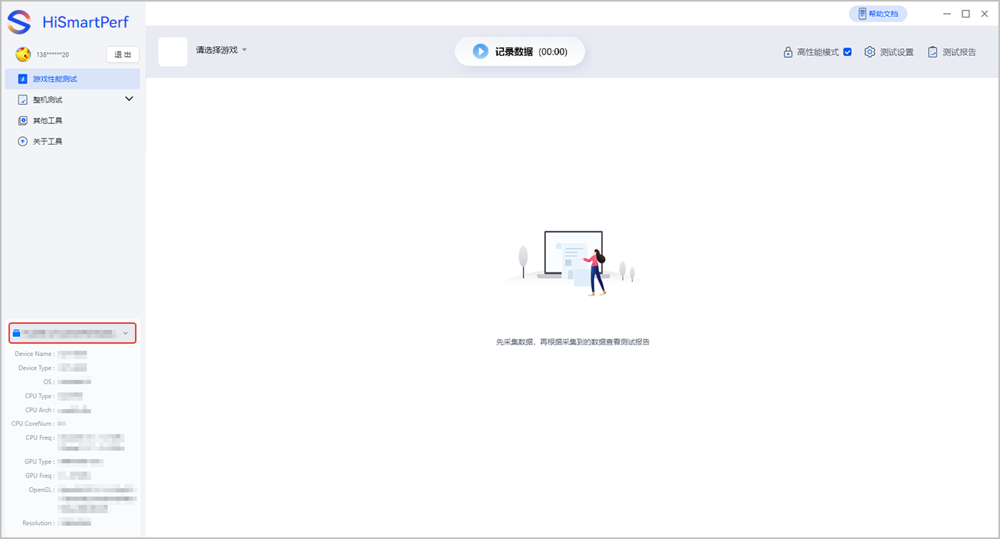
4. 若需要检测游戏功耗，工具也可以下拉切换成（**Wi-Fi**）连接方式，且手机与电脑**必须**处于同一个**Wi-Fi**下。

   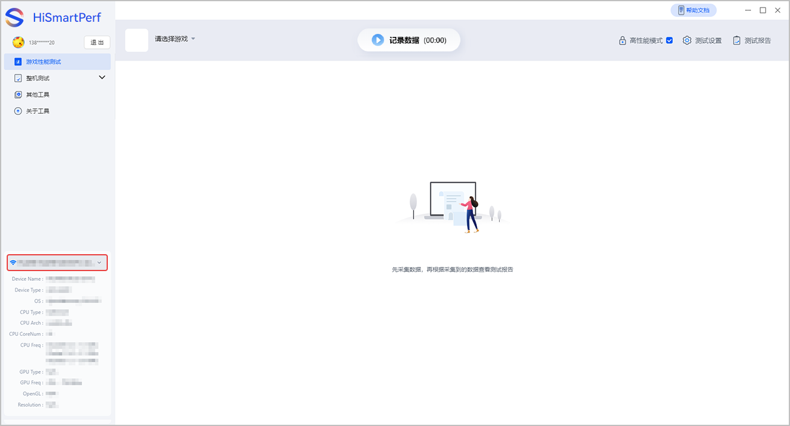

## 授权读取已安装应用

HarmonyOS 5.0及以上游戏需要在手机上授权允许读取已安装应用列表。

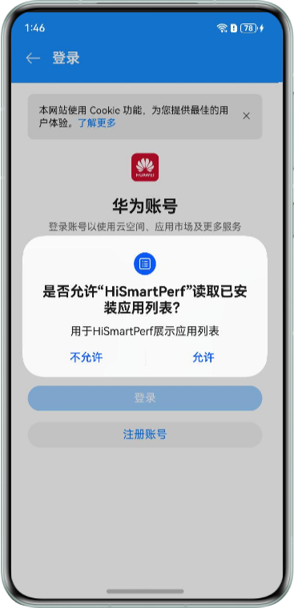
