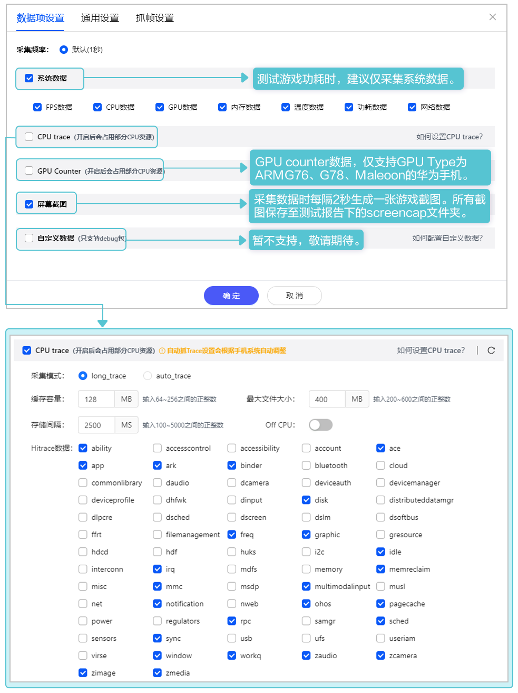
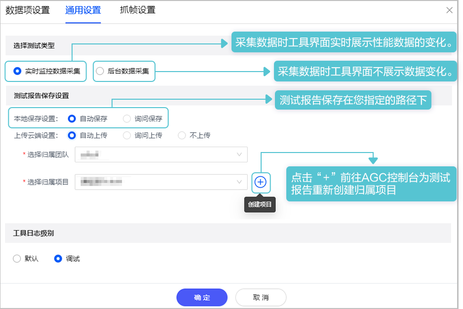
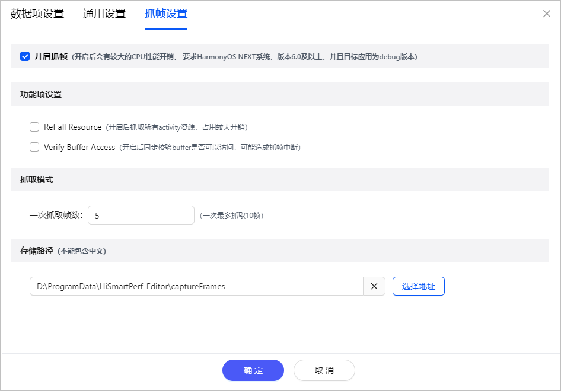

## 设置采集参数

游戏在采集数据前需在测试设置中自定义采集要求。

### 数据项设置

CPU trace配置项如下：

| 配置项 | 说明 | 配置变量 | 建议 |
| --- | --- | --- | --- |
| **采集模式** | | | |
| long\_trace | 根据存储间隔时间，周期性地将采集到的CPU trace数据直接写入trace文件中。 | * 缓存容量 * 存储间隔 * 最大文件大小 * Off CPU | * 缓存过大可能导致游戏可使用的内存降低，请根据实际情况合理分配**缓存容量**。 * 存储CPU trace数据会占用较多CPU，建议合理提升**存储（采集）间隔**。 * 文件过大会导致打开慢，甚至可能出现打不开的情况，建议合理设置**最大文件大小**。 * 建议需要记录线程切换的trace时，打开**Off CPU**开关。 * 根据实际的游戏性能需求，**抓取条件**支持设置大卡顿、卡顿及其它帧率事件。 * 根据不同使用场景，选择合适的**抓取模式**。“满足条件后抓取”用于抓取事件触发后10秒内的数据，“循环抓取，覆盖事件前后”用于抓取开始采集时至事件触发后5秒内的数据，并循环抓取直至停止采集。两种模式单次抓取的数据生成不大于256MB缓存容量的trace文件，超过则向前截取。 |
| auto\_trace | 根据抓取模式，自动抓取符合抓取条件的CPU trace数据。 | * 抓取条件 * 抓取模式 |
| **自定义数据项** | | | |
| Hitrace数据 | CPU的细分数据项，支持自定义配置。 | - | - |

### 通用设置

测试报告**上传云端**，即工具本地的测试报告**上传至****AGC控制台**。

### 抓帧设置

* 当前仅HarmonyOS 6.0及以上设备支持使用抓帧功能。
* 抓帧功能需使用debug包。

