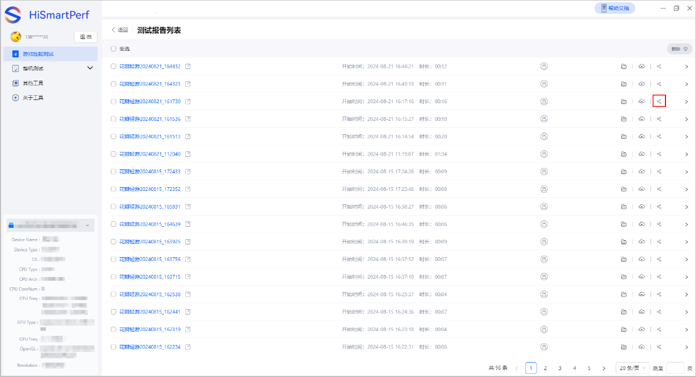
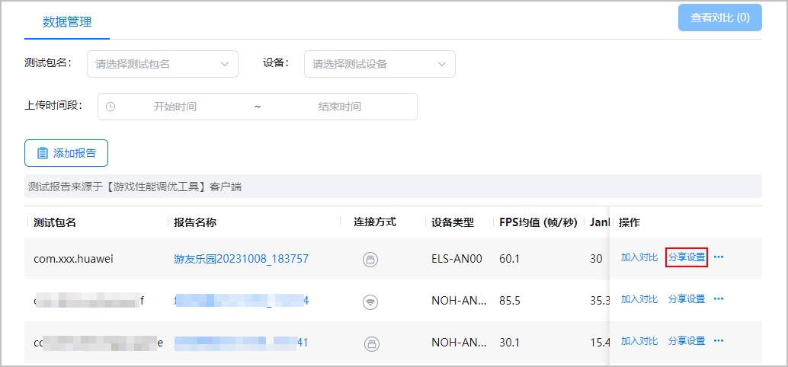
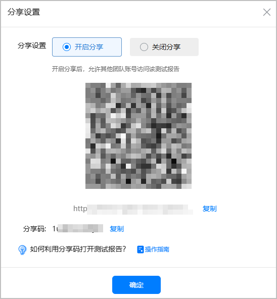
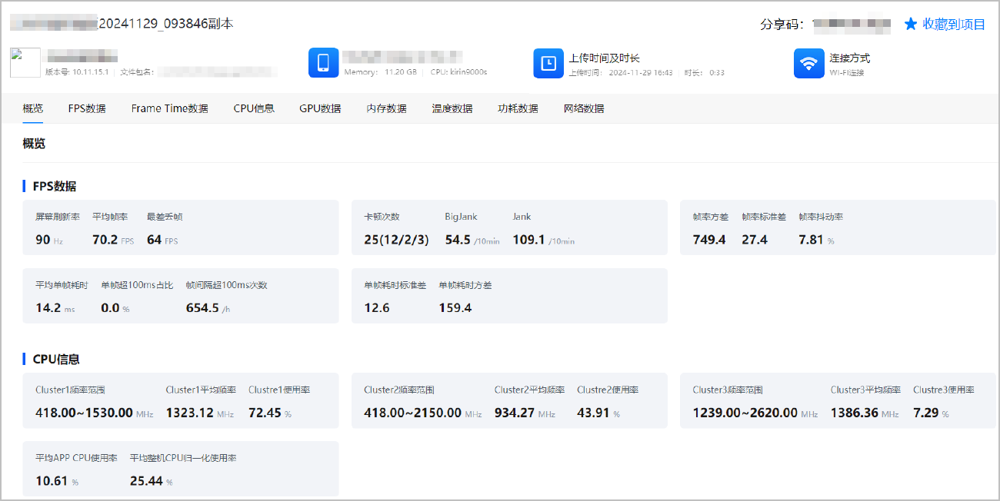
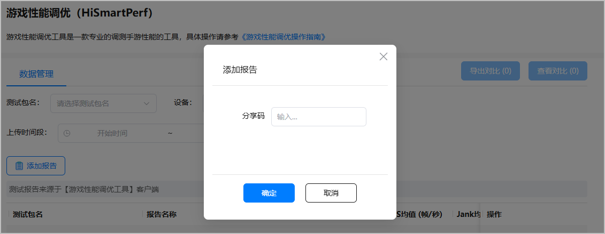

工具支持在本地或云端分享测试报告。

报告必须[上传](/docs/dev/game-dev/games-hismartperf-cloudview-0000002321404213#section1365144213172)后才能分享。

1. 在数据报告列表中，选择对应的测试报告，点击分享。
   * 本地分享

     
   * 云端分享

     
2. 在“分享设置”弹窗中选择“开启分享”，则非团队成员无需登录账号可通过二维码、网址链接访问该测试报告，其他团队账号可通过“分享码”访问该测试报告。

   

   若选择“关闭分享”，非团队成员无法访问该测试报告，可通过邀请其加入团队后查看此报告。

   
3. 如获取到其他团队分享的二维码或网址，可直接扫描二维码或点击网址查看测试报告。报告为html格式，用户点击链接后在浏览器中打开，与云端界面一致，不支持前进、后退、收藏等操作 。

   

   在测试报告被设置关闭分享后，则无法再通过分享过的二维码、网址继续查看。

   
4. 如获取到其他团队发送的分享码，可点击“添加报告”，输入“分享码”并点击“确定”，将测试报告导入到列表后查看。

   

   在测试报告被设置为关闭分享后，可继续查看已导入的报告，如取消导入则无法再通过分享码继续查看。

   
