## FPS数据

FPS（Frames Per Second）即每秒能显示的画面数量，用以衡量游戏画面的流畅度，帧率越高，流畅度越高。

### 总览

在“测试总览”栏查看FPS总览数据。

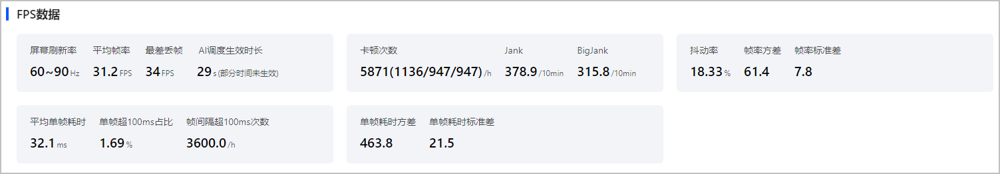

| 数据指标 | 单位 | 含义 | 说明 |
| --- | --- | --- | --- |
| 屏幕刷新率 | Hz | 游戏画面在测试过程中采集的刷新次数范围。 | - |
| 平均帧率 | FPS | 游戏画面在采集过程中平均每秒显示的帧数。 | 建议尽量达到屏幕刷新率。 |
| 最差丢帧 | FPS | 最差丢帧=满帧-最低帧率。 | 数值越低越好。 |
| AI调度生效时长 | s | 采集过程中AI调度的生效时长。 | - |
| 卡顿次数（小卡顿/中卡顿/大卡顿） | 次/h | 平均每小时内出现的卡顿次数。（卡顿次数=小卡顿数+2\*中卡顿数+3\*大卡顿数。） | 数值越低越好。 |
| BigJank | 次 | 平均每10分钟出现严重卡顿的次数。 | 数值越低越好。 |
| Jank | 次 | 平均每10分钟出现卡顿的次数。 | 数值越低越好。 |
| 抖动率 | - | 一段时间内帧率的变化程度。 | 数值越低越好。 |
| 帧率方差 | - | 一段时间内帧率的方差。 | 数值越低越好。 |
| 帧率标准差 | - | 一段时间内帧率的标准差。 | 数值越低越好。 |
| 平均单帧耗时 | ms | 一段时间内的单帧平均耗时。 | 数值越低越好。 |
| 单帧超100ms占比 | - | 帧耗时大于等于100ms的占比。 | 数值越低越好。 |
| 帧间隔超100ms次数 | 次 | 平均每小时内连续两帧之间超过100ms的次数。 | 数值越低越好。 |
| 单帧耗时方差 | - | 一段时间内的帧耗时方差。 | 数值越低越好。 |
| 单帧耗时标准差 | - | 一段时间内的帧耗时标准差。 | 数值越低越好。 |

### 详情

在“测试详情”栏查看FPS详细数据。

* FPS

  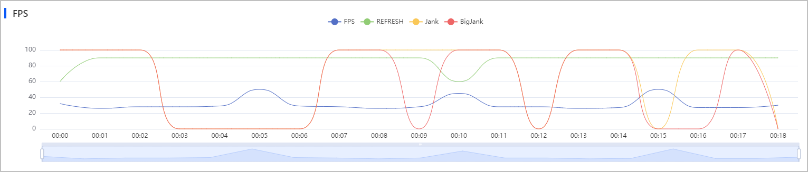

  + 观察fps数据指标的整体情况。若数据普遍偏低，您需要优化游戏的整体性能。若出现较大波动、或某一点波动较大，您需要复现、分析、解决问题。
  + 观察jank/big\_jank的整体情况。若数据普遍偏高，您需要优化游戏的整体性能。
* Frame Time

  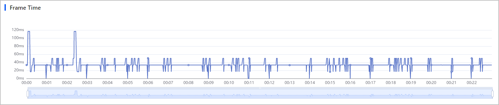

  Frame Time指帧时间，平均帧时间越短，流畅度越高。观察Frame Time的整体数据，您需在花费帧时间较长的游戏场景处优化代码，或调整游戏画面质量。

## CPU数据

衡量游戏占用CPU资源的情况。程序占用过多的CPU资源会出现芯片发烫的现象，手机因此会强制控温降频，这会导致操作游戏画面十分卡顿。

### 总览

在“测试总览”栏查看CPU总览数据。

* CPU信息

  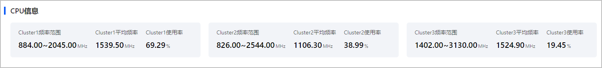

  | 数据指标 | 单位 | 含义 |
  | --- | --- | --- |
  | Cluster频率范围 | MHz | 各CPU能达到的实际频率范围。 |
  | Cluster平均频率 | MHz | 各CPU实际工作频率的平均值。 |
  | Cluster使用率 | - | 各Cluster内所有CPU核使用率的平均值。 |

* CPU使用率

  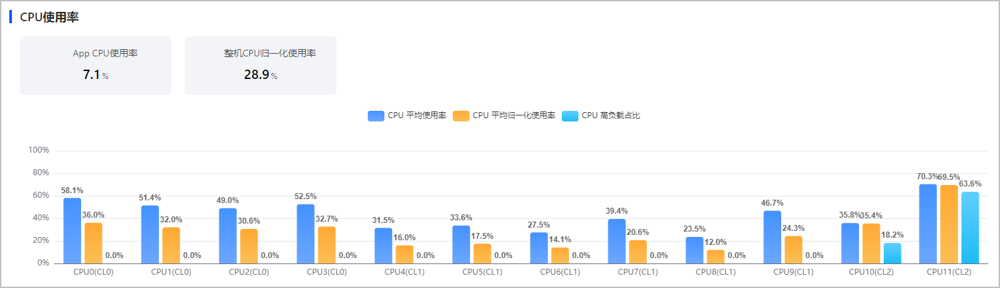

  | 数据指标 | 单位 | 含义 | 说明 |
  | --- | --- | --- | --- |
  | 平均App CPU使用率 | - | CPU执行应用程序时所占用的平均时间。 | 数值越低越好。 |
  | 平均整机CPU归一化使用率 | - | CPU的使用率进行归一化处理后的平均值。 | 数值越低越好。 |

  图表中的CL0表示Cluster0，以此类推。

  + 观察各CPU平均使用率，若存在平均使用率超过70%的CPU，建议有针对性地优化该CPU的调用程序。
  + CPU平均归一化使用率数值越低功耗越低，CPU综合负载越低。
  + CPU高负载占比是指CPU使用率超过70%的时间占比。观察各CPU的高负载占比，若存在高负载占比较大的CPU，建议有针对性地优化该CPU的调用程序。

### 详情

在“测试详情”栏查看CPU详细数据。

* CPU频率

  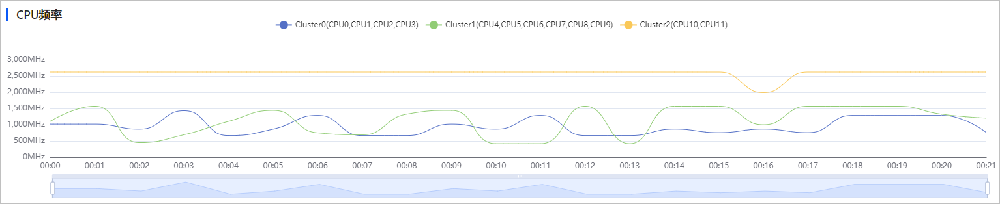

  CPU频率表示CPU运行时的繁忙程度，频率越高越繁忙，需观察各CPU频率的波动情况。若出现长时间频率波动较大的现象，建议按照时间点去复现问题，再排查各CPU问题。
* CPU使用率

  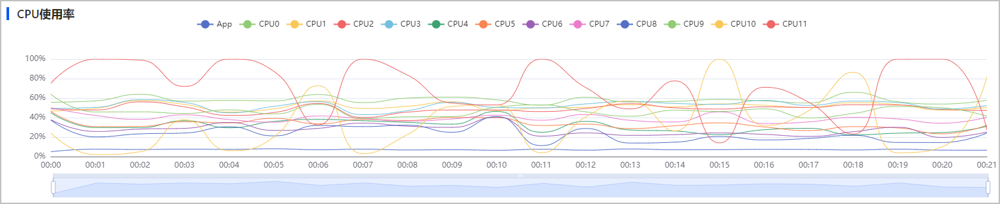

  观察当前被测试应用的CPU使用率，以及手机设备中所有程序在各CPU的工作负载情况。若有使用率长时间超过70%的CPU，建议优化该CPU的调用程序。
* CPU归一化使用率

  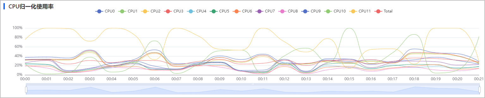

  CPU归一化处理是为了获取不同CPU的核心使用率。按照如下计算公式归一化处理即可获取单核/整个CPU的核心使用率，以便对比和分析CPU的核心使用率：

  + 单核CPU归一化使用率= （i表示CPU核数）
  + CPU整体归一化使用率= （n表示CPU总核数，i表示CPU某核）

  若CPU的核心使用率长时间超过70%，建议优化该CPU的调用程序。

## GPU数据

衡量游戏占用GPU资源的情况。程序占用过多的GPU会出现芯片发烫的现象，此时手机会强制控温降频，这会导致操作游戏画面十分卡顿。

### 总览

在“测试总览”栏查看GPU总览数据。

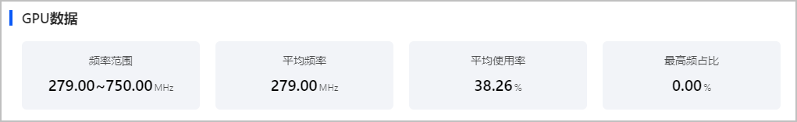

| 数据指标 | 单位 | 含义 | 说明 |
| --- | --- | --- | --- |
| 频率范围 | MHz | GPU能达到的实际频率范围。 | - |
| 平均频率 | MHz | GPU实际工作频率的平均值。 | - |
| 平均使用率 | - | 采集过程中GPU的平均使用率。 | 建议GPU的使用率不要长时间超过70%。 |
| 最高频占比 | - | 采集过程中频率达到GPU可达到的最高频的时间占比。 | 占比越低越好。 |

### 详情

在“测试详情”栏查看GPU详细数据。

* GPU频率&使用率

  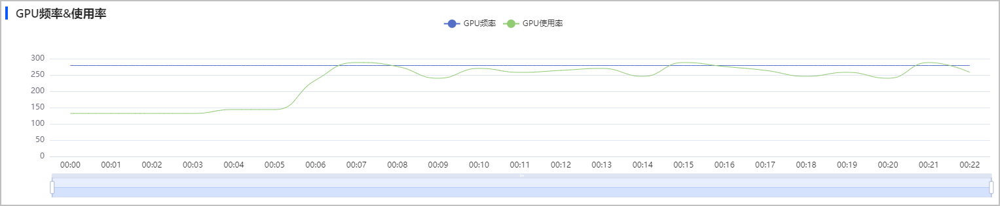

  + 观察GPU频率波动。若存在长时间接近最大频率的现象，建议复现、分析、优化该区间的游戏问题。
  + 观察GPU的使用率。若存在使用率超过70%的时间段，建议调整该区间内的GPU使用情况。

## 内存数据

衡量游戏的内存占比情况。建议分别测试程序空闲时、操作时间较短时、操作时间较长时的内存开销。

### 总览

在“测试总览”栏查看内存总览数据。

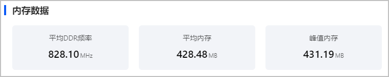

| 数据指标 | 单位 | 说明 |
| --- | --- | --- |
| 平均DDR频率 | MHz | 采集过程中内存工作频率的平均值。 |
| 平均内存 | MB | 采集过程中使用的平均内存空间。 |
| 峰值内存 | MB | 采集过程中使用的最大的内存空间。 |

### 详情

在“测试详情”栏查看内存详细数据。

* DDR频率

  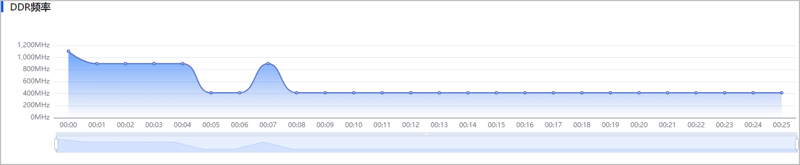

  观察内存的频率波动。若出现长时间高频率的工作，认为程序的内存消耗存在隐患，应优化内存的调用情况。
* 内存使用

  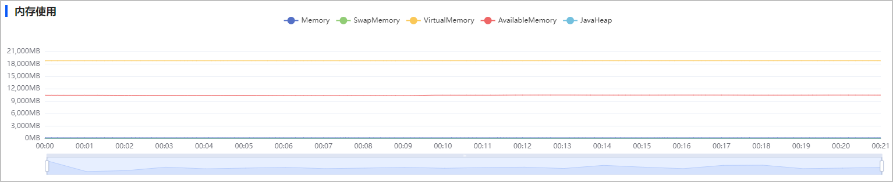

  

  + HarmonyOS 5.0及以上游戏不支持采集**JavaHeap**数据项。
  + 图表中的Memory是指游戏的PSS内存。

  + 游戏体量应与内存开销成正比。先了解同类型程序的内存开销情况，若当前偏离正常使用范围，需重新审视程序。
  + 观察内存数据波动。允许刚进入游戏时，出现大幅度上升，但若内存使用总量长时间只升不降，可能出现内存泄露的问题，您需要检查内存的申请、释放情况。

## 温度数据

监测游戏运行过程中的设备温度，异常的温度不仅带来不好的用户体验，还会存在其它安全隐患。若整机温度持续发烫超过**42℃**（不同设备可能略有差异），设备会强制进行控温降频。

### 总览

在“测试总览”栏查看温度总览数据。

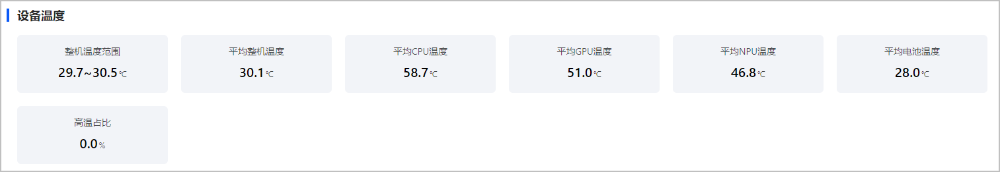

| 数据指标 | 单位 | 含义 | 说明 |
| --- | --- | --- | --- |
| 整机温度范围 | ℃ | 采集过程中设备温度的波动情况。 | 建议低于42℃。 |
| 平均整机温度 | ℃ | 采集过程中设备温度的平均值。 | 越低越好。 |
| 平均CPU温度 | ℃ | 采集过程中CPU温度的平均值。 | 越低越好。 |
| 平均GPU温度 | ℃ | 采集过程中GPU温度的平均值。 | 越低越好。 |
| 平均NPU温度 | ℃ | 采集过程中NPU温度的平均值。 | 越低越好。 |
| 平均电池温度 | ℃ | 采集过程中电池温度的平均值。 | 越低越好。 |
| 高温占比 | - | 设备超过42℃的时间占比。 | 占比越低越好。 |

### 详情

在“测试详情”栏查看温度详细数据。

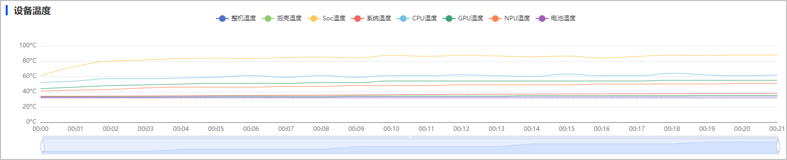

* 观察整机温度。若整机温度长时间超过42℃，需复现之前采集过程中的游戏操作，分析并解决问题。
* 观察其它部件温度，若长时间处在高温下，需结合同时间段内CPU、GPU的频率、使用率共同定位问题。

## 功耗数据

监测游戏运行中的功耗。

### 总览

在“测试总览”栏查看功耗总览数据。

* 功耗数据

  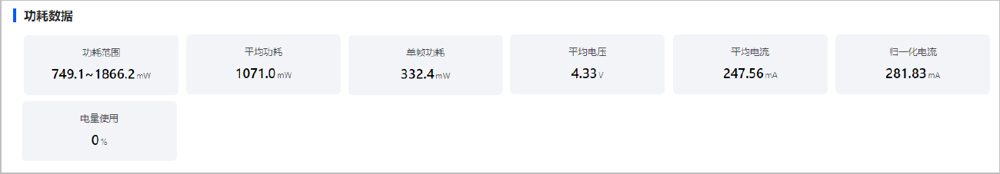

  | 数据指标 | 单位 | 含义 | 说明 |
  | --- | --- | --- | --- |
  | 功耗范围 | mW | 实际功耗的范围 | 电量消耗越低越好 |
  | 平均功耗 | mW | 实际功耗的平均值 | - |
  | 单帧功耗 | mW | 单帧的实际功耗，公式：平均功耗/平均帧率=单帧功耗 | - |
  | 平均电压 | V | 实时电压平均值。 | 越稳定越好。 |
  | 平均电流 | mA | 实时电流平均值。 | 越小越好。 |
  | 归一化电流 | mA | 3.8V电压下电流的使用情况。 | - |
  | 电量使用 | - | 手机消耗的电量 | 负值表示电量提升（例如正在充电） |
* 功耗拆解-拟合

  监测整机功耗状况，同时展示器件耗电排名，耗电占比前30的应用。若出现较耗电的器件，建议优化对应的进程。除当前测试游戏外，若出现耗电超过50%的应用，建议下次采集数据前先终止运行该应用。

  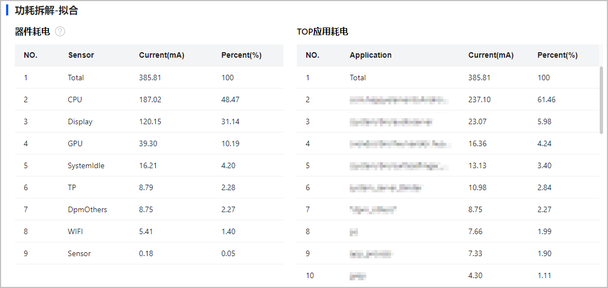

### 详情

在“测试详情”栏查看功耗详细数据。

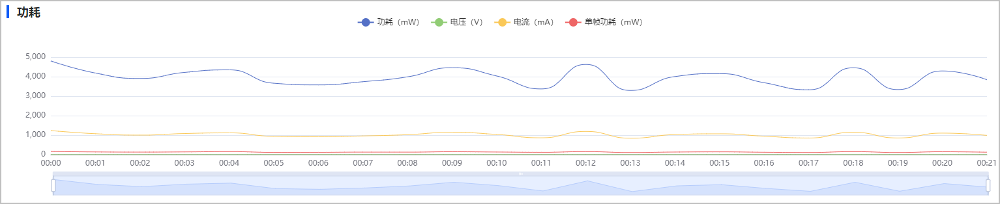

* 观察功耗波动。若功耗明显偏低或出现负值，有可能正在充电，若长时间电量消耗较多，建议优化耗电量较大的线程。
* 观察电压/电流数据。若电压数值不稳定，建议检查设备或换手机设备重新采集数据。若电流数据偏大，建议优化游戏程序。

## 网络数据

监测游戏运行过程中的网络带宽。

### 总览

在“测试总览”栏查看带宽总览数据。

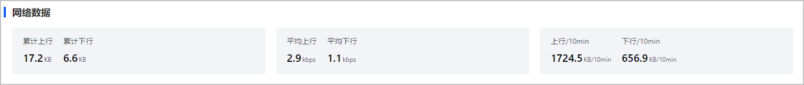

| 数据指标 | 单位 | 说明 |
| --- | --- | --- |
| 累计上行 | KB | 上传带宽累计之和。 |
| 累计下行 | KB | 下载带宽累计之和。 |
| 平均上行 | kbps | 游戏上传带宽。 |
| 平均下行 | kbps | 游戏下载带宽。 |
| 上行/10min | KB/10min | 10分钟内上传带宽之和。 |
| 下行/10min | KB/10min | 10分钟内下载带宽之和。 |

### 详情

在“测试详情”栏查看带宽详细数据。

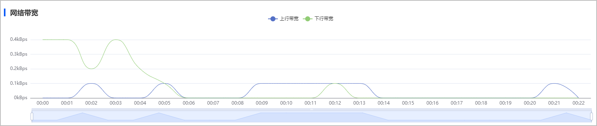

观察带宽波动，若出现较大幅度的波动，即发生了突发的大流量，建议复现、分析、解决游戏问题。
