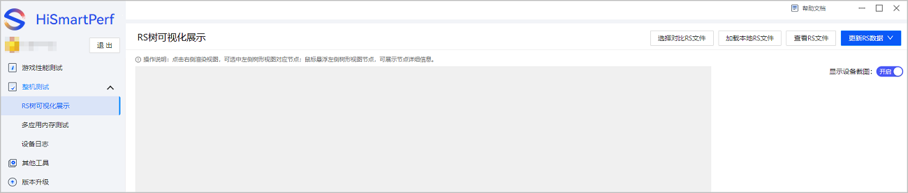
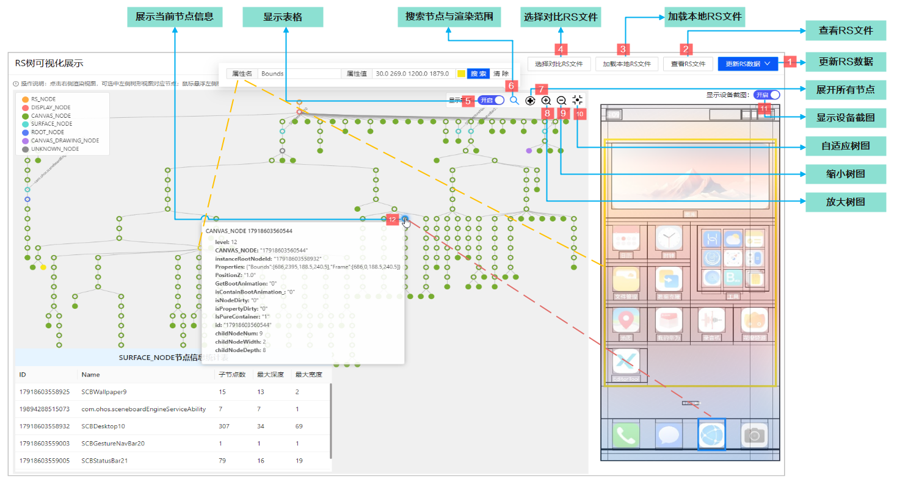
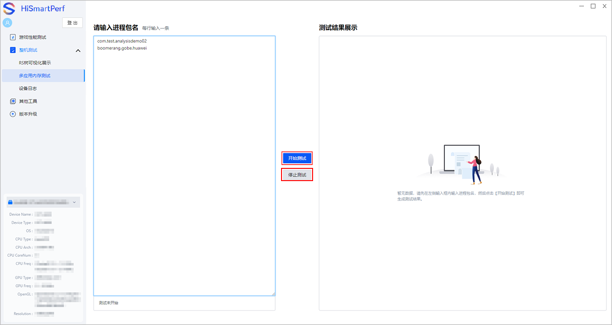
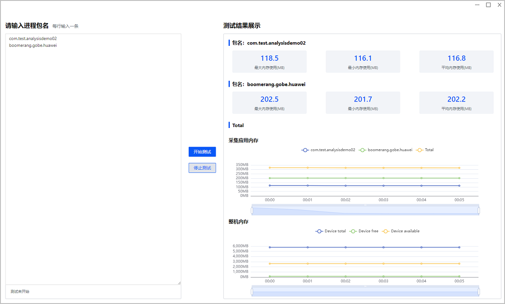
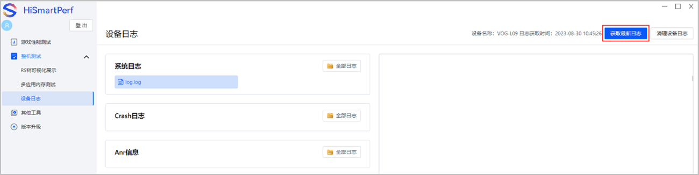
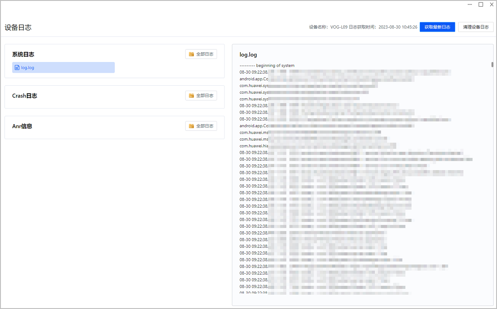
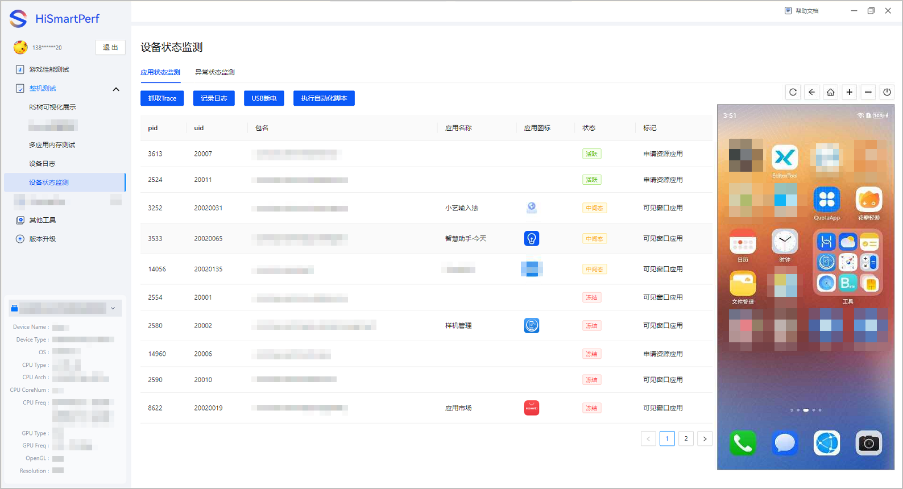
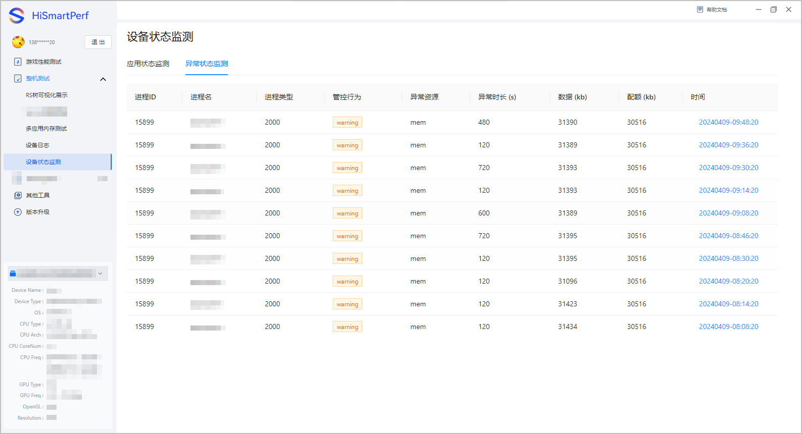

[RS树可视化展示](#section182307571364)、[多应用内存测试](#section11284462518)、[设备日志查看](#section51161733666)和[设备状态监测](#section12659161475117)功能，可帮助您进一步进行整机测试，定位图形渲染、内存占用等问题。

## 可视化展示RS树

RS树可视化展示功能，可以帮助您直观地了解渲染树结构以及各节点属性，方便您进行问题定位与应用调试。

1. 在主界面左侧选择“整机测试 &gt; RS树可视化展示”，进入RS树可视化展示页面。

   
2. 根据可视化展示需要，执行对应操作。

   

## 采集多应用内存数据

1. 在设备中分别打开对应的应用，同时确保打开的多个应用可以在后台**稳定地运行**。

   

   建议单次测试内存的手机应用不超过**5**个。
2. 打开性能调优工具，在主界面左侧菜单选择“整机测试 &gt; 多应用内存测试”。
3. 在左侧框中填写手机中已打开的**应用包名**，完成后点击中间的“开始测试”。测试过程中，您可以有针对性的操作应用的使用场景，例如常用功能模块，典型游戏场景。若想停止测试，点击中间的“停止测试”。

   

   建议内存测试时间不超过**30分钟**。

   
4. 停止测试后，您可在右侧框中查看应用内存的使用概况。

   

## 查看设备日志

您可以在HiSmartPerf-Editor工具中查看到已连接设备的日志信息，包含系统日志、Crash日志以及Anr信息。

1. 在主界面左侧选择“设备日志”进入日志列表页面，点击右上角“获取最新日志”，获取设备最新日志数据。

   
2. 在左侧列表中，您可查看已获取的“系统日志”、“Crash日志”及“Anr信息”相关文件。

   

## 设备状态监测

设备状态监测是在设备上启动多个应用时，查看处于活跃状态的应用个数，活跃状态是指应用正在运行且处于前台界面，这种状态的应用可以随时响应用户的操作，并在屏幕上及时反馈对应的信息。

### 应用状态监测

支持通过抓取trace、记录日志、USB断电、执行自动化脚本方式监测设备上应用的活跃状态。

### 异常状态监测

支持监测设备上出现Crash日志的应用。

