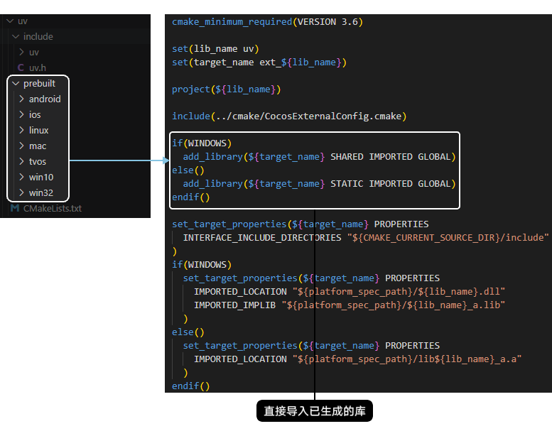
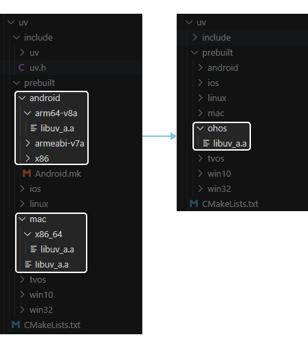

三方库一般是软件作者为了发布方便、替换方便或者二次开发的目的，而发布的一组可以单独于应用程序进行compile time或者runtime链接的二进制可重定位目标码文件。从本质上来说库是一种可执行代码的二进制形式，由于不同操作系统的本质不同，因此库的二进制是不兼容的。因此需要针对不同的操作系统对三方库进行编译。

## 三方库编译方式

三方库集成编译主要有两种方式：源码集成和库文件集成方式。下面举例说明这两种编译方式的差异。

### 源码集成方式

### 库文件集成方式

您可以通过三方库文件的CMakeLists.txt中add\_library方式区分集成方式，也可简单地通过目录来进行判定。

若三方库中使用不同平台文件夹来存放平台编译好的库文件即为库文件集成方式。库文件集成方式需将三方库使用HarmonyOS NDK进行编译，编译好后添加HarmonyOS目录，将库文件放到HarmonyOS目录下，如下图所示。

## 编译指导

* 源码集成方式

  DevEco Studio使用CMake构建工具，您可参考[CMake相关语法](https://cmake.org/cmake/help/latest/index.html)自行完成源码的集成。
* 库文件集成方式

  HarmonyOS 5.0及以上系统的三方库编译使用OHOS NDK进行编译，具体请参见[OHOS NDK使用指导](/docs/dev/ndk-dev/ndk-development-overview)，其中包括编译CMake构建的库、编译非CMake构建的库和编译有依赖的库相关指导。

  游戏工程编译完成后，将编译好的三方库文件复制到游戏工程对应目录即可。

  

  为协助您提升适配HarmonyOS 5.0及以上系统的效率，当前已提供了为HarmonyOS 5.0及以上系统快速编译、验证以及长期维护 的C/C++开源库：[HPKBUILD build script](https://gitee.com/han_jin_fei/lycium?_from=gitee_search)。您可以选择性地使用该开源项目。该项目下main目录包含目前已经进行HarmonyOS 5.0及以上系统的适配的各个开源三方库相关编译脚本，每个开源三方库编译脚本都在一个独立的目录中，其中包含：构建描述文件（HPKBUILD）、用于校验官方源码压缩包的校验值（SHA512SUM）。部分三方库由于平台差异问题，已做patch处理，故有些三方库目录下会有patch文件，详情可参考libzip目录。
