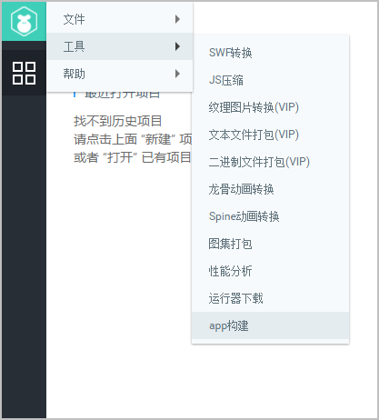
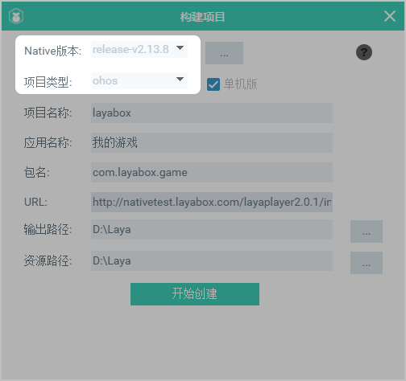
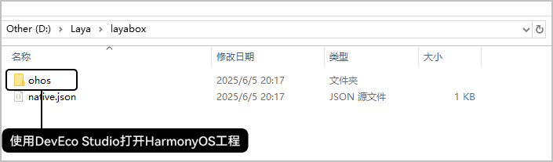
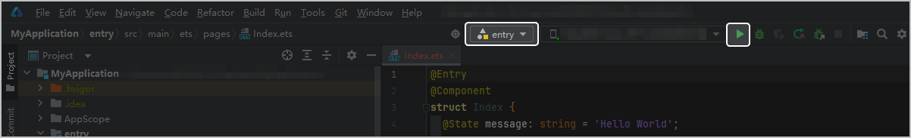

以Laya2.0为例打包构建HarmonyOS 5.0及以上工程：

* 打开LayaAir IDE &gt; 点击左上角LOGO图标 &gt; 工具 &gt; app构建，如图所示：

  
* 在构建项目配置界面选择最新的Native版本（当前2.13.8）、选择项目类型（ohos），如图所示：

  

* 配置完成后点击开始创建可在指定的输出路径输出HarmonyOS 5.0及以上工程项目，如图所示：

  
* 使用DevEco Studio工具打开并连接设备构建hap/app运行，如图所示：

  
