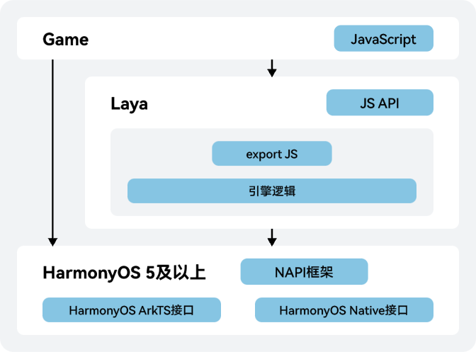

由于HarmonyOS 5.0及以上系统使用的协议栈和其他系统的协议栈不同，因此游戏原有的系统适配方法在HarmonyOS 5.0及以上系统可能不支持，需要根据当前游戏实际使用情况进行适配。游戏业务逻辑调用HarmonyOS 5.0及以上系统接口的原理如下图所示。



当前HarmonyOS 5.0及以上系统提供的系统接口主要包括如下两类：

* HarmonyOS Native接口 ：游戏替换相关能力时直接使用C/C++调用HarmonyOS 5.0及以上系统接口即可。Native API参考请参见[Native API参考](https://developer.huawei.com/consumer/cn/doc/harmonyos-references/capi-native-bundle)。
* HarmonyOS ArkTS接口：游戏替换相关能力时需要通过[Node-API框架](/docs/dev/ndk-dev/napi-introduction)进行C/C++和JS的相互调用。ArkTS API参考请参见[ArkTS API参考](https://developer.huawei.com/consumer/cn/doc/harmonyos-references/js-apis-app-ability-ability)。

## 游戏与ArkTS接口交互


仅Laya1和Laya2支持下述的反射通信，Laya3不支持，Laya3的反射通信请参见[原生语言与JavaScript通信](https://www.layaair.com/3.x/doc/released/native/platform_communication/readme.html)。

1. 在HarmonyOS 5.0及以上的工程中添加ets脚本。
2. 在ets脚本中添加需要调用的静态方法，如下示例代码：

   ```
   // src/main/ets/AccountDemo.ets
   // 初始化
   function gameServiceInit(cb: Function): void {
     // TODO 添加你的实现代码
   }
   // 登录
   function login(cb: Function): void {
     // TODO 添加你的实现代码
   }
   // 导出方法
   export { gameServiceInit, login };
   ```
3. 在模块的build-profile.json5文件中进行配置添加上一步的ets脚本，如下配置代码：

   ```
   // build-profile.json5
   {
     "apiType": 'stageMode',
     "buildOption": {
       "arkOptions": {
         "runtimeOnly": {
           "sources": [
             "./src/main/ets/AccountDemo.ets"
           ]
         }
       },
       ...
     }
   }
   ```
4. 游戏中调用添加到HarmonyOS 5.0及以上工程的静态方法，如下示例会调用之前添加在 AccountDemo.ets中 的静态方法：

   ```
   // 点击登录按钮
   onClickLogin() {
     let bridge = Laya.Browser.window.PlatformClass.createClass("entry/src/main/ets/AccountDemo");
     bridge.callWithBack((result: string) => {
       bridge.callWithBack((result: string) => {
         // TODO 添加你的游戏逻辑
       }, "login");
     }, "gameServiceInit");
   }
   ```
5. 在 ArkTS 代码中主动执行游戏 JS 脚本方法，如下示例会在游戏中执行 alert('hello world')

   ```
   // 导入laya的库文件
   import laya from "liblaya.so";
   function arkTsFunc(): void {
     // 调用laya引擎方法在游戏侧执行JS脚本
     laya.ConchNAPI_RunJS("alert('hello world')");
   }
   export {
     arkTsFunc
   };
   ```
