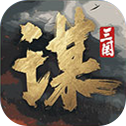

为便利您查看相关激励政策内容，本页面信息根据现有激励政策汇总，详情以该激励政策正式发布的官网公示信息为准；激励政策存在时效性，请您注意及时前往相关页面查看。

鸿蒙游戏生态稳步推进，技术日臻成熟，体验持续精进。

目前，已汇聚一众精品游戏，其中包含覆盖30+品类的人气大作。

|  |  |  |  |  |
| --- | --- | --- | --- | --- |
|   三国：谋定天下 |   开心消消乐 |   三国志·战略版 |   英勇之地 |   神火大陆 |
|   三国杀 |   问道 |   保卫萝卜4 |   地铁跑酷 |   迷你世界 |

现在加入鸿蒙游戏生态，40+款华为终端产品搭载HarmonyOS 5.0及以上，将助力游戏抢占华为全场景分发优势，有效吸引用户流量，打造用户量与收入的新增长曲线。
