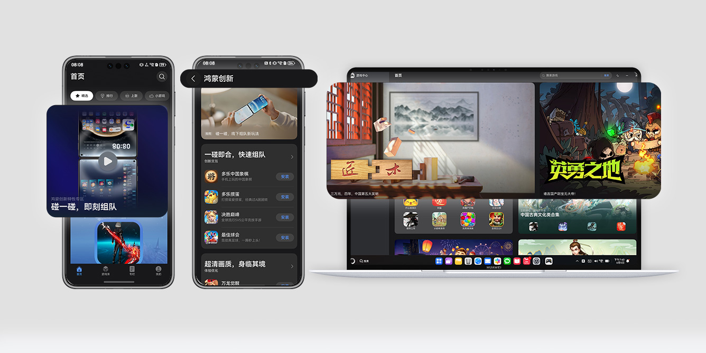

## 一、全场景接入资源政策

有意接入华为全场景的游戏，仅需简单调整手机端包体的配置，使游戏上架后同时适配PC、智慧屏，部分操作类游戏还需适配操控方式。

* 适配PC设备，具体适配方案请参见[适配PC设备](/docs/dev/game-dev/games-adapt-pc-platform-0000002330261222)。
* 适配智慧屏设备，具体适配方案请参见[适配智慧屏设备](/docs/dev/game-dev/games-adapt-tv-platform-0000002411169702)。

对于定制适配并上架多终端设备的游戏，华为平台给予如下支持和推广资源：

* 星携加分：可获得星携VIP加分、技术赋能、货架管理等服务支持。
* 联运推广：HarmonyOS 5.0及以上多终端的游戏中心和应用市场优先推荐，包含首页banner、大卡等推广资源位。
* 营销宣传：有机会在华为终端新品发布会露出和华为线下门店样机预装展示。

## 二、创新能力资源政策

HarmonyOS 5.0及以上提供资源包后台下载、秒级启动、AI超分、AI插帧、游戏场景感知等技术方案，全面优化游戏性能，帮助你的游戏实现快速启动、提升游戏画质与流畅度，为用户打造更优的游戏体验。

### 创新能力

| 分类 | 创新特性 | 说明 |
| --- | --- | --- |
| 桌面渲染 | [创新互动卡片](/docs/dev/game-dev/games-quickgame-interact-card-0000002317894952) | 创新互动卡片聚焦即点即用，解决用户碎片化的娱乐需求，支持玩家在桌面卡片上完成游戏内容的互动，为用户带来更多的创新交互玩法，同时帮助你的游戏抢占用户屏幕，培养用户习惯，打造全新的桌面娱乐新体验。 |
| 多元操控 | [Wear Engine穿戴服务](/docs/dev/app-dev/system/system-hardware/wear-engine-kit-guide) | 借助华为Wear Engine开放能力，让你的游戏实现手机生态应用与穿戴设备间的信息互传，结合体感交互及精准触控，为玩家提供沉浸式的游戏体验。 |
| 近场游戏 | [碰一碰](/docs/dev/game-dev/games-share-0000002284803108) | 两台或多台设备通过“碰一碰”可实现快速组队、分享裂变和近场快传，不同类型游戏可基于游戏内容和玩法设计差异化的接入方案。 |
| [近场快传](/docs/dev/game-dev/games-nearby-0000002255611268) | 近场快传服务基于分布式软总线，实现近距离传输，游戏玩家通过碰一碰可以直接将游戏内资源包分享给附近的好友，节省流量消耗及资源包下载等待时长。 |
| [近场联机](/docs/dev/game-dev/games-quickgame-runtime-game-nearby-playing-0000002351933705) | 华为小游戏基于分布式网络实现设备联机，满足用户在飞机/高铁等无网络环境下有游戏可玩的诉求，当前仅支持RPK小游戏。 |
| 体验提升 | [秒级启动](/docs/dev/app-dev/graphics/graphics-accelerate-kit-guide/graphics-accelerate-launchacceleration-service/graphics-accelerate-mirror-launch) | 基于内存镜像技术，重启后跳过游戏启动初始化阶段，直接进入登录或大厅，实现游戏秒开秒进。 |
| [资源包后台下载](/docs/dev/game-dev/games-resourse-service-0000002252508222) | 基于系统机制，让游戏在未启动时有机会静默下载游戏资源包，减少游戏启动后等待资源下载的时间，解决游戏资源包更新等待时间过长的痛点。 |
| [时域AI超分](/docs/dev/app-dev/graphics/xengine-kit-guide/xengine-kit-ai-temporal-upscaling) | 融合时域实现超采样率和超分辨率功能，并利用神经网络达到抗锯齿效果，提升游戏分辨率。 |
| [AI超帧](/docs/dev/app-dev/graphics/graphics-accelerate-kit-guide/graphics-accelerate-rendering/graphics-accelerate-fg) | 通过AI算法，提升单帧能效，大幅优化画面效果，保证游戏低功耗高帧率稳定运行。 |
| [游戏场景感知](/docs/dev/game-dev/games-gameperformance-0000002287198517) | 基于游戏提供场景信息，软硬件协同智能调度系统资源以达到更精细化的优化匹配效果，协作改善玩家的游戏体验。 |

### 激励政策

游戏如果将游戏内容或玩法与全场景产品软硬件创新特性深度融合创新，同时积极进行游戏服务和方案设计，并配合华为方完成验证、测试、调优，即可获得如下支持和推广资源：

* 专属资源推广：可获得鸿蒙游戏中心和应用市场端内推荐资源，包含精选内容、创新专区、创新标识 、直播推荐和活动推荐等。

  
* 品牌营销宣传：有机会获得发布会露出、媒体宣传、门店合作等营销资源。
* 联运服务支持：可获得VIP加分、技术赋能、货架管理和HGS服务等支持。
