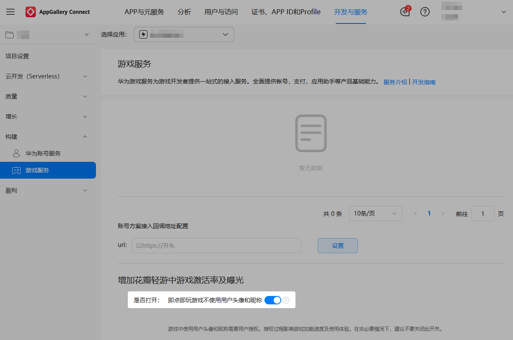
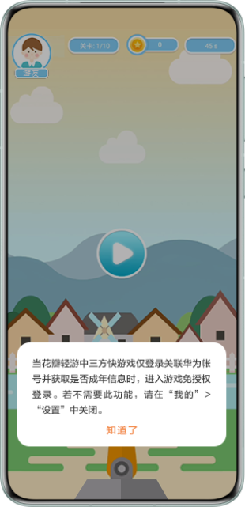
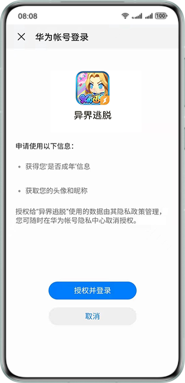

## 配置免授权登录

打开快游戏需授权用户头像和昵称，但授权过程影响游戏的加载速度及玩家的使用体验，您可以为快游戏配置免授权登录，减少快游戏的授权频率，提升玩家的用户体验。

1. 登录[AppGallery Connect](https://developer.huawei.com/consumer/cn/service/josp/agc/index.html)，点击“开发与服务”，在项目卡片列表选择需要配置免授权登录的项目及项目下的快游戏。
2. 选择“构建 &gt; 游戏服务”，在页面右侧配置“即点即玩游戏不使用用户头像和昵称”，即在“花瓣轻游”和“花瓣轻游”客户端打开快游戏是否免授权登录。

   

   * **打开**“即点即玩游戏不使用用户头像和昵称”将免授权登录快游戏。首次打开免授权登录的快游戏会有如下提示，后续玩家再打开快游戏将直接进入游戏界面。

     
   * **关闭**“即点即玩游戏不使用用户头像和昵称”，玩家打开快游戏时均出现如下授权登录页面。

     

     在非必要情况下，建议不要关闭此开关。

     
