## 使用qg.downloadFile下载和解压远程压缩文件失败

**现象描述**

快游戏加载大量资源时，使用qg.downloadFile接口远程下载服务端的zip压缩文件资源，无法正常下载、解压。

**问题分析**

无法正常下载、解压文件可能有如下原因：

1. 调用downloadFile接口时，没有传入filePath，却未获取文件临时存放路径。

   filePath是选填参数，如果调用接口没有传入，文件存放于临时路径，需访问在success回调中获取的临时路径获取文件。
2. 传入的filePath仅仅是一个目录。

   filePath的格式要求为：文件存放路径+文件名称
3. 传入的filePath格式正确，但是传入的文件路径不是用户本地可以读取的路径。

**解决方法**

1. 如果没有传入filePath，通过success回调获取文件的临时存放路径，示例代码如下：

   ```
   success(res) {
           let filePath = res.tempFilePath;
   }
   ```
2. 如果filePath仅设置为目录，需在存放目录后再加上下载文件的文件名。
3. 如果filePath已设置为目录+文件名，确保文件目录是通过qg.env.USER\_DATA\_PATH获取的用户有读写权限的目录。示例代码如下：

   ```
   qg.downloadFile({
           url: "http://127.0.0.1:8080/docs/test.zip",
           filePath:qg.env.USER_DATA_PATH +"/sdcard/Pictures/Screenshots/test.zip",
           success() {
                   console.log("success");
           },
           fail(e) {
                   console.error(e.errMsg);
           },
           complete() {
                   console.log("complete");
           }
   });
   ```
4. 成功获取文件后，使用qg.getFileSystemManager.unzip(Object object)接口进行解压，示例代码如下：

   ```
   var filePath = res.filePath        //获取的下载后的zip文件
   var fileSystemManager = qg.getFileSystemManager();
   fileSystemManager.unzip({
           zipFilePath: filePath,
           targetPath: qg.env.USER_DATA_PATH +"/test",
                   success(res) {
                           console.log("unzip success!");
                   },
                   fail(e) {
                           console.log("unzip fail :", e.errMsg);
                   }
   });
   ```

## laya游戏打包成华为快游戏无法满屏

**现象描述**

laya游戏打包成华为快游戏后，出现游戏屏幕无法满屏的情况，如下图所示：

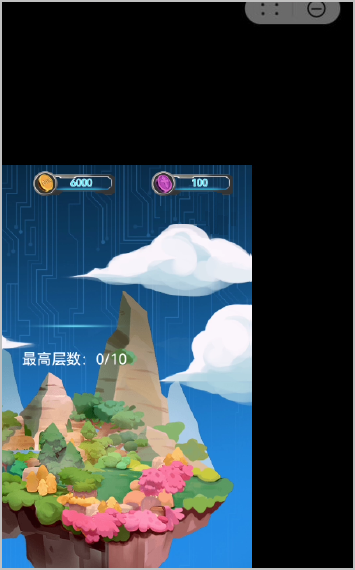

**问题分析**

出现此问题一般可能是打包前没有修改屏幕适配的代码，或者采用的适配方式没有根据屏幕灵活修改。

**解决方法**

首先确认当前游戏的屏幕设计模式scaleMode，一般打包前需要针对不同模式做一些全屏适配的操作。当前主流设计模式有exactfit，fixedwidth，fixedheight三种。

* exactfit：强行拉伸全屏模式，该模式下，画布宽高与舞台宽高会等于游戏设计宽高。完全不考虑设计时比例强行缩放至逻辑宽高全屏。该模式简单来说，不需要开发者做额外适配，能保证在任何机型下都可以全屏显示。缺点是当手机物理宽高与设计宽高比例不同时，会拉伸变形。
* fixedwidth：保宽适配模式，适用于竖屏游戏。画布宽和舞台宽会等于设计宽。但画布高和舞台高会按照物理宽与设计宽比例进行缩放改变。由于宽度是完全等比显示的，开发者只需要调整高度，可以通过相对布局的属性（top和bottom），把背景拉到全屏显示。
* fixedheight：保高适配模式，适用于横屏游戏。画布高和舞台高等于设计高。画布宽和舞台宽会按照物理高与设计高的比例进行缩放后改变。由于高度是完全等比显示的，开发者只需要调整宽度，可以通过相对布局的属性（left和right），把背景拉到全屏显示。

针对以上几种scaleMode，打包华为快游戏时，针对不同的laya版本分别有不同的屏幕适配方法。

* **laya.1.x**

  在huawei-adapter.js中提供了适配方法，开发者只需要引入huawei-adapter.js，然后在游戏入口处code.js文件中Laya.init后面添加屏幕适配代码，重新定义游戏舞台和设计宽高。

  ```
  window.getAdapterInfo = function (config) {
      let scaleX = 1;
      let scaleY = 1;
      let vw = window.innerWidth;
      let vh = window.innerHeight;
      let w = config.width;
      let h = config.height;
      config.scaleMode = config.scaleMode.toLowerCase();
      switch (config.scaleMode) {
          case "exactfit":
              scaleX = vw / w;
              scaleY = vh / h;
              break;
          case "fixedwidth":
              scaleX = scaleY = vw / w;
              break;
      }
      return {
          scaleX: scaleX,
          scaleY: scaleY,
          w: w,
          h: h,
          vw: vw,
          vh: vh,
          rw: w * scaleX,
          rh: h * scaleY
      };
  };
  Laya.init(600, 400, WebGL);// 600 400 需要修改成游戏的设计尺寸
  Laya.stage.scaleMode = "exactfit";//exactfit只是示例值，需要修改为本身游戏中的值
  //屏幕适配
  if(typeof getAdapterInfo !== "undefined"){
     var stage = Laya.stage;
     var info = getAdapterInfo({width:600, height:400, scaleMode:"exactfit"});// 600 400 需要修改成游戏的设计尺寸
     stage.designWidth = info.w;
     stage.designHeight = info.h;
     stage.width = info.rw;
     stage.height = info.rh;
     stage.scale(info.scaleX, info.scaleY);
   }
  //屏幕适配结束
  ```
* **laya.2.0~laya2.8.0**

  在bundle.js文件中程序入口后面添加屏幕适配代码，示例代码如下：

  ```
  //程序入口
  //根据IDE设置初始化引擎
  if (window["Laya3D"]) Laya3D.init(GameConfig.width, GameConfig.height);
  else Laya.init(GameConfig.width, GameConfig.height, Laya["WebGL"]);
  Laya["Physics"] && Laya["Physics"].enable();
  Laya["DebugPanel"] && Laya["DebugPanel"].enable();
  Laya.stage.scaleMode = GameConfig.scaleMode;
  Laya.stage.screenMode = GameConfig.screenMode;
  Laya.stage.alignV = GameConfig.alignV;
  Laya.stage.alignH = GameConfig.alignH;
  //屏幕适配
  if (typeof getAdapterInfo !== "undefined") {
  var stage = Laya.stage;
  var info = getAdapterInfo({ width: GameConfig.width, height: GameConfig.height, scaleMode: GameConfig.scaleMode });
    //注意：其中 GameConfig.width 和 GameConfig.height 为该demo中设置游戏的宽和高，请根据实际项目填写
  stage.designWidth = info.w;
  stage.designHeight = info.h;
  stage.width = info.rw;
  stage.height = info.rh;
  stage.scale(info.scaleX, info.scaleY);
  }
  //屏幕适配结束
  ```

如果以上方式都无法适配游戏屏幕，在laya2.0以上版本可以通过开启视网膜画布适配方式来调整游戏屏幕适配，示例代码如下：

```
//程序入口
//根据IDE设置初始化引擎
if (window["Laya3D"]) Laya3D.init(GameConfig.width, GameConfig.height);
else Laya.init(GameConfig.width, GameConfig.height, Laya["WebGL"]);
Laya["Physics"] && Laya["Physics"].enable();
Laya["DebugPanel"] && Laya["DebugPanel"].enable();
Laya.stage.scaleMode = GameConfig.scaleMode;
Laya.stage.screenMode = GameConfig.screenMode;
Laya.stage.alignV = GameConfig.alignV;
Laya.stage.alignH = GameConfig.alignH;
//屏幕适配
if(typeof qg !== 'undefined'){
    Laya.stage.useRetinalCanvas = true;
}
//屏幕适配结束
```

适配后，游戏正常全屏的效果如下：

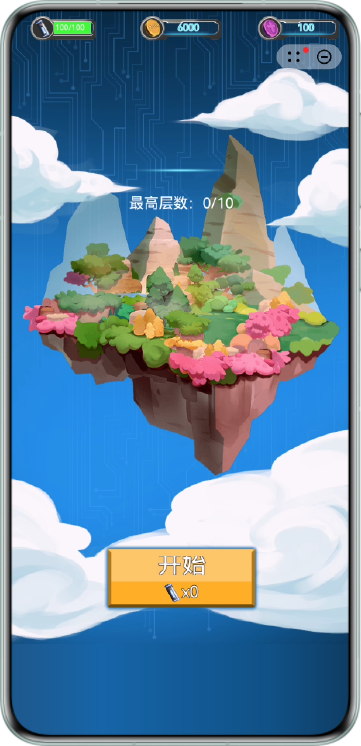

## 不同手机上使快游戏的Banner广告始终在手机最下方展示

1. 设置manifest.json文件中minPlatformVersion为1078及以上版本。

   ```
   "minPlatformVersion": 1078
   ```
2. 创建banner广告的方法如下：

   ```
   let bannerAd = qg.createBannerAd({
     adUnitId: 'testw6vs28auh3',
     style:{
       top:20,
       left:20,
       height:57,
       width:360
     }
   })
   ```

   其中width和height是广告图片本身的宽度与高度，单位dp，该值一般是固定且提前可以获取。top和left是banner广告左上角的坐标，是需要动态设置的值。

   由于每个手机自身的屏幕尺寸和分辨率大小不同，所以需要使用getSystemInfoSync获取当前手机屏幕的高度和宽度。

   通过qg.getSystemInfoSync接口获取safeArea，safeArea是object对象，safeArea.height是手机高度，数值大小是以dp为单位，正好和广告高度单位匹配，使用safeArea.height减去广告高度就等于要设置的top值。

   详细代码如下：

   ```
   createBannerAd() {
     //获取手机详细参数
     var sysInfo = qg.getSystemInfoSync();
     console.log("on getSystemInfoSync: success =" + JSON.stringify(sysInfo));
     //获取当前手机屏幕高度(dp)
     let bannerTop = sysInfo.safeArea.height
     let bannerAd = qg.createBannerAd({
       adUnitId: 'testw6vs28auh3',
       style:{
      //top需要手机屏幕高度减去广告本身高度
         top:bannerTop-57
         left:0,
         height:57,
         width:360
       }
     });
     setTimeout(function () {
              bannerAd.show()
           }, 1000);
   }
   ```

使用3.2.1.300及以上版本的华为快应用加载器运行，最终效果图如下：

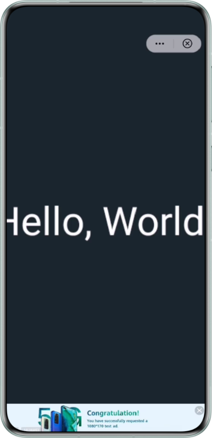

## 华为快游戏分包报错，提示“run root entry script error”或“can not find root script”

**现象描述**

快游戏调用qg.loadSubpackage接口下载rpk中的分包时报错，提示“run root entry script error”或“can not find root script”。

**问题分析**

1. 看分包路径：分包路径从当前工程根目录开始算起，例如您的分包在根目录下的文件夹A中，则该分包的resource应声明为："resource":"A"。检查分包代码中路径正确。
2. 看分包要求：分包要求对应分包固定加载resource指定目录下的game.js（分包入口文件，必须存在）。检查发现，是game.js有问题导致的上述报错。

**解决方法**

请排查以下几点：

1. 对应分包下的game.js必须存在，并且是可执行的。
2. game.js内容不能为空，否则分包下载时会进入失败回调，提示“run root entry script error”。
3. game.js代码编译不能出错，否则分包下载时会进入失败回调，提示“can not find root script”。

## 华为快游戏分包无进度条回调

**现象描述**

快游戏调用qg.loadSubpackage接口下载rpk中的分包后，调用onprogress监听下载进度，发现无法打印onprogress回调进度。引擎日志信息如下所示：

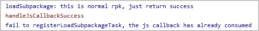

**问题分析**

关于分包无进度条回调，有以下三种情况：

1. 本地rpk未分包。

   如果manifest.json文件中没有声明subpackages字段，说明rpk未分包。则无分包下载过程，无进度条回调。
2. 本地rpk分包，在本地加载器运行。

   本地rpk没有拆包过程，分包代码存在于完整的rpk软件包中，无需进行分包下载，所以无进度条回调。
3. 本地rpk分包，上架后，由华为服务器根据rpk的manifest配置，拆成一个主包和多个分包。

   玩家在快应用中心首次打开的是rpk的主包，进入应用主界面。当进入不同场景时，会触发分包场景，下载当前场景对应的分包代码。

   如果单个分包过小，网络环境良好时下载速度过快，在onProgressUpdate接口未回调成功前就下载完成，则不会触发进度条回调。

**解决方法**

按照[要求](https://developer.huawei.com/consumer/cn/doc/games-guides/games-quickgame-subpackage-0000002317894828)分包，上架后由华为服务器进行拆包，且单个分包足够大（建议在1mb以上），则会正常触发进度条回调。引擎日志信息如下所示：

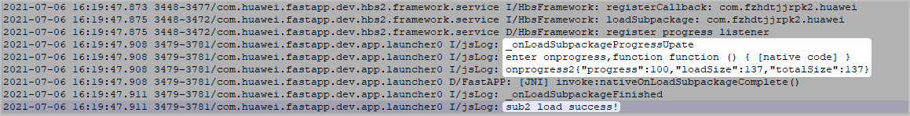

## 调用obtainOwnedPurchases返回为空

**现象描述**

在测试华为托管支付接口时，已成功购买，但是调用obtainOwnedPurchases查询已购商品信息时，返回结果中inAppPurchaseDataList参数为空，没有购买信息。

问题代码如下：

```
function obtainOwnedPurchases (){
var priceType = document.getElementById("priceType")
    var params = { ownedPurchasesReq: {"priceType": 0,"applicationID": "100798021",
    "publicKey":"XXX"}}
    HwFastappObject.obtainOwnedPurchases(JSON.stringify(params));
}
```

接口返回信息如下：

onObtainOwnedPurchasesResult:\&#123;"code":0,"data":"&#123;\"returnCode\":0,\"inAppSignature\":[],\"inAppPurchaseDataList\":[],\"errMsg\":\"success\",\"itemList\":[\"Product1\"]\&#125;"&#125;

**问题分析**

该接口是返回用户已经购买的商品信息，若没有返回，则肯定是入参错误。检查obtainOwnedPurchases接口的参数。

* applicationID是快游戏的appid，这个一般不易弄错。
* priceType是我们在AppGallery Connect（简称AGC）上配置的商品，消耗型商品参数传0，非消耗型商品参数传1。
* publicKey是支付公钥，参数易传递错误。

**解决方法**

检查参数是否传递错误，尤其是publicKey值，可参见“开通应用内支付服务”中的“[使用支付3.0接口](https://developer.huawei.com/consumer/cn/doc/quickApp-Guides/quickapp-enable-iap-kit-0000001079803876#section1318913307128)” 获取正确的publicKey。

当参数传递正确时，接口调用成功，返回信息如下：

onObtainOwnedPurchasesResult:\&#123;"code":0,"data":"&#123;\"returnCode\":0,\"inAppSignature\":[\"KDCZHaie/+UMFS8etxpP8igrEvZWCCYRdO+luu0f1n95WzAjBMDj1IRWkYqqRVPcGlKik/9JM+etjW/4wca0Z+kvr0QkRnUhJIGSyOPlK3H0BCROk+D4HCBxIfYOm3pcS35pXcuaiT8i9oSpuYaL2ttgCkQ7EqlOFR1WUwhQppkmnm6eHwy9i9lFLOc54QNubOmZpHh5DjOiMcdaRKaJ5VHRkj/LA11CILY1IvTnsfkurzlyhEYrS9CfkyL08HJJGBGVjabBETdbyuDkBGSWC8R0XpHjHh59gtcFAhJ4jOI1+7Tzb4s1MAdExrZ5dfoOQPFVgGRIk2TSMuWCE5W+pyOMdolMPDWsqwynDfyrgT+7+8WRo7SmASl8lROhywm5ZHayfTFylGc+mm49tOh0QbSeRv2jvvpVUvVD6qpGrxQZ5sVlytSOT8yUSVRd5ZlX1CLW+41k5+5/n2K7nDis4NsxAl596PeNg0B8NtM+xuJUWrxgYulaVkXXwgKoRcL5\"],\"inAppPurchaseDataList\":[\"&#123;\\\"autoRenewing\\\":false,\\\"orderId\\\":\\\"20210531100004617f8e860501.100798021\\\",\\\"packageName\\\":\\\"com.huawei.fastapp.dev\\\",\\\"applicationId\\\":100798021,\\\"kind\\\":0,\\\"productId\\\":\\\"Product1\\\",\\\"productName\\\":\\\"gold\\\",\\\"purchaseTime\\\":1622426407000,\\\"purchaseTimeMillis\\\":1622426407000,\\\"purchaseState\\\":0,\\\"developerPayload\\\":\\\"testPurchase\\\",\\\"purchaseToken\\\":\\\"00000179c02651167921efb13f3ee6d5adf42045c55a0427313b53a168c045ae459661f8ccdc8280x434e.1.100798021\\\",\\\"consumptionState\\\":0,\\\"confirmed\\\":0,\\\"purchaseType\\\":0,\\\"currency\\\":\\\"CNY\\\",\\\"price\\\":100,\\\"country\\\":\\\"CN\\\",\\\"payOrderId\\\":\\\"sandbox20210531100007156C0B6B9\\\",\\\"payType\\\":\\\"31\\\",\\\"sdkChannel\\\":\\\"1\\\"\&#125;\"],\"errMsg\":\"success\",\"itemList\":[\"Product1\"]&#125;"&#125;

## 快游戏中使用分包无法加载资源

**现象描述**

使用egret打包开发的快游戏，不使用华为分包加载时，游戏正常运行；使用分包加载时，游戏无法加载资源。

分包代码如下：

```
console.log("开始加载分包代码");
  var sysInfo = qg.getSystemInfoSync();
  var obj = {};
  if (typeof qg.loadSubpackage == "function") {
    var subTask2 = qg.loadSubpackage({
      // manifest.json中配置的子包包名
      subpackage: "stage2",
      // 子包加载成功回调
      success: function () {
        console.log("加载分包2成功!");
      },
      fail: function () {
        console.log("加载分包2失败"), callback2(false);
      }
    })
    subTask2.onprogress = function callback(res) {
      console.log("进入onprogress,function",progback);
      if (typeof progback == "function") {
        console.log("onprogress2" + JSON.stringify(res));
        progback(res, 2);
      }
    }
    setTimeout(() => {
      var subTask1 = qg.loadSubpackage({
        // manifest.json中配置的子包包名
        subpackage: "stage1",
        // 子包加载成功回调
        success: function (res) {
          console.log("加载分包1成功!");
        },
        fail: function (res) {
          console.log("加载分包1失败"), callback2(false);
        }
      })
      subTask1.onprogress = function callback(res) {
        if (typeof progback == "function") {
          console.log("onprogress1" + JSON.stringify(res));
          progback(res, 1);
        }
      }
    }, 200);
}
```

下载分包完成后，加载分包内资源代码如下：

```
else if (this.currDate.type == LoadingType.TYPE_6) {//加载皮肤
  let theme = new eui.Theme(this.currDate.url,LoadingManager.$stage);
  theme.addEventListener(eui.UIEvent.COMPLETE,this.__onThemeLoadComplete,this);
}
```

游戏运行现象和日志显示：分包代码下载成功，加载分包内资源没有进入成功回调，无法加载资源。

```
07-06 16:31:08.508 I/jsLog   ( 9097): enter---subpackage
07-06 16:31:08.510 I/jsLog   ( 9097): 5 0 undefined
07-06 16:31:08.558 I/jsLog   ( 9097): _onLoadSubpackageFinished
07-06 16:31:08.558 I/jsLog   ( 9097): 加载分包2成功!
07-06 16:31:08.721 I/jsLog   ( 9097): enter---subpackage
07-06 16:31:08.773 I/jsLog   ( 9097): _onLoadSubpackageFinished
07-06 16:31:08.774 I/jsLog   ( 9097): 加载分包1成功!
07-06 16:31:08.924 I/jsLog   ( 9097): enter---subpackage
07-06 16:31:08.977 I/jsLog   ( 9097): _onLoadSubpackageFinished
07-06 16:31:08.977 I/jsLog   ( 9097): 加载分包3成功!
07-06 16:31:09.124 I/jsLog   ( 9097): enter---subpackage
07-06 16:31:09.175 I/jsLog   ( 9097): _onLoadSubpackageFinished
07-06 16:31:09.175 I/jsLog   ( 9097): 加载分包4成功!
07-06 16:31:09.317 I/jsLog   ( 9097): enter---subpackage
07-06 16:31:09.375 I/jsLog   ( 9097): _onLoadSubpackageFinished
07-06 16:31:09.375 I/jsLog   ( 9097): 加载分包5成功!
07-06 16:31:09.375 I/jsLog   ( 9097): 加载代码完成
07-06 16:31:09.376 I/jsLog   ( 9097): ---------加载皮肤----------------- [object Object]
07-06 16:31:09.380 I/jsLog   ( 9097): ---------加载皮肤currData----------------- resource/default.thm.json
07-06 16:31:09.380 I/jsLog   ( 9097): ---------加载皮肤LoadingManager.$stage----------------- [object Object]
07-06 16:31:09.380 I/jsLog   ( 9097): 6 3 undefined
```

**问题分析**

1. 游戏未使用分包前，能正常运行，说明分包资源本身没有问题，和加载资源代码本身也没有关系。
2. 分析如上日志，分包都正常下载，但是加载资源没有成功，由此我们需要抓取logcat详细日志作进一步分析。

   如下日志显示：分包下载的js代码均不在app的包里，后面又出现“filePath is invalid”，据此猜测系统进程没有读取到这些js代码，初步判断加载失败和引用代码路径有关。

   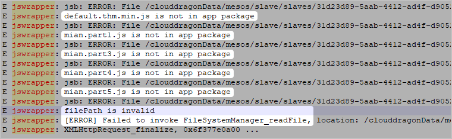
3. 排查rpk中对分包代码的引用。

   分包体如下图：

   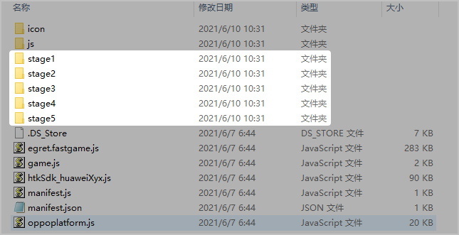

   分包入口game.js代码如下图：

   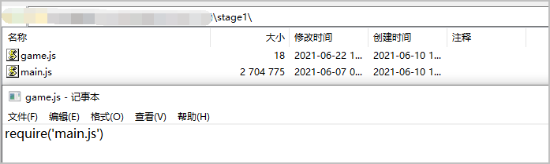

   最终问题定位为game.js中代码引用路径出错。

**解决方法**

game.js在引入分包的其他js文件时，js路径需从当前根目录算起。

例如：项目目录下stage1分包里有game.js和main.js，那么game.js引入main.js时，需写成require('stage1/main.js')。

**建议与总结**

分包问题，我们可以从分包代码qg.loadSubpackage、分包本身资源文件、加载分包代码和其引用代码来分析。结合相应报错日志，从而一步步找到出错点。

## Cocos引擎如何加载远程资源

**现象描述**

使用Cocos引擎工具远程加载图片时，以jpg，png等结尾的图片地址均可以正常加载，但是图片地址没有后缀时加载报错，手动加上其他后缀又请求不到图片。

**问题分析**

当前的 Cocos Creator 支持加载远程资源，开发者可以直接使用 cc.assetManager.loadRemote 方法。具体可参见官网中[loadRemote方法](https://docs.cocos.com/creator/api/zh/classes/AssetManager.html#loadremote)的详细介绍。

该接口有三个参数，url是String类型的远程资源的地址，options是可选的对象参数，用于手动指定加载资源的类型，onComplete是加载完成后触发的回调函数。

**解决方法**

加载报错，可能是传参问题，建议使用如下代码加载图片资源：

```
loadPics(){
    var remoteUrl= "https://sf6-be-pack.pglstatp-toutiao.com/obj/ad.union.api/06d885572f1c64092678bf6cbadb281b"
    cc.assetManager.loadRemote(remoteUrl,{ext:".png"},(err, texture)=>{
        console.log("err"+err);
        var spriteFrame=new cc.SpriteFrame(texture);
        this.sprite_node.getComponent(cc.Sprite).spriteFrame=spriteFrame;
        this.sprite_node.active=true;
    });
},
```

## 原生广告存在多余请求

**现象描述**

广告审核驳回原因：原生广告中存在多余请求。

**问题分析**

广告存在多余请求，一般是广告日志中广告请求数量多于界面中广告显示数量。

**解决方法**

通过查看广告日志来比较广告请求数量和广告显示数量。

广告日志中，request data是广告请求消息。在日志中搜索clientAdRequestId(广告请求ID)可查看具体请求数量，然后重点关注reqPurpose(广告请求目的)，该字段取值有2种情况：

* “1”表示正式广告请求，是我们所关心的真实请求数量。

  大部分广告是请求后需要立即展示，因此可以拿这个数量和应用或游戏界面的广告具体数量做比较。
* “2”表示纯缓存广告素材请求，只有在激励视频和插屏视频中会遇到。

  即adtype(请求广告类型，8--banner, 7--激励视频，3--原生，1--开屏，12--插屏)为7或者12时，才会查看reqPurpose为2的情况。

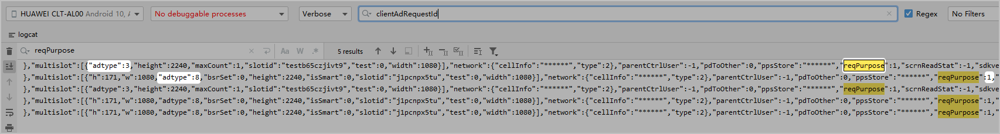

当广告存在多余请求时，我们一般比较日志中reqPurpose的数量和应用或游戏界面中原生、banner等广告展示的数量。可以在每个场景中去对比数量，快速找出问题点，从而迅速修复。可能出现以下三种情况：

1. 原生广告请求广告数据后，未立即展示广告。

   需要修改为立即展示。
2. 原生广告请求广告数据失败后，重复发起请求。

   正常情况下不管是成功还是失败都不要再次发起请求。
3. 界面切换时，onHide和onShow生命周期中存在重复请求广告的行为。

   不要在onHide里写请求广告的方法，只在onShow中请求广告。

## 广告存在多余上报曝光事件

**现象描述**

广告审核驳回原因：有原生广告展示，但是存在多余的上报曝光事件。

**问题分析**

广告存在多余上报曝光，一般是广告日志中广告上报曝光数量多于界面中广告显示数量。

**解决方法**

通过查看广告日志来比较广告上报曝光数量和广告显示数量。

在广告日志中搜索关键字“addEventToCache, event:imp”。

* 每一个“addEventToCache, event:imp”代表上报一次广告曝光事件。
* showId是根据日志输出时间的时间戳。
* contentId是上报曝光的素材id，即对应的展示的广告id。

需要注意的是，原生广告只要展示一次，就需要上报曝光一次。但是banner如果设置了自动刷新（比如30s，如下图红框所示），导致的周期性上报曝光不算重复曝光事件。

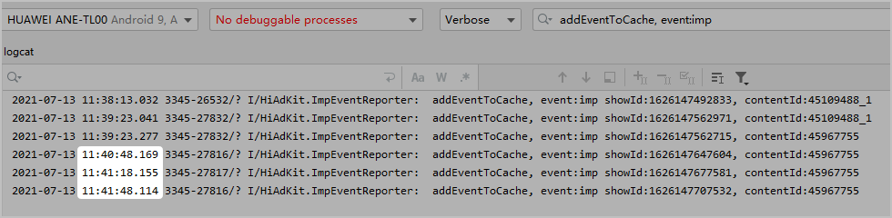

面对广告存在多余上报曝光时，我们一般比较日志中addEventToCache, event:imp的数量和应用或游戏界面中原生、banner等广告展示的数量。可以在每个场景中去对比数量，快速找出问题点，从而迅速修复。

可检查以下场景是否按照要求正确上报曝光事件：

* 原生广告在load请求后，需要立即展示时，需要立即调用reportAdShow接口上报曝光事件。
* 点击原生广告跳转落地页（未销毁广告），从落地页返回的时候，如果广告还在屏幕可见范围内显示，需要立即调用reportAdShow接口上报曝光事件。
* 场景来回切换时（未销毁广告），如果广告还在屏幕可见范围内显示，需要立即调用reportAdShow接口上报曝光事件。
* 含有原生广告的信息流列表场景中，页面上下滑动，广告每次滑到屏幕可见范围内时，都需要调用reportAdShow接口上报曝光事件。
* 请求广告的数据只展示在1个位置，不要在多个地方展示。
* 广告刷新避免使用同一个广告对象调用load方法去请求，如果需要更新，须先销毁之前的广告，再重新创建广告对象，然后请求广告数据。

## 快游戏加载资源场景，运行时卡屏报错

**现象描述**

快游戏加载资源场景，运行时出现如下错误信息：

initWithImageFile:/storage/emulated/0/Android/data/com.huawei.fastapp.dev/files/fastappEngine/games/xxx.jpg failed!

**问题分析**

报错是由于手机目录 /Android/data/com.huawei.fastapp.dev/files/fastappEngine/games 下不存在该图片，而此手机目录 /Android/data/com.huawei.fastapp.dev/files/fastappEngine 中以游戏包名命名的文件夹下出现该图片资源，将该图片放到games下对应文件夹内，游戏运行正常。

这是因为在账号登录前，游戏预加载了下一个场景的资源，资源存放在目录 /Android/data/com.huawei.fastapp.dev/files/fastappEngine/“游戏包名” 下；登录之后，资源会存在 /Android/data/com.huawei.fastapp.dev/files/fastappEngine/games 下。

**解决方法**

游戏打包时，首屏资源要打在rpk包里，不要预加载下一个场景资源，也不要加载远程资源，账号登录后再加载。

**建议与总结**

该案例对临时缓存数据也适用。

手机目录Android/data/com.huawei.fastapp.dev/cache/fastappEngine下存放游戏临时缓存数据。

华为账号登录也会在临时数据中做数据隔离处理，具体存放位置是在fastappEngine下，如果文件夹是以“包名”命名的文件夹则是登录前的数据，如果是games文件夹则是登录后的数据，相互之间不能访问。

## 开发者联盟管理中心的“支付”卡片中不显示已创建的快游戏

**现象描述**

在[华为开发者联盟](https://developer.huawei.com/consumer/cn)的管理中心配置支付回调地址时，点击“支付”卡片进入产品列表，列表中不显示已创建的快游戏。

**问题分析**

可能是该游戏没有开通应用内支付服务。

**解决方法**

登录 [AppGallery Connect](https://developer.huawei.com/consumer/cn/service/josp/agc/index.html) ，选择“我的项目”，[打开应用内支付服务开关](https://developer.huawei.com/consumer/cn/doc/games-guides/games-quickgame-enable-game-kit-0000002351893445#ZH-CN_TOPIC_0000002382054097__zh-cn_topic_0000001113292730_li59494019315)，开通之后联盟后台即可显示该游戏信息。

## 如何实现快游戏强制更新

快游戏从打开到更新的流程如下：

1. 拉起游戏进程。

   用户从华为手机应用市场或者桌面图标等入口启动快游戏时，会启动进程。
2. 检测是否存在新版本。

   每次打开任何一个快应用，快应用中心都会查询该应用是否为首次打开，非首次打开的应用需要检查是否存在新版本。

   如果返回应用的最新版本信息，则立即标记该应用为优先更新。
3. 弹出版本更新提示框。
   1. 快游戏运行过程中，当收到步骤2的更新信息后，会直接弹出版本更新提示框。
   2. 点击进入新版本按钮，会结束当前游戏进程，重启游戏。
   3. 在重启进程中打开该游戏，这样就确保再次打开时，强制进入最新版本。

   如下是在拉起快游戏，进入游戏的过程中出现的版本更新提示框，玩家必须选择新版本才可以进入游戏。

   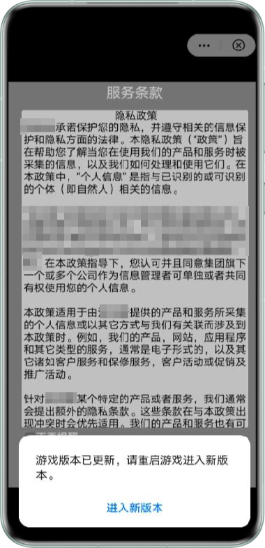


* 游戏是在运行的时候，强制弹出版本更新提示框，弹框返回速度取决于更新接口查询返回结果的快慢。
* 需要检查游戏新版本是否正式上架华为应用市场，特别是设置了定时上架的情况。如果审核通过时间早于定时时间，会按照定时时间来上架。
