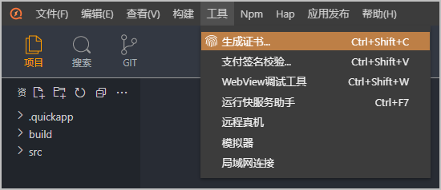
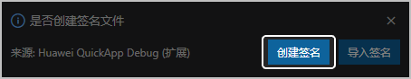
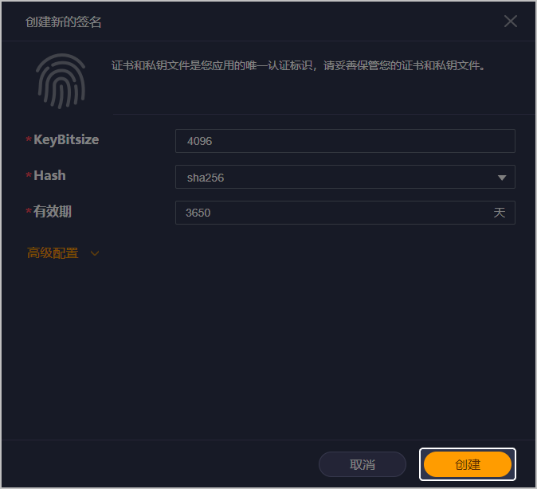
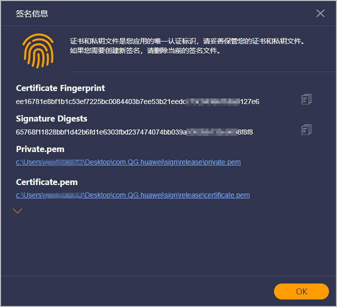

证书指纹可以保证快游戏的完整性和安全性。在快应用IDE中生成，并在AGC控制台进行配置。下载快应用IDE请[前往快应用IDE下载页](https://developer.huawei.com/consumer/cn/doc/Tools-Library/quickapp-ide-download-0000001101172926#section8185184915)。

1. 在华为快应用IDE菜单栏选择“工具 &gt; 生成证书”。

   
2. 右下角弹出提示窗口，点击“创建签名”创建签名文件。您也可以点击“导入签名”导入本地已有的签名文件。

   
3. 在弹出的“创建新的签名”窗口中点击“创建”即可成功创建签名文件。

   
4. 您可以在菜单中再次选择“工具 &gt; 生成证书”查看证书信息。

   
5. 登录[AppGallery Connect](https://developer.huawei.com/consumer/cn/service/josp/agc/index.html)，选择“开发与服务”，在项目卡片列表中选择待配置证书指纹的项目及项目下的快游戏。
6. 在“项目设置 &gt; 常规”页面的“应用”区域，在“SHA256证书指纹”后面填写生成的SHA256指纹，完成后点击“保存”。

   
