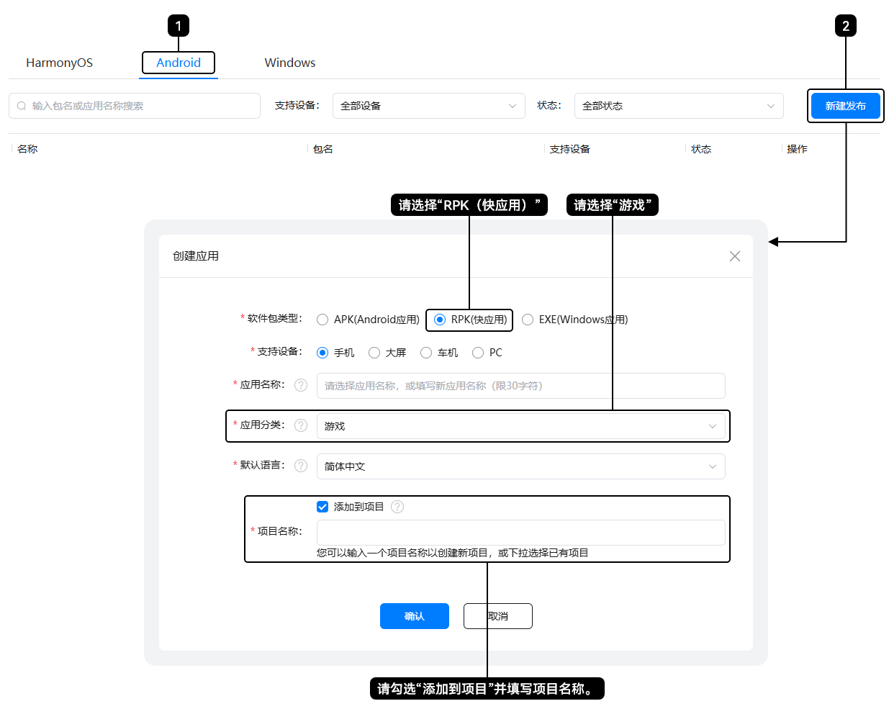

项目是AppGallery Connect资源的组织实体，您可以将快游戏的不同版本添加到同一个项目中。若您的快游戏需要使用账号、支付、广告等华为服务时，您可以前往AGC控制台[创建项目](https://developer.huawei.com/consumer/cn/doc/app/agc-help-createproject-0000001100334664)，并按如下步骤添加快游戏，详情请参见[创建快应用](https://developer.huawei.com/consumer/cn/doc/app/agc-help-createrpk-0000001912713192)。

