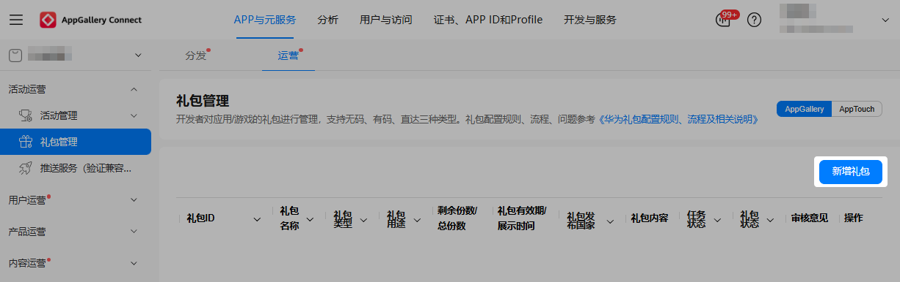
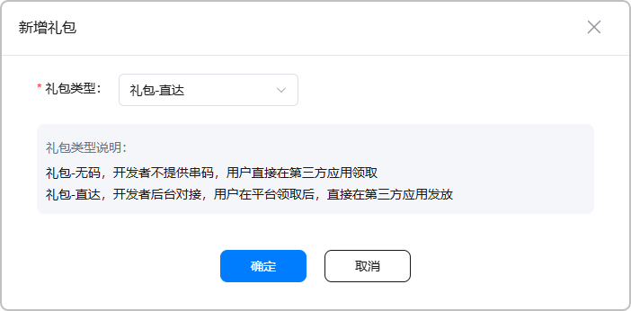
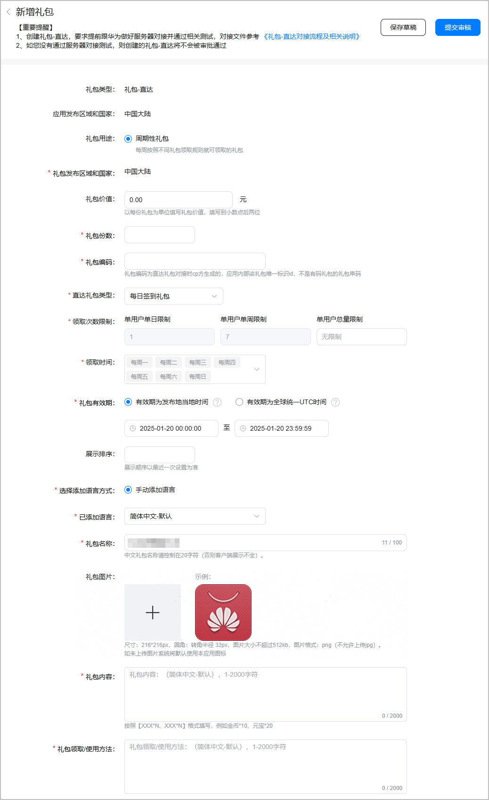
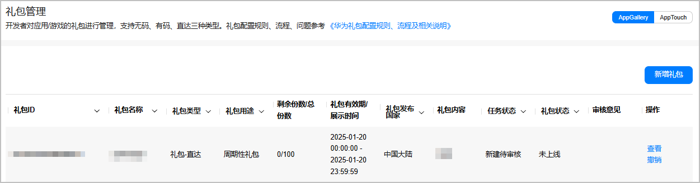
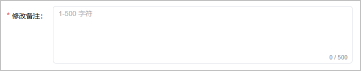
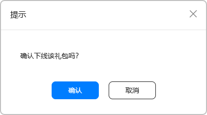

直达礼包为用户提供了方便快捷的礼包领取体验，同时降低了礼包被刷的风险。

## 前提条件

* 已[注册并认证开发者账号](https://developer.huawei.com/consumer/cn/doc/games-guides/games-quickgame-registration-account-0000002351933629)。
* 已[创建项目和快游戏](https://developer.huawei.com/consumer/cn/doc/games-guides/games-quickgame-create-quickgame-0000002317894816)。
* 已提前准备如下素材。

  | 准备项 | 说明 |
  | --- | --- |
  | 礼包编码 | 直达礼包对接时CP方生成的应用内部该礼包唯一标识ID，**不是**有码礼包的礼包串码。 |
  | 礼包名称 | + 建议格式“游戏名称 礼包名”，例如“\*\*\* 每日签到礼包”。 + 礼包名称不超过20个字符，否则客户端展示不全。 + 禁止包含敏感/消极关键词，例如“\*\*\* 进群礼包”。 + 非活动礼包不可包含条件关键词，例如“\*\*\* 充值礼包”。 |
  | 礼包图片 | + 要求宽\*高为216px\*216px，圆角转角半径为32px，不超过512KB的PNG图片。 + 建议使用背景色为白色的礼包图片。 + 如果未上传礼包图片，系统将默认使用本应用图标。 |
  | 礼包内容 | 简要的奖品描述，不超过2000个字符，建议格式为“奖品名称\*对应数量”，用“、”分隔，例如“金币\*4000、专属皮肤\*2”。 |
  | 礼包领取/使用方法 | 礼包的领取或使用方法，不超过2000个字符。 |

## 提交礼包申请

1. 登录[AppGallery Connect](https://developer.huawei.com/consumer/cn/service/josp/agc/index.html)，点击“APP与元服务”，在应用列表页面选择需要新增礼包的应用。
2. 选择“运营 &gt; 活动运营 &gt; 礼包管理”，在“礼包管理”页面右侧点击“新增礼包”。

   
3. 在弹出的“新增礼包”窗口选择礼包类型为“礼包-直达”后，点击“确定”。

   
4. 在“新增礼包”页面根据提示填写礼包信息，完成后点击“提交审核”。

   

   | 配置项 | 说明 |
   | --- | --- |
   | 礼包发布区域和国家 | 勾选礼包发布的区域：  * 只能在当前应用发布的其中一个站点中选择区域和国家。 * 国内礼包统一勾选“中国大陆”。 |
   | 礼包价值（可选） | 单份礼包的现金价值，保留小数点后两位。 |
   | 礼包份数 | 发放的礼包总数。 |
   | 礼包编码 | 填写提前准备的[礼包编码](#ZH-CN_TOPIC_0000002382173901__zh-cn_topic_0000002190381013_p126792712558)。 |
   | 直达礼包类型 | 选择发放的直达礼包的类型，可选值如下：  * 每日签到礼包：用户只需要到达福利页面即可领取。 * 每日登录礼包：用户需要登录一次游戏后方可领取。 * 周六福利礼包：用户在周六时到达福利页面即可领取。 * 自定义礼包：可自定义配置礼包领取的次数限制、时间。 |
   | 领取次数限制 | 用户领取礼包的次数限制。  * 单用户单日限制：单用户单日可领取礼包的次数，可填写“无限制”或正整数。 * 单用户单周限制：单用户单周可领取礼包的总次数，可填写“无限制”或正整数。 * 单用户总量限制：单用户总共可领取礼包的次数，可填写“无限制”或正整数。 说明：  当直达礼包类型选择“每日签到礼包”、“每日登录礼包”或“周六福利礼包”时，该项为默认值，即“单用户单日限制”1次、“单用户单周限制”1/7次和“单用户总量限制”无限制，不可修改。 |
   | 领取时间 | 配置礼包可领取的时间。  说明：  当直达礼包类型选择“每日签到礼包”、“每日登录礼包”或“周六福利礼包”时，该项为默认值，即每天/每周六，不可修改。 |
   | 礼包有效期 | 礼包的有效时间，可选值如下：  * 有效期为发布地当地时间：礼包有效期与所配置的发布国家当地时间一致。 * 有效期为全球统一UTC时间：全球统一UTC时间为 世界标准时间，礼包有效期需按照发布地所处时区进行换算。 请统一勾选“有效期为发布地当地时间”，建议不少于7天。 |
   | 展示排序（可选） | 填写礼包在展示时的位置，仅可填写正整数。展示顺序以最近一次设置为准。 |
   | 已添加语言 | * 若礼包发布在“中国大陆”时，默认为“简体中文”。 * 若礼包发布在非中国大陆时，默认为“美式英语”。 |
   | 礼包名称 | 填写提前准备的[礼包名称](#ZH-CN_TOPIC_0000002382173901__zh-cn_topic_0000002190381013_p867911720552)。 |
   | 礼包图片 | 上传提前准备的[礼包图片](#ZH-CN_TOPIC_0000002382173901__zh-cn_topic_0000002190381013_p6399726471)。 |
   | 礼包内容 | 填写提前准备的[礼包内容](#ZH-CN_TOPIC_0000002382173901__zh-cn_topic_0000002190381013_p136797725515)。 |
   | 礼包领取/使用方法 | 填写提前准备的[礼包领取/使用方法](#ZH-CN_TOPIC_0000002382173901__zh-cn_topic_0000002190381013_p55381627114017)。 |
5. 成功提交直达礼包申请后，华为工作人员预计需要1~3个工作日完成审核，审核结果可在“审核意见”栏查看。审核通过且到达礼包有效日期后，礼包的状态变更为“上线”。

   

## 管理礼包

### 编辑礼包

您可以重新编辑礼包的相关信息，并填写“修改备注”，完成后点击“提交审核”。

### 下线礼包

处于“上线”状态的礼包支持下线操作，在华为工作人员审核通过后，礼包状态变更为“已下线”状态。

