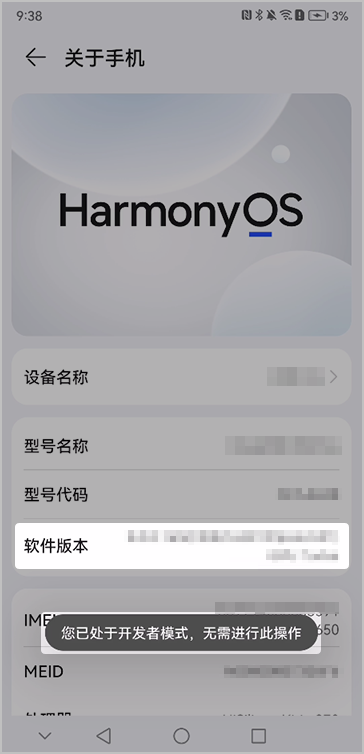
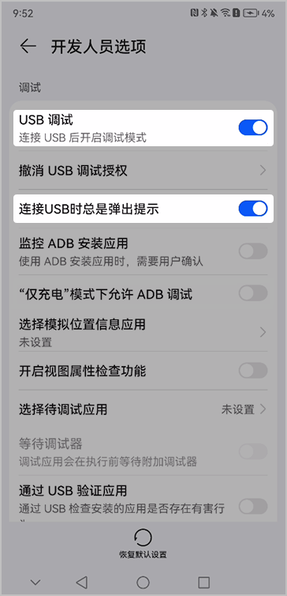
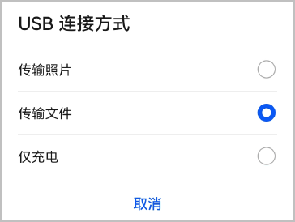

1. 打开手机的“设置”应用，进入“关于手机”页面。
2. 快速、连续、多次点击“软件版本”，直到提示“您正处于开发者模式！”或“您已处于开发者模式，无需进行此操作”，表示您已进入当前手机的**开发者模式**。

   
3. 进入“设置”应用的“开发人员选项”页面后，打开“USB调试”、“连接USB时总是弹出提示”2个开关。

   
4. 在底部弹出的“是否允许USB调试？”窗口上点击“确定”。

   
5. 使用USB数据线连接手机与电脑，并在弹出的“USB连接方式”窗口上选择“传输文件”。

   
6. 继续在“是否允许USB调试？”窗口上点击“确定”。

   
7. 在Windows命令行窗口输入命令，查看设备序列号。

   ```
   hdc list targets
   ```

   若打印出设备序列号，表示手机已成功连接电脑。

   ```
   List of devices attached
   MDX***58        device
   ```
