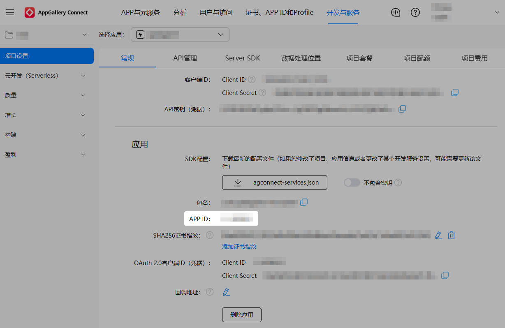
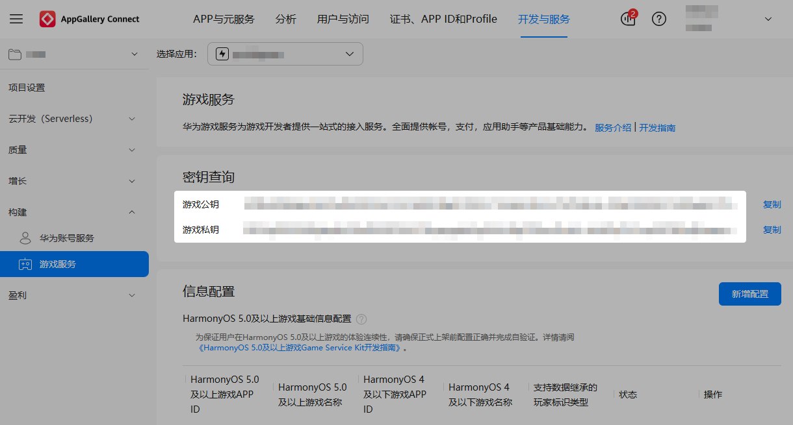
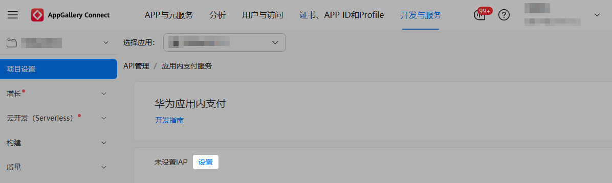
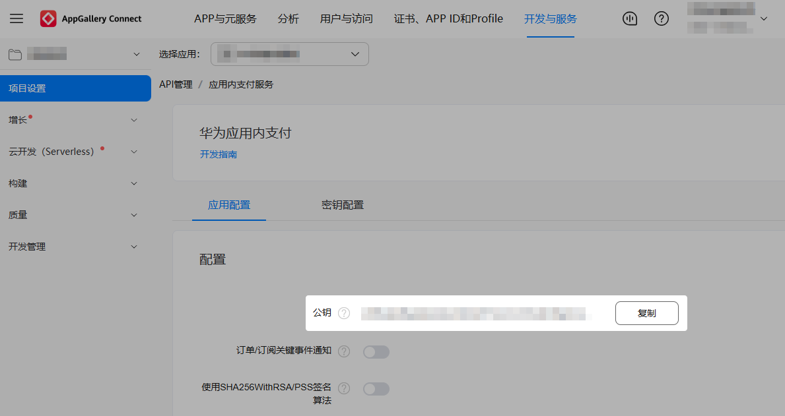
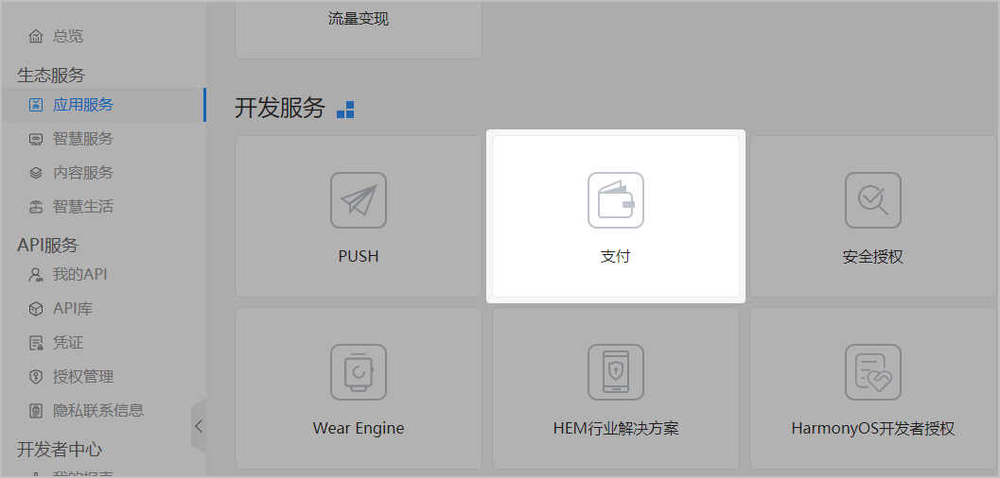
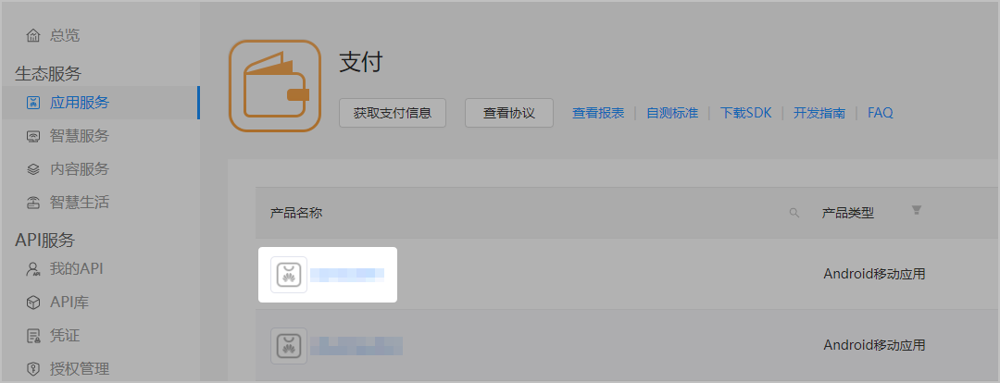
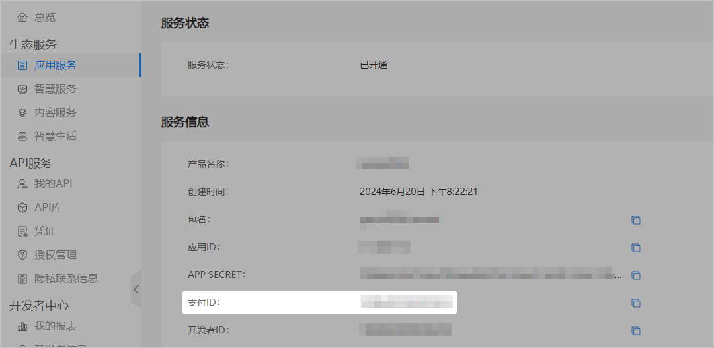

## 获取APP ID

APP ID是快游戏的唯一标识，在AGC控制台创建快游戏后生成。APP ID将在多个服务中使用，您需提前记录下APP ID。

1. 登录[AppGallery Connect](https://developer.huawei.com/consumer/cn/service/josp/agc/index.html)，点击“开发与服务”，在项目列表选择要获取APP ID的项目及项目下的快游戏。
2. 在“项目设置”页面右侧的“应用”区域下即可获取快游戏的APP ID。

   

## 获取游戏公钥和私钥

若在服务端对账号登录数据进行加签、验签，您需提前记录下游戏公钥和游戏私钥。

1. 登录[AppGallery Connect](https://developer.huawei.com/consumer/cn/service/josp/agc/index.html)，点击“开发与服务”，在项目列表选择要查询信息的项目及项目下的快游戏。
2. 选择“构建 &gt; 游戏服务”，记录下游戏公钥与游戏私钥。
   * 游戏公钥：RSA公钥，可验证华为游戏服务器的验签结果。
   * 游戏私钥：RSA私钥，可对登录数据进行加签，并传递给华为游戏服务器。

   

## 获取支付公钥

若快游戏需在服务端对购买返回数据进行验签，以保证数据未被篡改，您需提前记录下支付公钥。

1. 登录[AppGallery Connect](https://developer.huawei.com/consumer/cn/service/josp/agc/index.html)，点击“开发与服务”，在项目卡片列表选择要查询信息的项目及项目下的快游戏。
2. 选择“项目设置 &gt; API管理 &gt; 应用内支付服务 &gt; 配置”，若首次设置应用内支付服务的配置项，请点击“设置”。

   
3. 在“应用内支付服务 &gt; 应用配置”页面记录快游戏的支付公钥。

   

## 获取支付ID

支付ID是由华为开发者联盟给开发者分配，即商户ID。支付ID、商户ID和开发者ID三者相同。用于开发中对merchantId参数的设置。

1. 登录[华为开发者联盟](https://developer.huawei.com/consumer/cn)网站，点击“管理中心”。
2. 在“应用服务”页面，选择“支付”。

   
3. 单击需要查询支付服务信息的应用。

   

   如果没有需要查询的应用，表示应用尚未申请支付服务，请检查是否已为应用申请支付服务。

   
4. 在“服务信息”区域获取支付ID，即商户ID。支付ID、商户ID和开发者ID三者相同。

   
