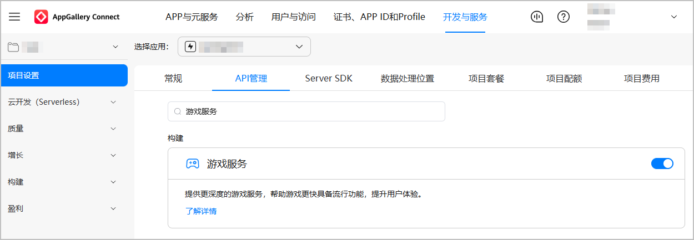
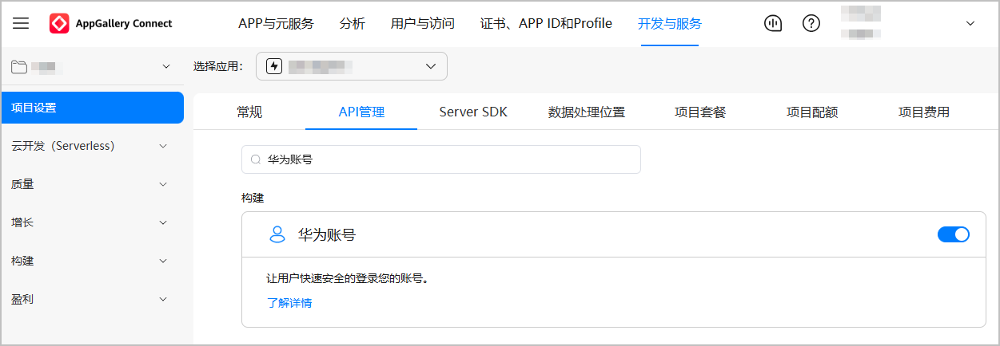
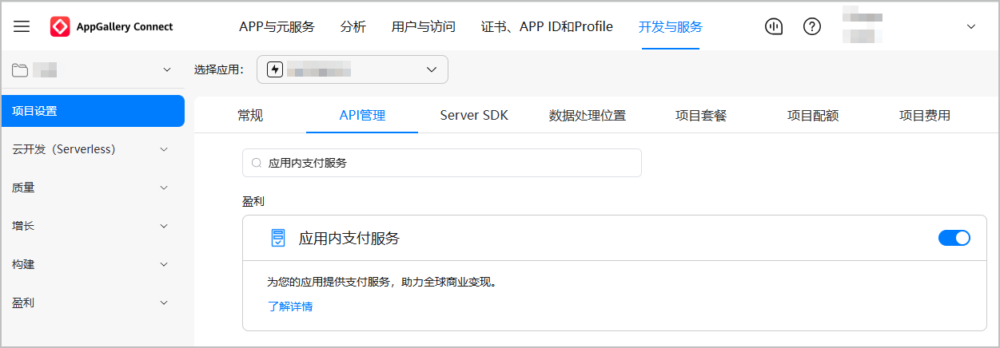

您需在AppGallery Connect控制台打开对应服务的API开关：

* 快游戏必须打开**游戏服务**API开关。

  
* 快游戏必须接入账号登录服务，您需要打开**华为账号**API开关。

  
* 若快游戏接入华为支付服务，您需要先**[开通商户服务](https://developer.huawei.com/consumer/cn/doc/start/merchant-service-0000001053025967#section3513222624)**，再打开**应用内支付服务**API开关。

  
