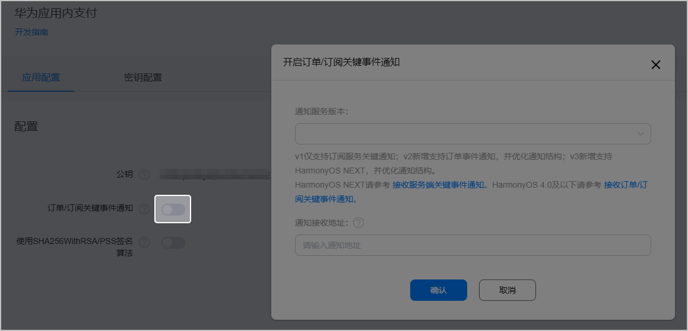
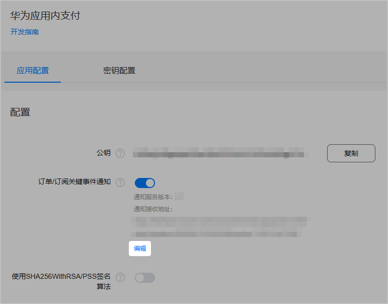
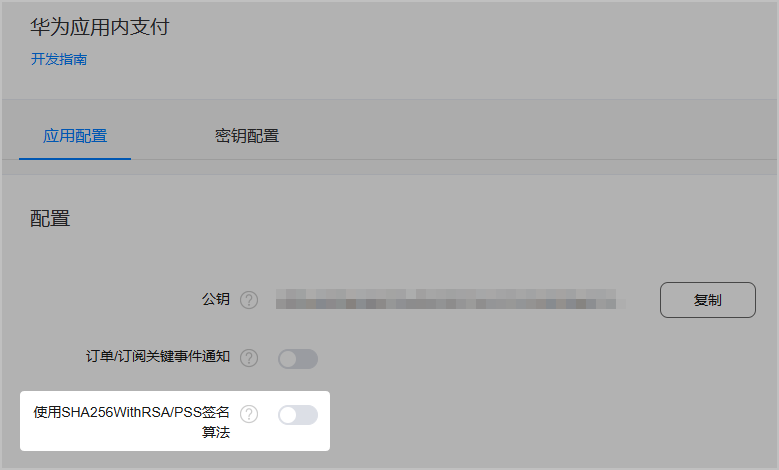

若您的游戏对安全性要求比较高，可以不使用客户端数据，直接通过服务端向华为支付服务器发起校验请求，进一步确认订单的准确性。

## 配置回调地址

1. 登录[AppGallery Connect](https://developer.huawei.com/consumer/cn/service/josp/agc/index.html)，点击“开发与服务”，在项目卡片列表选择要配置地址的项目及项目下的快游戏。
2. 选择“项目设置 &gt; API管理 &gt; 应用内支付服务 &gt; 配置”，在“应用内支付服务 &gt; 应用配置”页面打开“订单/订阅关键事件通知”开关，在弹出“开启订单/订阅关键事件通知”的窗口中填写信息。

   

   | 信息项 | 说明 |
   | --- | --- |
   | 通知服务版本 | 请选择**V2**版本的关键事件通知类别。 |
   | 通知接收地址 | 华为应用内支付服务器将发送此接收地址告知V2版本的关键事件，将作为[关键事件通知V2版本](https://developer.huawei.com/consumer/cn/doc/HMSCore-References/api-notifications-about-subscription-events-v2-0000001385268541#section1943932814710)的接口URL。请填写具备商业域名机构颁发证书的**HTTPS**地址。  说明：  建议所有的关键事件均配置在同一个接收地址，以便更好、更及时地为玩家提供服务。 |
3. 成功配置回调地址后，通知版本和接收地址均会展示在下方。您可以点击“编辑”修改通知内容。

   

## 选择签名算法

请根据实际情况指定[关键事件通知版本v2](https://developer.huawei.com/consumer/cn/doc/development/HMSCore-References/api-notifications-about-subscription-events-v2-0000001385268541#section18290165220716)请求体中的签名算法：

* 关闭状态：默认状态，签名**推荐**使用**SHA256WithRSA**算法。
* 打开状态：签名使用**SHA256WithRSA/PSS**算法。

