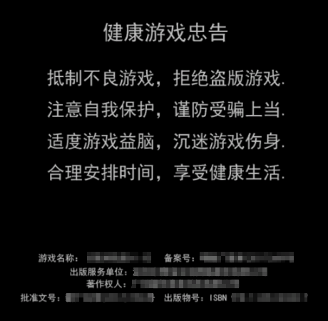
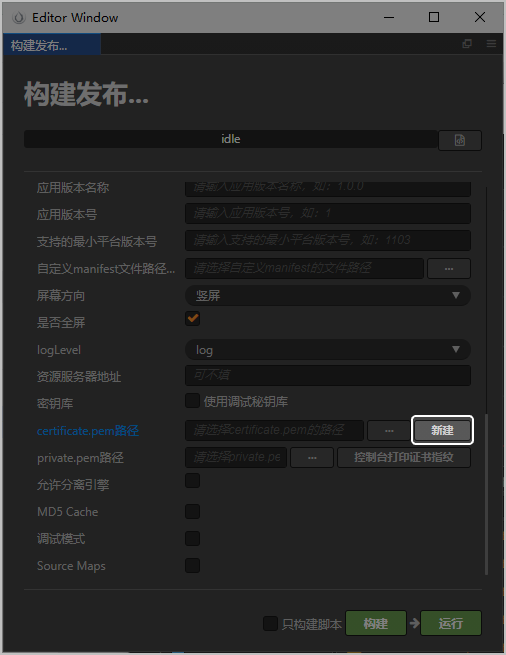
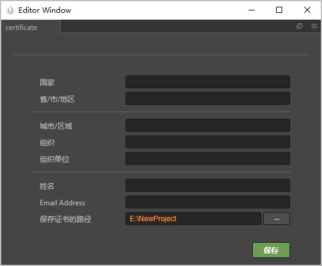
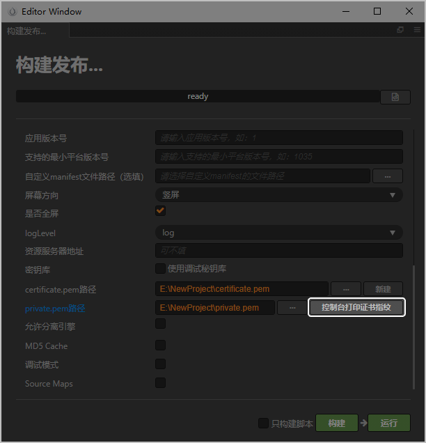
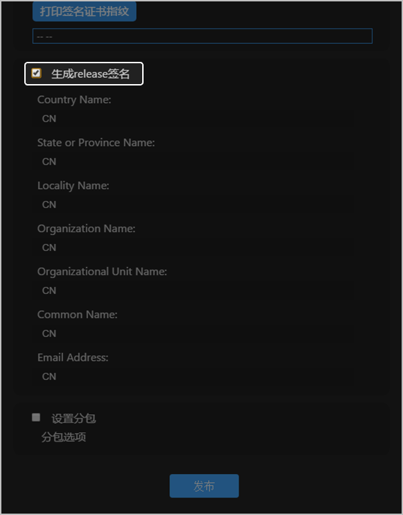
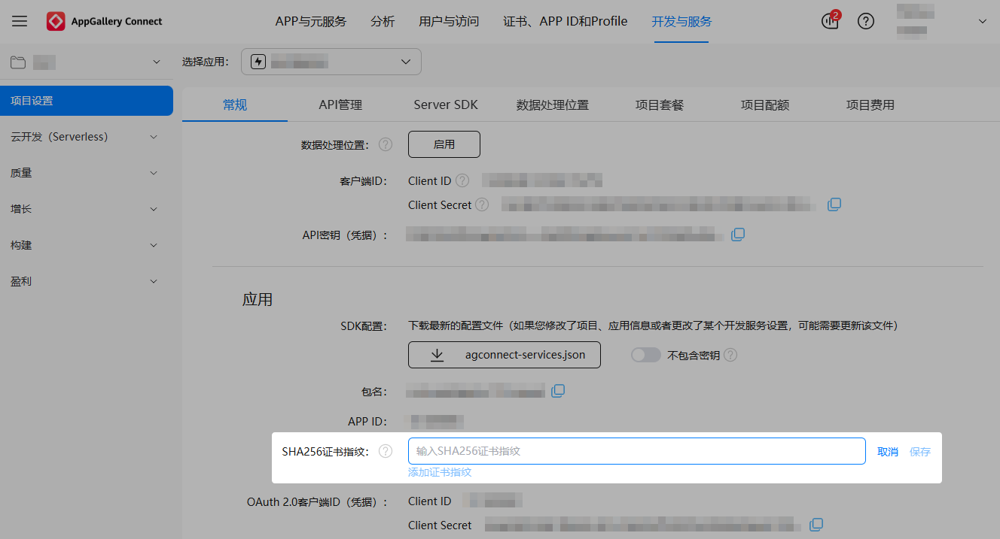

## 硬件要求

| 硬件设备 | 说明 |
| --- | --- |
| 台式机或笔记本 | 支持Windows系统或macOS系统，其中Windows系统要求64位。 |
| 手机 | 用于真机调试的华为手机。 |

## 软件要求

### 开发工具

支持如下游戏引擎开发快游戏。

| 游戏引擎 | 说明 |
| --- | --- |
| Cocos Creator | 前往[Cocos官网](https://www.cocos.com/creator)下载并安装用于华为快游戏编译的Cocos Creator 2.x（2.0.7以上版本）。 |
| LayaAir | 前往[LayaAir官网](https://www.layabox.com/)，根据实际情况下载并安装版本包。 |
| Egret | 根据实际情况下载并安装EgretLauncher和Egret Wing版本包。 |

### 运行/调试工具

请前往[下载快游戏开发者工具](/docs/dev/game-dev/games-quickgame-releasenotes-tool-0000002317894812#section1301631582)，工具的使用指导请参见[快游戏开发者工具](/docs/dev/game-dev/games-quickgame-tool-releasenotes-0000002317894960)。

## 准备素材

开发快游戏的过程中需使用如下素材内容，您需提前准备：

| 素材 | 要求 |
| --- | --- |
| 快游戏图标 | 分辨率216px\*216px、圆角大小为0px、大小不超过2MB的PNG图片。 |
| 健康游戏忠告页面 | 要求游戏在正式开始前，必须向玩家展示**健康游戏忠告**页面，页面上包括健康游戏忠告八句话、游戏名称、核准（备案）号、出版服务单位、著作权人、批准文号、出版物号，且该页面的停留时间不宜过短。示例如下：   |

## 生成并配置证书指纹

证书指纹可以保证快游戏的完整性和安全性。在游戏引擎中生成，并在AGC控制台中进行配置。

### Cocos Creator

1. 在Cocos Creator菜单栏选择“项目 &gt; 构建发布”，在“构建发布”页面，“发布平台”选择“华为快游戏”。在“certificate.pem路径”后面点击“新建”。

   
2. 在弹出的窗口中填写信息，所有信息需填写为英文，“国家”需填写所处国家的国家码，例如中国填写CN，美国填写US，信息填好后点击“保存”。

   
3. certificate.pem和private.pem文件已在指定路径下生成。点击“控制台打印证书指纹”，即可在Cocos控制台查看生成的证书指纹信息。

   
4. 登录[AppGallery Connect](https://developer.huawei.com/consumer/cn/service/josp/agc/index.html)，选择“开发与服务”，在项目卡片列表中选择待配置证书指纹的项目及项目下的快游戏。
5. 在“项目设置 &gt; 常规”页面的“应用”区域，在“SHA256证书指纹”后面填写生成的SHA256指纹，完成后点击“保存”。

   

### LayaAir

1. LayaAir主界面的菜单选择“项目 &gt; 发布”，在“发布”弹窗的“发布平台”选择“华为快游戏”。
2. 勾选“生成release签名”后填写相关信息。所有信息需填写为英文，“国家”需填写所处国家的国家码，例如中国填写CN，美国填写US，完成后点击“发布”。

   
3. 发布后，生成的签名文件存放至项目工程的sign/release路径下。
4. 登录[AppGallery Connect](https://developer.huawei.com/consumer/cn/service/josp/agc/index.html)，选择“开发与服务”，在项目卡片列表中选择待配置证书指纹的项目及项目下的快游戏。
5. 在“项目设置 &gt; 常规”页面的“应用”区域，在“SHA256证书指纹”后面填写生成的SHA256指纹，完成后点击“保存”。

   

### Egret

使用快应用IDE生成证书指纹，详情请参见[生成并配置证书指纹](/docs/dev/game-dev/games-quickgame-certificate-fingerprint-0000002541510397)。
