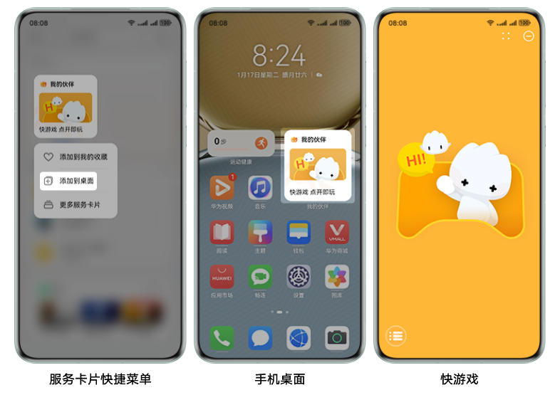
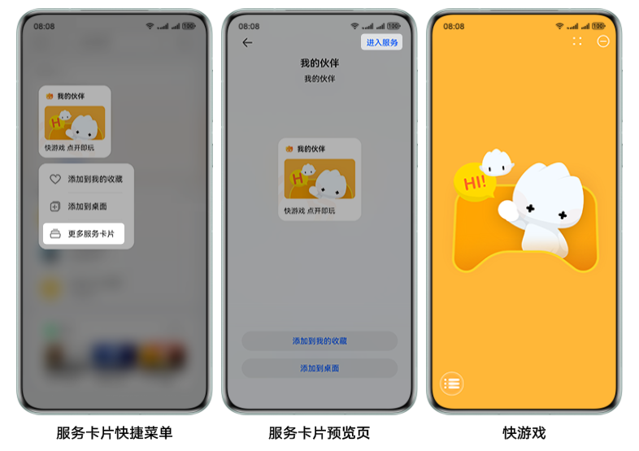
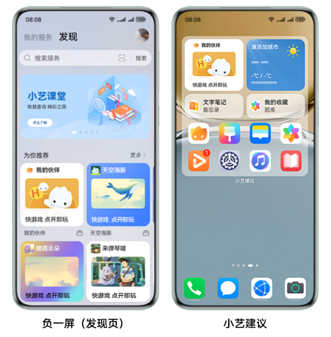

## 服务卡片

HarmonyOS是一款面向万物互联时代的、全新的分布式操作系统。运行在HarmonyOS的应用分为两种形态：

* 应用：传统方式需要安装的应用。
* 元服务：提供特定功能、免安装的应用，可在负一屏等流量阵地分发推荐，用户点击后无需显式安装，即可直接打开对应的应用程序。

上架元服务即可搜索、使用对应的服务卡片。服务卡片是一种界面展示形式，将应用程序的重要信息或操作前置到卡片中，以达到直达服务、减少体验层级的目的。

## 快游戏的服务卡片

基于元服务，快游戏的服务卡片摆脱了平台的束缚、直接面向快游戏用户，是将快游戏的精简介绍以轻量级的卡片形式呈现在流量阵地，为您的快游戏带来全新的流量入口，吸引用户点击，持续刷新快游戏的曝光量和用户的活跃度。而用户仅需点击服务卡片即可直达快游戏界面，大大减少了应用层级的跳转，这为快游戏的高效转化带来了新的增长空间。

## 用户体验

元服务上线后可在服务中心搜索并长按后，您可在快捷菜单选择不同的功能：

* 点击“添加到桌面”，可在手机桌面固定展示服务卡片。点击手机桌面的服务卡片可直接打开对应的快游戏。

  

* 点击“更多服务卡片”，跳转至服务卡片预览页；在预览页右上角点击“进入服务”直接打开对应的快游戏。

  

## 服务卡片资源位

服务卡片可以常驻在手机负一屏、手机桌面、小艺建议等流量阵地，为您的快游戏拉新促活。

