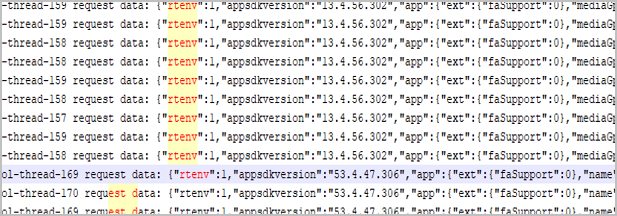
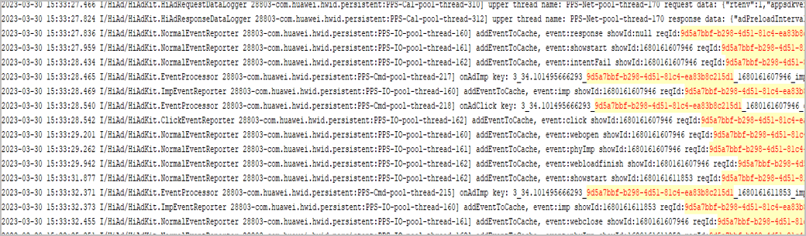
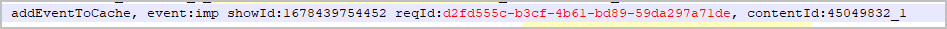
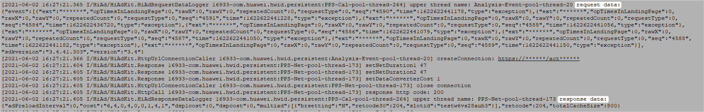

## 接入广告

### 快游戏接入广告时，提示\&#123;"errCode":1004,"errMsg":"No suitable advertising."\&#125;，如何处理？

先检查使用的广告id是不是测试id，正式id是无法在本地加载器测试的。测试id参见“鲸鸿动能媒体接入指南”的“[广告测试验证及上线](https://developer.huawei.com/consumer/cn/doc/distribution/monetize/ceshiyanzhengjishangxian-0000001085219714)”章节。

如果使用测试id，仍然出现该问题，则需要检查手机环境问题，需要满足以下条件：

1. 使用华为手机进行测试。
2. 应用市场搜索HMS Core，更新至最新版本。
3. 手机时间需与当前时间同步。
4. 手机的“限制广告跟踪”设置项为关闭状态。

## 原生广告

### 如何解决原生广告图片展示失败的问题？

若部分原生广告素材返回后的URL未携带图片后缀名，加上接口调用不符合调用规则，将出现这些广告图片无法正常加载的问题，最终影响原生广告的变现效果。若遇到原生广告图片展示失败，您必须指定远程图片文件的类型，才可以正常加载显示出来图片。不同的游戏引擎建议如下：

* 在Cocos中使用：

  ```
  cc.assetManager.loadRemote(remoteUrl, {ext: '.image'}, (err, texture)=>{
  });
  ```
* 在Laya中使用Laya.Loader.IMAGE指定资源类型。


若不按要求接入原生广告，可能会导致部分广告素材图片无法正常加载，这会影响广告变现效果。

### 原生广告展示时需要展示哪些信息？

广告返回字段中的imageUrl（图片地址）、title（广告标题）、desc（广告描述）、source（广告来源），如果不为空，都需要展示在广告中。

### 调用广告时，二级界面使用的原生广告在关闭界面后销毁，重新打开界面会重新创建，但是加载不出来广告，如何处理？

展示广告后，关闭销毁时需要依次调用offError、offLoad、destroy接口，正确销毁上一次创建的广告，才不会影响新创建的广告。

示例代码如下：

```
showRewardedAd() {
  this.rewarded.isShow = false;
  //创建广告实例对象
  rewardedVideoAd = qg.createRewardedVideoAd({ adUnitId: this.rewarded.adUnitId });
 //广告加载成功后触发onLoad回调
  rewardedVideoAd.onLoad(() => {
    let that = this;
    console.log('onload');
    rewardedVideoAd.show();
    this.rewarded.isShow = true;
    if(this.rewarded.isShow){
      //注意此时需要注销当前广告的监听与销毁广告，来保证每一次调用都是新创建的实例对象，不会混用上一次对象
      rewardedVideoAd.offError();
      rewardedVideoAd.offLoad();
      rewardedVideoAd.destroy();
      this.rewarded.isShow = false;
    }
  })
  //监听广告错误触发该回调
  rewardedVideoAd.onError((e) => {
    console.error('load rewarded video ad error:' + JSON.stringify(e));
    this.rewarded.errStr = JSON.stringify(e);
  })
  //用户主动关闭广告后触发该回调
  rewardedVideoAd.onClose((res) => {
    console.log('ad onClose: ' + res.isEnded);
  })
  //请求激励广告
  rewardedVideoAd.load();
},
```

## 激励视频广告

### 如何解决激励视频广告播放按钮快速多次点击出现多个广告覆盖播放的问题？

需针对按钮事件的点击做一个时间间隔的有效判断。例如：

```
const CLICK_INTERVAL = 500
let lastClickTime = 0
function isFastClick(){
    if(lastClickTime !==0 && (new Date().getTime() - lastClickTime < CLICK_INTERVAL)){
        return true
    }
    lastClickTime = new Date().getTime()
    return false
}
```

### 激励视频未播放完成，回到游戏渲染正常。但是完整的播放完激励视频，回到游戏却提示call to OpenGL ES API with no current context，如何处理？

出现此错误信息的原因是：OpenGL ES所在的线程被阻塞或者被挂起，导致渲染设备上下文丢失。

解决方案：

1. 将可能导致渲染线程被阻塞或被挂起的代码移动到别处。比如在渲染循环之前执行或之后执行。
2. 将绘图方法放在gl线程里运行。

### 激励视频的广告是否有判断是否过期的接口？

快游戏引擎没有对广告有效期进行控制，也没有对外提供相应的api。

### 观看激励视频两次后，游戏场景偶现加载node场景节点时出现黑色方块，如何处理？

此问题一般是渲染问题，可以通过加延时解决，比如关闭激励视频100ms后，才加载node场景节点解决。

### 激励视频广告如何判断玩家观看完整个视频而不是中途退出？

激励视频的onClose 回调中isEnded为true时表示有效观看完视频，为false表示未观看完视频，代码如下：

```
rewardedVideoAd.onClose((res) => {
    console.log('ad onClose: ' + res.isEnded)
    if (res && res.isEnded || res === undefined) {
        console.log('播放视频结束，给予奖励')
    }else{
        console.log('未播放完视频，不给予奖励')
    }
})
```

## 海外快游戏

### 现网的海外快游戏点击广告没有反应，如何处理？

抓取日志获取到204错误，请联系广告客服确认正式id的广告位是否已经开通。

### 海外快游戏请求非个性化广告setNonPersonalizedAd是不是需要传1的参数，还是说可以不调用此接口？

低于1077版本时无此接口，可以不用调用，服务器会有个默认值，当前是1。如果要调用，请按照[接口文档](https://developer.huawei.com/consumer/cn/doc/games-references/games-api-quickgame-runtime-ad-0000002399676813)描述的参数来填写。

## 测试广告

### 如何获取自测阶段的广告日志？

通过手机的“文件管理”找到如下文件：sdcard/Android/data/com.huawei.hwid/files/Log/HiAdKitLog.log。

### 如何获取测试广告位ID?

自测阶段请使用测试广告ID，可通过如下途径获取测试ID：

* 打开[广告测试验证及上线](https://developer.huawei.com/consumer/cn/doc/distribution/monetize/ceshiyanzhengjishangxian-0000001085219714)”，下载《RPK广告位信息表》，表格中有不同广告类型的测试广告位ID。
* 打开[广告常见问题](https://developer.huawei.com/consumer/cn/doc/distribution/monetize/changjianwenti-0000001132481583)，在**Q4：测试ID是多少？**表格中获取不同广告类型的测试广告位ID。


若测试广告位ID没有返回数据，可在测试广告位ID加前缀**test**。

## 其他

### 如何查看并处理广告存在多余请求？

1. 使用Android Studio的Logcat工具查看广告日志，或在命令行工具窗口输入如下命令，导出并查看广告日志。

   ```
   adb pull /sdcard/Android/data/com.huawei.hwid/files/Log/HiAdKitLog.log
   ```
2. 在日志文件中搜索**request data: &#123;"rtenv**，查找快游戏的广告请求数据。

   
3. 在所有的广告请求数据中逐行搜索字段**clientAdRequestId**，并复制对应的字段值。
4. 全文逐个搜索字段**clientAdRequestId**对应的字段值。

   
5. 逐行查找**clientAdRequestId**字段值是否有addEventToCache, event:**response**和addEventToCache, event:**imp**：
   * addEventToCache, event:response表示一次请求广告的**成功响应**。
   * addEventToCache, event:imp表示一次请求广告的**成功展示**。

   一次广告请求应该对应一次广告展示，通过搜索字值**clientAdRequestId**的字段值，不断定位并排查是否存在**请求广告成功响应，却没有展示**的情况，最后一次广告请求不统计在内。

### 如何查看曝光日志并处理曝光问题？

* 查看曝光日志
  1. 使用Android Studio的Logcat工具查看广告日志，或在命令行工具窗口输入如下命令，导出并查看广告日志。

     ```
     adb pull /sdcard/Android/data/com.huawei.hwid/files/Log/HiAdKitLog.log
     ```
  2. 在日志文件中根据广告位ID的**reqId**字段值查看是否有曝光事件**addEventToCache, event:imp**。

     
* 解决曝光问题
  1. 是否能使用缓存进行曝光？

     对于广告曝光，媒体不要将展示过的素材缓存起来以备下次请求展示，建议实时请求实时曝光，广告缓存也存在有效期。
  2. 如何解决广告存在叠加上报情况？

     媒体多个界面存在广告，要排查代码逻辑，只上报当前展示的广告，根据日志判断广告上报的展示数量是否正常。
  3. 如何处理再次展示没有上报曝光？

     广告展示时，切桌面后返回，或进入落地页后返回，广告仍需展示需请再次调用reportAdShow方法上报曝光。

### 提交验收前的自检**CheckList**

1. 请勿设置定时器循环请求广告。
2. 请勿失败后频繁重复请求广告。
   * 【错误做法】失败后在**onError**中重新请求广告。若每次都回调onError，会进入“请求广告—&gt;失败—&gt;请求广告”的恶性循环。
   * 【推荐做法】正常情况下不管是成功还是失败都不要再次发起请求。若业务希望请求失败后重试，**激励视频**可以再发起1次，其他类型广告都不要再次发起请求。
3. 每次请求的广告不能重复展示，展示完成后需重新实时获取后再次展示。
   * 【错误做法】在多个页面使用同一个全局的广告去展示广告。
   * 【推荐做法】每个页面的广告对象是独立的，需要使用createXX的方法去创建广告、注册回调等。
4. 预缓存的广告如激励视频插屏广告，请注意load和show接口调用的时间间隔，超过一个小时需重新请求新的广告来展示，否则计为无效展示，将不计费结算。
5. 激励视频调用show接口前，建议先预加载，加载失败的时候， 广告入口需要有合理的文案提示或不要显示广告入口，否则从广告入口进入后，可能因为视频数据没有加载完成，导致空白。建议在onLoad回调中延时几秒或者几分钟调用show接口。

   

   延时时长不要超过1个小时，否则广告计为无效展示，将不计费结算。
6. 没有任何内容或不以内容为主的屏幕上应避免展示广告。
7. 广告必须有关闭按钮，特别是由开发者自行定义布局的原生广告，一定要在广告界面上设计关闭能力。
8. 广告素材必须全尺寸等比例展示。展示广告时，要保证原有的宽高比，只能等比例缩放。
9. 请勿将广告背景设置为可点区域，只允许广告的图片、标题、按钮等素材区域可以点击跳转落地页。
10. 原生广告每次点击都需要调用reportAdClick接口上报点击事件。原生广告多次点击请勿只上报一次点击事件。
11. 原生广告每次展示都需要上报曝光事件。
    * 【错误做法】原生广告多次展示只上报一次曝光事件。 例如：在首次展示广告的时候调用reportAdShow接口上报，但当从其他页面返回到广告页面时，仍然显示了广告，但是没有上报曝光事件。
    * 【推荐做法】当页面可见时，如果还显示原生广告，需要再次上报曝光事件。一般在页面生命周期onShow中处理。
12. 点击原生广告图片区域应调用reportAdClick接口实现落地页跳转。
13. 原生广告的广告来源、广告标题、广告标识、关闭按钮、查看或者下载安装按钮，都不能有缺失。
14. 除了需要预加载的激励视频和插屏广告，其他类型广告都需要实时请求成功后再实时展示。请勿请求了原生广告却没有展示。
15. 必须用户同意了用户隐私协议才能展示广告，不同意请勿请求和展示广告。
16. 建议优先选择test开头的测试广告位ID。

    | **广告位类型** | **测试广告位ID** | **展示形式** | **尺寸**（单位：px） | **推广类型** |
    | --- | --- | --- | --- | --- |
    | 开屏 | testq6zq98hecj | 图片 | 1080\*1620 | 网页 |
    | q6zq98hecj | 图片 | 1920\*1080 | 网页 |
    | n7p4mh57xs | 图片 | 1080\*1620 | 应用促活 |
    | q1h4mvd5a3 | 图片 | 1080\*1620 | 应用下载 |
    | testd7c5cewoj6 | 视频 | 720\*1280 | 网页 |
    | 原生 | testu7m3hc4gvm | 大图 | 1080\*607 | 网页 |
    | i7ik1b3mgg | 大图 | 1080\*607 | 应用促活 |
    | a5sz2rxpaj | 大图 | 1080\*607 | 应用下载 |
    | u7m3hc4gvm | 大图 | 1080\*607 | 应用下载 |
    | r6w14o0hqz | 三图 | 225\*150 | 应用下载 |
    | testb65czjivt9 | 小图 | 225\*150 | 应用下载 |
    | b65czjivt9 | 小图 | 225\*150 | 应用下载 |
    | testy63txaom86 | 视频 | 640\*360 | 应用下载 |
    | y63txaom86 | 视频 | 640\*360 | 应用下载 |
    | j79gukslrn | 图片 | 160\*160 | 应用下载 |
    | 激励视频 | u2k89ub7vq | 视频 | 640\*360 | 网页 |
    | e7hm5vx799 | 视频 | 640\*360 | 应用下载 |
    | testx9dtjwj8hp | 视频 | 720\*1080 | 应用下载 |
    | Banner | x0kvs12iu6 | 图片 | 1080\*170 | 应用下载 |
    | testw6vs28auh3 | 图片 | 1080\*170 | 应用下载 |
    | 插屏 | testb4znbuh3n2 | 视频 | 720\*1080 | 网页 |
    | t3u4pks711 | 视频 | 640\*360 | 应用下载 |
    | l7s7x17w20 | 视频 | 1280\*720 | 应用下载 |
    | g2tz5d4wkv | 视频 | 720\*1280 | 应用下载 |

### 调用广告时，返回1003错误，如何处理？

1003是内部错误。请先确定手机是否支持广告展示，比如看看其他类型广告是否展示。

* 如果支持，则结合日志查询广告的返回码。
* 如果不支持，则对手机方面进行排查，或者换台手机试试。

### 调用接口setConsentStatus设置了consentStatus，但是在游戏中获取的值没有变化？

调用setConsentStatus接口前，需要调用requestConsentUpdate接口获取isNeedConsent的值来判断是否需要用户确认。目前在中国大陆统一返回false，即不需要设置用户意见，无论ConsentStatus是什么，都可以向鲸鸿动能SDK请求个性化广告。如果回调参数中isNeedConsent取值为true，表明该用户在欧洲经济区或其他敏感地区内，此时才需要进一步确认用户意见ConsentStatus。

### 如果一个广告多次点击，每次点击都上报的话，是否会出现点击数大于展示量？

不会。游戏开发者针对客户端的每次点击、每次曝光，都需要上报相应事件，华为服务器会过滤重复事件。

### 如果鸿蒙App已经接入了广告，那么使用鸿蒙App的正式广告id可以加载广告吗？

广告的正式id与应用（包名）相匹配，快应用的包名和鸿蒙App的包名不一样，所以不通用，无法加载。

### 如何分析华为鲸鸿动能 Kit日志？

1. 日志获取

   **【方法一】**在手机的【文件管理】App中找到日志并拷贝。拷贝路径：

   手机【文件管理】App &gt; 内部存储 &gt; Android &gt; data &gt; com.huawei.hwid &gt; files &gt; Log &gt; HiAdKitLog.log

   **【方法二】**手机连接电脑，通过adb命令获取手机中的日志，“./”表示存放在当前路径。

   adb pull /sdcard/Android/data/com.huawei.hwid/files/Log/HiAdKitLog.log ./

   如果没有找到HiAdKitLog.log，需要确认HMS Core中是否允许写入日志，配置路径如下：

   设置 &gt; 应用 &gt; 应用管理 &gt; HMS Core &gt; 权限 &gt; 存储，设置为开启
2. 日志解读

   分析广告请求的消息体和响应信息，将关键字为“HiAd”的日志过滤出来，尤其关注request data和response data的日志内容，如下所示：

   

   request data和response data的内容都是JSON 格式，为了方便观看，可自行用工具格式化一下。

   1. 广告请求信息request data解读

      ```
      {
      "adRestrict":0,			// 儿童保护，0表示不限制广告推送，1表示限制广告推送，-1表示未设置
          "rtenv":0,
       "appsdkversion":"13.4.39.300",
          "app":{
              "mediaGpsOn":0,
              "name":"赛几探险记",
              "pkgname":"com.igame.njmy.sjtxjrpk.huawei",
              "version":"1.0.0"
          },
          "clientAdRequestId":"118302ea-b7e8-4157-8870-ad498c9ff676",
          "device":{
              "aaid":"******",
              "adsLoc":0,
              "agCountryCode":"CN",
              "androidid":"******",
              "brand":"HUAWEI",
              "buildVersion":"WAS-AL00 8.0.0.358(C00)",
              "clientTime":"2021-06-02 16:27:21.314+0800",
              "dpi":480,
              "emuiVer":"EmotionUI_8.0.0",
              "freeDiskSize":41043329024,
              "freeSdcardSize":41022357504,
              "gpsOn":1,
              "height":1920,
              "hmsGpsOn":1,
              "isTrackingEnabled":"******",
              "language":"zh",
              "localeCountry":"CN",
              "maker":"HUAWEI",
              "model":"WAS-AL00",
              "oaid":"******",
              "os":"android",
              "pxratio":"3.0",
              "roLocale":"ZH-HANS-CN",
              "roLocaleCountry":"CN",
              "routerCountry":"CN",
              "script":"Hans",
              "totalDiskSize":56478384128,
              "totalSdcardSize":56457412608,
              "type":4,
              "udid":"******",
              "useragent":"******",
              "uuid":"******",
              "vendor":"ALL",
              "vendorCountry":"CN",
              "verCodeOfAG":"110202302",
              "verCodeOfHms":"50300312",
              "verCodeOfHsf":"110002200",
              "version":"8.0.0",
              "width":1080
      },
          "multislot":[
          {
                  "h":483,			// 请求广告素材的高（像素）
                  "w":3240,			// 请求广告素材的宽（像素）
                  "adtype":8,			// 请求广告类型，8--Banner,  7--激励视频，3--原生，1--开屏，12--插屏
                  "bsrSet":1,
                  "height":1920,		// 手机的屏幕高（像素）
                  "isSmart":0,
                  "slotid":"testw6vs28auh3",	// 广告位ID
                  "test":0,
                  "width":1080		// 手机的屏幕宽（像素）
              }
          ],
          "network":{
              "cellInfo":"******",
              "type":2
          },
          "parentCtrlUser":-1,
          "pdToOther":0,
          "ppsStore":"******",
          "reqPurpose":1,
          "scrnReadStat":0,
          "sdkversion":"3.4.41.303",
          "version":"3.4"
      }
      ```
   2. 广告请求响应信息response data解读
      1. 请求失败日志

         ```
         {
           "adPreloadInterval":0,
         "cost":"6,4,0,4,0,0,1,4,1",
           "dsp1cost":0,
           "dspcost":0,
           "multiad":[
               {
                   "brsetting":"N",
                   "retcode30":204,			// 响应码, 204表示请求成功，但没有广告返回。
                   "slotid":"testw6vs28auh3"		// 广告位ID
               }
           ],
           "retcode":204,
           "totalCacheSize":800
         }
         ```
      2. 请求成功日志

         ```
         {
         "adPreloadInterval":0,
           "cost":"93,83,0,49,4,0,0,49,1",
           "dsp1cost":0,
           "dspcost":0,
           "multiad":[
               {
                   "brsetting":"N",
                   "content":[
                       {
                           "clickActionList":[
                               3,
                               4,
                               1
                           ],
                           "contentid":"34.100237265421",
                           "taskinfo":"TASKINFO_UNIQUE_2||mnO56RBXzu+EYW0CanS7vFlQgo+zK+R/Dzxz5q9ovCjPQqzEZunrF0QIvR1QvpUq6qVWZ3h6xsgibYNQ4NnUpAlDJBN9jjpHSMLW0ib9a4hEmm23dvplQSKAlZ/9DcXWmA1FMPSBBWG/kLX3tVLdfV4In2IiLLqu1NbL4iVZDA5r6NYxzBkFMKZ+9meU7NEWftxZ31b1VZMJgcx7pWF/kPpMA7Mi",
                           "creativetype":2,
                           "ctrlSwitchs":"100011101002100101",
                           "dispTime":0,
                           "endtime":1622622297764,
                           "filterList":[
                               3
                           ],
                           "interactiontype":5,
                           "landPageWhiteList":"contentcenter-drcn.dbankcdn.com,lp.pinduoduo.com,h5hosting-drcn.dbankcdn.cn",
                           "landingTitle":0,
                           "logo2Pos":"ll",
                           "metaData":"******",
                           "monitor":"******",
                           "paramfromserver":"******",                    "sequence":0,
                           "showAppLogoFlag":1,
                           "skipTextPos":"tr",
                           "spare":0,
                           "starttime":1622532297764,
                           "taskid":"34.100237265421",
                           "useGaussianBlur":1,
                           "webConfig":"******"
                       }
                   ],
                   "retcode30":200,			    // 响应码, 请求成功
                   "slotid":"f3tnev5vy6"			// 广告位ID
               }
           ],
           "retcode":200,
           "totalCacheSize":300
         }
         ```
3. 日志分析
   1. 在请求数据中，可以通过multislot查询请求广告素材的宽高、广告类型、广告id来判断是否符合请求标准。
   2. 在返回数据中，可以通过retcode30查询返回结果。

      下表是常见返回错误码：

      | 错误码取值 | 含义 |
      | --- | --- |
      | 1001 | api版本不在广告支持范围内。 |
      | -1 | http请求失败，非业务失败。 |
      | 200 | 请求成功。 |
      | 201 | 广告请求，先返回配置。 |
      | 204 | 请求报文正确，没有广告返回。 |
      | 403 | 广告请求的接口版本号错误。 |
      | 407 | 广告请求的SDK版本号缺失。 |
      | 408 | 广告请求的SDK版本号错误。 |
      | 421 | 广告位ID缺失。 |
      | 424 | 广告位ID与应用不匹配。 |
      | 425 | 该广告位ID不能请求正式广告。 |
      | 498 | 无效广告位，广告位与应用包名不匹配。 |
      | 499 | 其他错误。 |
      | 500 | 系统内部错误。 |
      | 602 | 返回已经失效的素材id列表。 |
      | 700 | 原生广告未请求到，请查看日志。 |
      | 701 | 原生广告未请求到，请查看日志。 |
      | 702 | 原生广告正在请求中，不能重复发起请求。 |
      | 703 | 快应用的广告位id非法。 |
      | 704 | 横幅广告过期。 |
      | 705 | 横幅广告任务下架。 |
      | 800 | 贴片广告未请求到，请查看日志。 |
      | 801 | 贴片广告正在请求中，不能重复发起请求。 |
      | 802 | 贴片广告的广告位ID列表为空。 |
      | 804 | 传入的参数格式非法。 |
      | 900 | 激励广告未请求到，请查看日志。 |
      | 901 | 激励广告正在请求中，不能重复发起请求。 |
      | 902 | 激励广告的广告位ID列表为空。 |
      | 1000 | 插屏广告未请求到，请查看日志。 |
4. 总结

   上述日志中，国内快游戏Banner广告只支持1080\*170尺寸。该示例传的是483\*3240尺寸，不符合广告要求，所以retcode30返回204，请求成功，无返回。要修改Banner为 1080\*170的Banner尺寸进行测试。所以拿到日志后，主要分析request data中multislot广告素材相关的请求参数和response data中retcode30错误码来配合修改广告代码即可。
