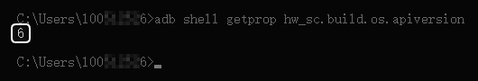
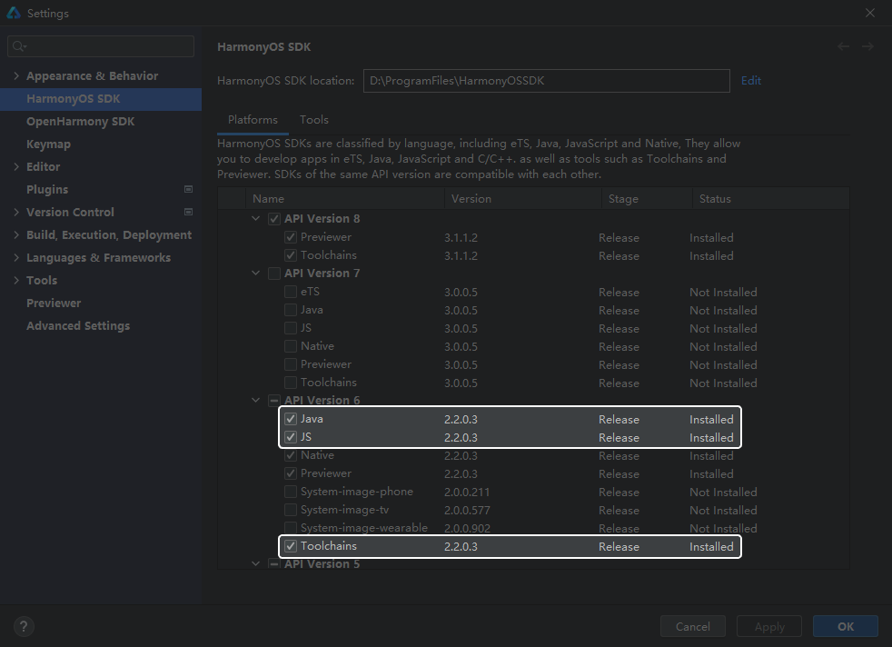

## 如何查看华为手机的HarmonyOS版本号？

1. 打开手机设备的“开发者模式”，并连接手机与电脑，在终端输入命令行查看手机设备的序列号。若显示设备序列号，表示您已成功连接手机设备。

   ```
   // 查看手机设备序列号
   adb devices

   // 显示手机设备序列号，表示您已成功连接手机设备
   List of devices attached
   D5F0218428017954     device
   ```
2. 继续在终端输入命令行。

   ```
   adb shell getprop hw_sc.build.os.apiversion
   ```

   若查询结果为6及以上，则对应HarmonyOS 2.0及以上。

   

## 运行样例工程需安装API Version 6下哪几种语言和工具？

1. 在DevEco Studio顶部菜单栏中选择“File &gt; Settings”。
2. 在弹出的窗口中点击“HarmonyOS SDK”，在窗口右侧请勾选“API Version 6”下的“Java”、“JS”、“Toolchains”后，点击右下角的“OK”即可安装所选语言和工具。

   

## HarmonyOS 3.0 Mate50手机调试方式

因HarmonyOS 3.0 Mate50手机没有服务中心，仅有负一屏，安装Hap调试包后无法找到快游戏的服务卡片入口。此时，您需在config.json配置文件将**installationFree**参数值临时修改为“false”，Hap调试包安装至真机设备后会在手机桌面出现有一个应用图标，您可以：

* 点击应用图标验证相关功能。
* 上滑应用图标出现快游戏的服务卡片后，再验证相关功能。


**installationFree**参数值决定了安装在手机设备后的应用形态：

* **installationFree**=“false”，安装后为传统的HarmonyOS应用。
* **installationFree**=“true”，安装后为免安装的元服务。

修改**installationFree**参数值为“false”仅为临时调试使用，但构建发布APP正式包前一定要修改为“true”，否则会导致上架失败。

## 在AGC控制台上传软件包时出现1010错误码

在AGC控制台上传元服务软件包时出现**1010**错误码，出现此错误码表示您上传了**错误类型**的软件包。软件包类型由**installationFree**参数值决定：

* installationFree为**false**表示软件包类型是传统的HarmonyOS应用。
* installationFree为**true**表示软件包类型是免安装的元服务。

请全局查看代码中的**installationFree**参数值是否为**true**。若您在调试阶段将installationFree临时修改为false，请在正式上架之前修改回true。
