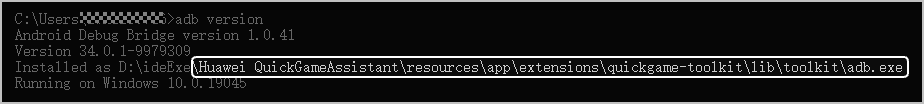
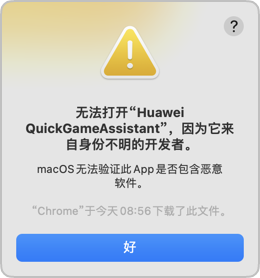
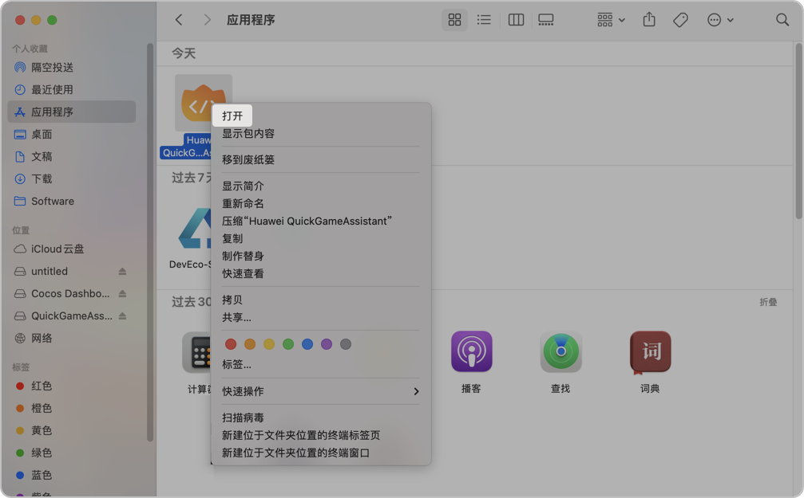
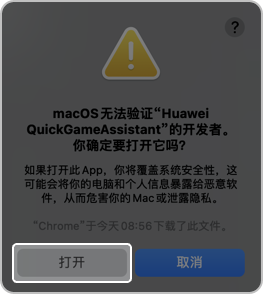
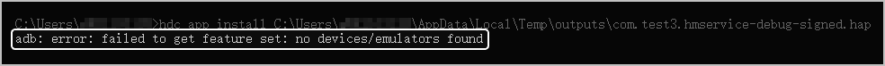
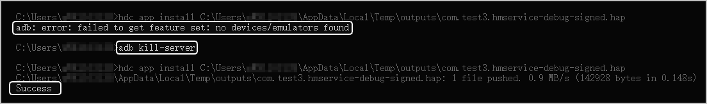
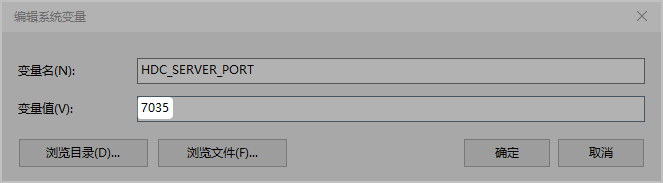
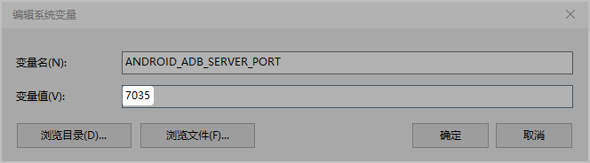

## 如何使用工具自带的adb

* **问题描述**

  若adb端口被占用，或者adb版本不兼容工具自带的adb命令时，运行/调试快游戏时会出现如下报错信息：

  ```
  could not install *smartsocket* listener: cannot bind to 0.0.0.0:5038: 通常每个套接字地址(协议/网络地址/端口)只允许使用一次
  ```

  或者出现如下报错信息：

  ```
  adb server version(xxx) doesn't match this client（xxx）
  ```
* **解决方案**

  建议使用快游戏开发者工具自带的adb，具体操作步骤如下：

  1. 在CMD窗口执行如下命令行，关闭电脑中默认的adb进程。

     ```
     adb kill-server
     ```
  2. 在环境变量中配置工具安装路径下的Huawei QuickGameAssistant\resources\app\extensions\quickgame-toolkit\lib\toolkit，并置顶该环境变量，确保优先使用快游戏开发者工具自带的adb。
  3. 在CMD窗口中执行如下命令行：

     ```
     adb version
     ```

     如下图显示表示配置成功。

     
  4. 重启快游戏开发者工具，尝试运行/调试等功能。

## 安装后打开时提示来自身份不明的开发者

安装成功并打开Mac版本的快游戏开发者工具后，弹出来自不明开发者的提示窗口。



请按照如下步骤打开工具：

1. 选择“访达 &gt; 应用程序”，找到**Huawei QuickGameAssistant。**
2. 右键点击**Huawei QuickGameAssistant**图标，在下拉菜单中点击“打开”。

   
3. 在弹出的提示窗口中点击“打开”，即可成功打开Mac版本的快游戏开发者工具。

   

## 如何解决运行/调试过程中出现白屏或黑屏现象

使用不同的证书运行/调试同一个快游戏可能会出现白屏或黑屏的现象，这是因为证书冲突，此时您可以尝试清除花瓣轻游缓存后再重新运行/调试快游戏。

## 如何解决下载sdk失败的问题

1. 请检查无线WIFI或有线网线是否连接好。
2. 若网络受限，是否正确配置开发者工具代理。
3. 根据网络是否受限，是否正确配置NPM代理。
4. 请检查是否正确配置nodejs环境变量、配置Java环境变量。

## 如何解决打包失败的问题

若网络受限，且配置代理会篡改证书。您可以根据错误日志里面提供的信息，将下载网站的证书用命令行配置到java中。

1. 在JDK 17的安装目录下打开jre/lib/security文件夹，将.crt或.pem格式的证书文件复制到**security**文件夹中。

   

   添加证书时需要保证证书的真实性和可信度，否则可能会导致安全问题。建议仅添加自己信任的网站证书。
2. 打开JDK 17的控制台，输入如下命令行，确定要添加的证书。

   ```
   // <alias>为证书别名，可以自定义；<certificate_file>为证书文件名。
   keytool -import -alias <alias> -keystore cacerts -file <certificate_file>
   ```
3. 输入JDK 17的keystore密码，默认为**changeit**。
4. 确认添加证书，输入**yes**。
5. 成功添加后，输入如下命令行，再输入keystore密码，即可查看已添加的证书列表。

   ```
   keytool -list -keystore cacerts
   ```
6. 重新前往快游戏开发者工具中打包元服务。

## 如何查看工具详细的报错日志

请前往C盘**用户**的**AppData\Roaming\QuickGameAssistant\logs**路径下查看日志，**AppData**属于隐藏文件夹，您可以根据日志中的错误字段定位并解决问题。

## 解决Hap调试包安装失败的问题

在执行hdc app install安装命令行时，若出现adb: error: failed to get feature set：no devices/emulators found错误：



可能因为hdc的端口和adb的端口有冲突，您可以参照如下解决方案：

* **方案一**：在Windows命令行窗口输入**adb kill-server**后，再执行hdc app install安装命令。该方案可以快速解决问题，但下次安装时可能还会报错。

  

  

  您可以执行**adb start-server**重新拉起adb服务进程。
* **方案二**：将系统环境变量中的adb和hdc的端口号设置为相同的端口号即可长期解决问题。

  

  
