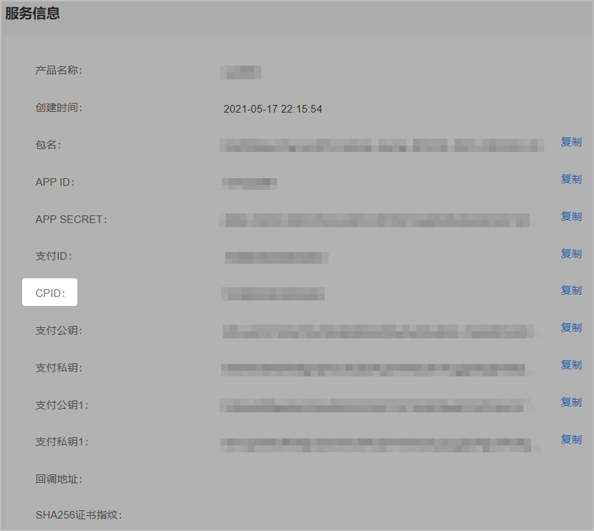
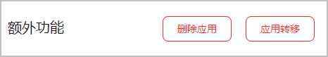

## 更换开发者联盟账号后，快游戏需要做哪些变更操作？

更换开发者联盟账号appid不会变更，但是商户和cpid会改变。所以支付接口中相关参数都需要配套更新，修改后必须确保本地测试没有问题再提交上架审核。上架后如果玩家无法支付，建议尝试引导玩家清除历史缓存。

## 重新创建了新应用，APP ID、APP SECRET不一样，但是支付ID、游戏公私钥和支付公私钥等参数平台生成的是一样的，这个会有问题吗？

没有问题，同一个开发者账号下，申请不同应用，应用内支付服务的公私钥等参数是一样的。

## 游戏CPID是在哪里获取？

在申请应用内支付服务时获取。

## 游戏公钥、私钥和支付的公钥、私钥是一个东西吗？

不是的，请以开发者联盟获取的参数为准。

## 同一个开发者账号获取的支付公钥、支付私钥是相同的吗？

一般是相同的，同一个开发者账号下的快游戏可以复用支付公钥和支付私钥。

## 快游戏有实名认证系统吗？

有，登录游戏后会有弹出实名认证弹框。

## 快游戏支持预约吗？

不支持。

## 快游戏支持首发吗？

支持。

## 快游戏包名可以和网游包名一样吗？快游戏包名有什么格式要求吗？

不能一样，每次创建一个应用，包名需要是唯一的。快游戏的包名建议以com.xx1.xx2格式命名，其中xx1可以是公司名，包名中不要包含demo。建议快游戏包名以**.huawei/.HUAWEI**结尾。

## 如何删除多余的产品？

1. 登录[AppGallery Connect](https://developer.huawei.com/consumer/cn/service/josp/agc/index.html) ，选择“APP与元服务”。
2. 搜索需要删除应用的名称，点击应用名称，进入“应用信息”页面。
3. 点击“额外功能”区域的“删除应用”。

   

## 如何停运下架快游戏？

登录华为开发者联盟将快游戏下架，具体操作请参见“[游戏下架](/docs/distribute/app-dist/game-center/game-center-maintaining-0000001239205271/game-center-removing-0000001194165316)” 。

## 游戏更新版本时，如果要变更签名证书，如何处理？

需重新创建新的快游戏，待上架后将旧版本申请下架。

## AppGallery Connect上的报表数据是实时的吗？

不是，次日可见。
