## 快游戏

### 快游戏运行加载场景动态效果时出现抖动、重影、闪烁等现象，如何处理？

这类现象一般是由游戏的渲染机制导致，请设置游戏帧率为60帧，暂时不支持其他帧率。

### 快游戏在调用华为账号登录前需要先取得授权么？ AppGallery Connect提交的证书指纹怎么生成？

无需授权，在游戏中直接调用账号登录的API即可。证书签名是通过Cocos Creator或快应用IDE生成，请确保提交的证书指纹和正式打包签名里面的证书指纹是一致的。

### 快游戏分包加载时，偶现分包加载不成功，如何处理？

如果所有分包加载不成功，请检查分包配置是否正确，详细参见“[分包加载](/docs/dev/game-dev/games-quickgame-subpackage-0000002317894828)” 。

如果是部分分包加载不成功，请考虑加载性能的问题，建议不要连续加载多个分包，分包加载之间增加延时。

### 华为快游戏无法调起键盘，定位是input标签的blur()方法报错了，报错提示“E/jswrapper: ERROR: Uncaught TypeError: this.\_inputElement.blur is not a function”，如何处理？

要使用原生的键盘接口，需要适配华为的键盘接口即[qg.showKeyboard](https://developer.huawei.com/consumer/cn/doc/games-references/games-api-quickgame-runtime-keyboard-0000002366156876#section816150185312)。

### 快游戏引入第三方库例如protobuf时，在require库时报gameThirdScriptError错误，如何处理？

出现此错误，可能包含Function("return this")();这类代码，游戏引擎为了安全性默认禁用此类代码，建议修改js代码。除了protobuf，如下三方库也存在类似代码，如果引入需要一起修改。

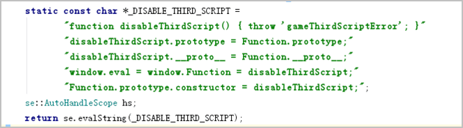

## Egret引擎

### 使用Egret引擎开发的华为快游戏在华为加载器中点击图片无反应，如何处理？

Egret引擎开发的游戏默认采用 showAll 模式，图片显示时，上下两边会有黑边，点击事件需要加上上下黑边的高度才能被触发。建议把 showAll 模式修改为 fixedWidth模式，去掉图片上下黑白，就可以解决问题。

### Egret引擎的快游戏如何设置屏幕的缩放模式？

Egret 目前支持的模式有：showAll, noScale, noBorder, exactFit, fixedWidth, fixedHeight, fixedNarrow, fixedWide。

以设置fixedWidth为例，有两种设置方式：

* 在index.html文件中设置 data-scale-mode="fixedWidth"
* 在需要设置缩放模式页面代码中设置 this.stage.scaleMode=egret.StageScaleMode.fixedWidth;

### Egret引擎的快游戏如何开启WebGL渲染？

Egret引擎默认的渲染模式是canvas，从 Egret Engine 2D 3.0.6 开始可以自由开启 WebGL 渲染模式，设置方式如下：

在项目根目录找到index.html，将renderMode设置为webgl。

```
egret.runEgret({renderMode:"webgl"});
```

如果不指定任何参数，则使用canvas渲染。

### Egret引擎的快游戏如何使用遮罩显示对象？

从Egret 2.5 版本开始提供了不规则遮罩的功能，可以通过将一个显示对象用作遮罩来创建一个孔洞，透过该孔洞使另一个显示对象的内容可见。

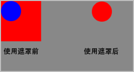

示例图中100\*100的红色正方形和半径为25像素的蓝色圆，红色正方形被蓝色圆遮罩，由于被遮罩的对象显示在用作遮罩对象的全部不透明区域之内，所以显示的正方形部分只是由圆完整部分覆盖的那部分，即遮罩后只有红色圆可见。

详细实现代码如下：

```
//将maskSprite设置为mySprite的遮罩
mySprite.mask = maskSprite;
//画一个红色的正方形
 var square:egret.Shape = new egret.Shape();
 square.graphics.beginFill(0xff0000);
 square.graphics.drawRect(0,0,100,100);
 square.graphics.endFill();
 this.addChild(square);
//画一个蓝色的圆形
var circle:egret.Shape = new egret.Shape();
circle.graphics.beginFill(0x0000ff);
circle.graphics.drawCircle(25,25,25);
circle.graphics.endFill();
this.addChild(circle);
square.mask = circle;
```

用作遮罩的显示对象可设置动画、动态调整大小。

遮罩显示对象不一定要添加到显示列表中。但是，如果希望在缩放舞台时也缩放遮罩对象，或者希望支持用户与遮罩对象的交互（如调整大小），则必须将遮罩对象添加到显示列表中。

### Egret一键发布华为快游戏时如何调整游戏的横竖屏设置？

在Egret项目的index.html里，把data-orientation改成landscape是横屏，默认是portrait竖屏。

### Egret快游戏如何实现加载文本和二进制文件？

Egret 加载资源主要使用 egret.HttpRequest 类。该类封装了XMLHttpRequest（XHR）对象，用于与服务器交互。通过 XMLHttpRequest 可以在不刷新页面的情况下请求特定的URL，获取数据。

HttpRequest对象最核心的方法就是 open() 和 send() 。 open() 方法接收该请求所要访问的URL。作为可选项还可以传入加载方式，这个参数通常用 HttpMethod 取常量，默认是最常用的 GET 方式。

在加载完成时，通过 HttpRequest 对象的 response 属性来获取返回的数据。

加载静态文件，分为两种类型：文本和二进制数据。加载静态文件的特点是可以进行进度跟踪。

* **加载文本**

  加载文本数据的方法如下：

  ```
  var url = "resource/config/description.json";
  var  request:egret.HttpRequest = new egret.HttpRequest();
  var respHandler = function( evt:egret.Event ):void{
     switch ( evt.type ){
         case egret.Event.COMPLETE:
             var request:egret.HttpRequest = evt.currentTarget;
             console.log( "respHandler:n", request.response );
             break;
         case egret.IOErrorEvent.IO_ERROR:
             console.log( "respHandler io error" );
             break;
     }
  }
  var progressHandler = function( evt:egret.ProgressEvent ):void{
     console.log( "progress:", evt.bytesLoaded, evt.bytesTotal );
  }
  request.once( egret.Event.COMPLETE, respHandler, null);
  request.once( egret.IOErrorEvent.IO_ERROR, respHandler, null);
  request.once( egret.ProgressEvent.PROGRESS, progressHandler, null);
  request.open( url, egret.HttpMethod.GET );
  request.send( );
  ```

  HttpRequest 默认的加载类型是 TEXT ，因此不需要专门设定。

  需要侦听的主要事件是 COMPLETE ，从COMPLETE事件中获取数据。

  要考虑意外的情况，在 IO\_ERROR 事件中处理数据加载异常的情况。

  加载进度事件是 ProgressEvent.PROGRESS，在加载内容较大的资源时比较有用。
* **加载二进制**

  加载二进制数据的方法如下：

  ```
  var url = "resource/assets/egret_icon.png";
  var  request:egret.HttpRequest = new egret.HttpRequest();
  request.responseType = egret.HttpResponseType.ARRAY_BUFFER;
  var respHandler = function( evt:egret.Event ):void {
     switch ( evt.type ){
         case egret.Event.COMPLETE:
             var request:egret.HttpRequest = evt.currentTarget;
             var ab:ArrayBuffer = request.response;
             console.log( "respHandler:n", ab.byteLength );
             break;
         case egret.IOErrorEvent.IO_ERROR:
             console.log( "respHandler io error" );
             break;
     }
  }
  request.once( egret.Event.COMPLETE, respHandler, null);
  request.once( egret.IOErrorEvent.IO_ERROR, respHandler, null);
  request.open( url, egret.HttpMethod.GET );
  request.send( );
  ```

  加载二进制数据，先设置 HttpRequest 的加载类型为 ARRAY\_BUFFER。

  数据加载完成后可从 response 属性获取 ArrayBuffer 对象，即可进行进一步读取操作。

### Egret快游戏如何实现矩形碰撞检测和像素碰撞检测？

碰撞检测是判断显示对象是否与一点相交，以下是两种碰撞检测的方式：

* 矩形碰撞检测：判断显示对象的包围盒是否与一点相交。
* 像素碰撞检测：判断显示对象的图案（非透明区域）是否与一点相交。

Egret 提供 hitTestPoint() 方法进行碰撞检测。

* 矩形碰撞检测的用法为：

  ```
  var isHit:boolean = shp.hitTestPoint( x: number, y:number );
  ```
* 像素碰撞检查的用法为：

  ```
  var isHit:boolean = shp.hitTestPoint( x: number, y:number, true:boolean );
  ```

shp 是待检测的显示对象，(x, y)是待检测的点的位置，相比于矩形碰撞检测，像素碰撞检测增加了第三个参数 true ，表示使用像素碰撞检测。

示例代码如下：

```
class HitTest extends egret.DisplayObjectContainer
{
   public constructor()
   {
       super();
       this.addEventListener(egret.Event.ADDED_TO_STAGE,this.onAddToStage,this);
   }
   private onAddToStage(event:egret.Event)
   {
       this.drawText();
       var shp:egret.Shape = new egret.Shape();
       //定义显示对象的图案
       shp.graphics.beginFill( 0xff0000 );
       shp.graphics.drawCircle( 0, 0, 20);
       shp.graphics.endFill();
       //定义显示对象的包围盒
       shp.width = 100;
       shp.height = 100;
       this.addChild( shp );
       //矩形碰撞检测和像素碰撞检测实现，二者取一
       //矩形碰撞检测
       var isHit:boolean = shp.hitTestPoint( 25, 25 );
       //像素碰撞检测
       //var isHit:boolean = shp.hitTestPoint( 25, 25, true );
       this.infoText.text = "isHit: " + isHit;
   }
   private infoText:egret.TextField;
   private drawText()
   {
       this.infoText = new egret.TextField();
       this.infoText.y = 200;
       this.infoText.text = "isHit: ";
       this.addChild( this.infoText );
   }
}
```

编译调试后，效果如下图：

|  |  |
| --- | --- |
|  | 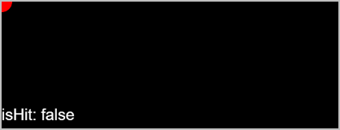 |
| 矩形碰撞检测：文本中返回碰撞的结果，显示为 true，表示发生了碰撞。 | 像素碰撞检测：文本中返回碰撞的结果，显示为 false，表示没有发生碰撞。 |


1. 该点并未与红色圆形直接相交，而是与红色圆形的包围盒相交。
2. 大量使用像素碰撞检测，会消耗更多的性能。

## Laya引擎

### 如何使用LayaAir IDE实现快游戏的分包与加载？

1. 在LayaAir IDE发布设置处，勾选“设置分包”。

   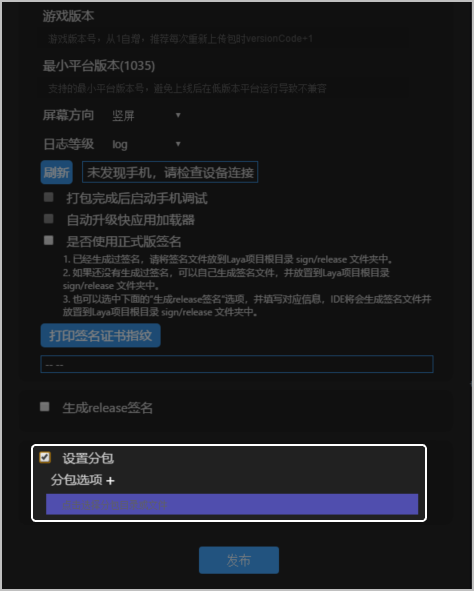
2. 点击“分包选项”，在如下页面设置分包名和对应的分包文件夹。

   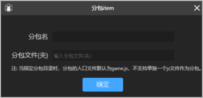
3. 在manifest.json文件中，声明subpackages分包字段，格式如下：

   ```
   subpackages:[
     {
       "name":"subpackageName1",//对应分包名
       "resource":"subpackagePath1"//对应分包文件夹
     },
     {
       "name":"subpackageName2", //对应分包名
       "resource":"subpackagePath2"//对应分包文件夹
     }
   ]
   ```

   

   手动分包时，配置resource最后以“/” 结尾，同时对应分包文件夹下需要有game.js文件。
4. 使用分包，示例代码如下：

   ```
   var task = qg.loadSubpackage({
     subpackage:'subpackageName1',
     success : function () {
         console.log("loadSubpackage success" );
     },
     fail:function(){
         console.log("loadSubpackage fail");
     },
     complete:function() {
         console.log("loadSubpackage complete");
     }
   });
   task.onprogress(
       callback(res) {
         console.log("onProgress" + JSON.stringify(res));
       }
   );
   ```

### LayaAir IDE如何清除缓存问题？

1. 在IDE导航的帮助菜单里点击“打开编辑器本地缓存”，如下图所示：

   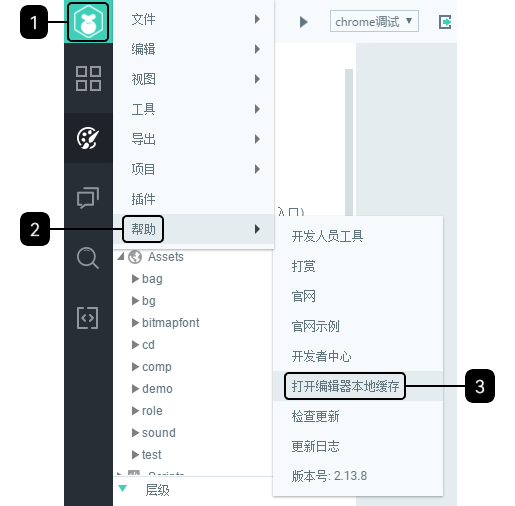
2. 打开缓存资源的目录，如下图所示。如果是布局问题需要清除缓存，则删除layout目录。如果无法确定问题，也可以删除所有目录和文件。

   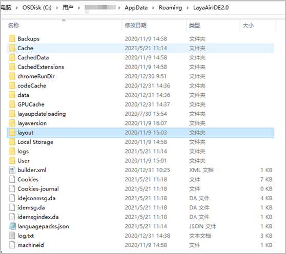

### 在Laya引擎中，无法移除Dialog遮罩层，如何处理？

可以有两种方式实现：

* 直接使用Laya.Dialog.manager.maskLayer.removeself()进行遮罩层的移除。

  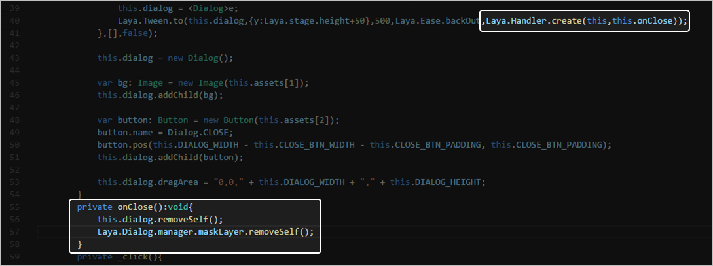
* 如果自己调用close方法，则需要将close中的第二个showEffect的布尔值设为false，否则将无法进行close()方法中的判断效果，从而造成关闭无效，或第二次启用无效的问题。

  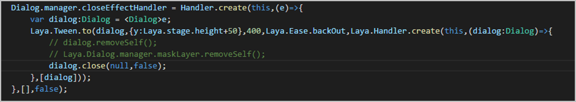

### LayaAir开发的快游戏如何生成签名指纹？

1. 访问 [Laya官网](https://www.layabox.com/)，获取用于华为快游戏编译的LayaAir IDE。
2. 打开LayaAir IDE，创建项目后，菜单选择“项目 &gt; 发布”。
3. 在发布页面，“发布平台”下拉框选择“华为快游戏”，如下图所示：

   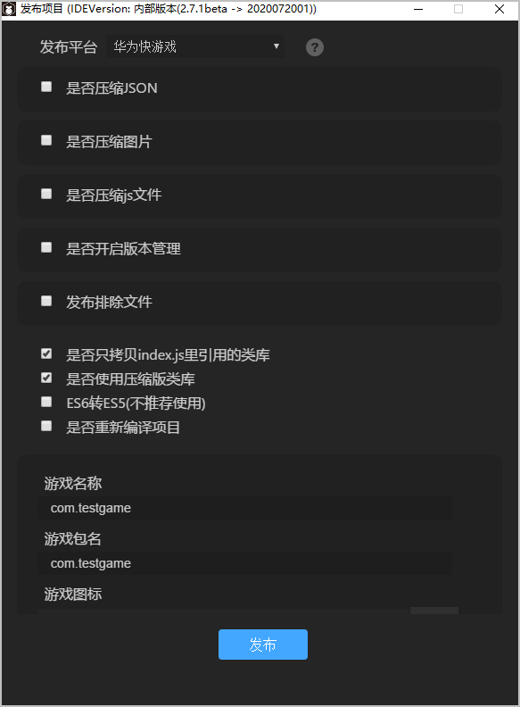
4. 点击“生成release签名”，所有信息需填写为英文，“国家”需填写所处国家的国家码，比如中国填写CN，美国填写US。填写完成后点击“发布”。

   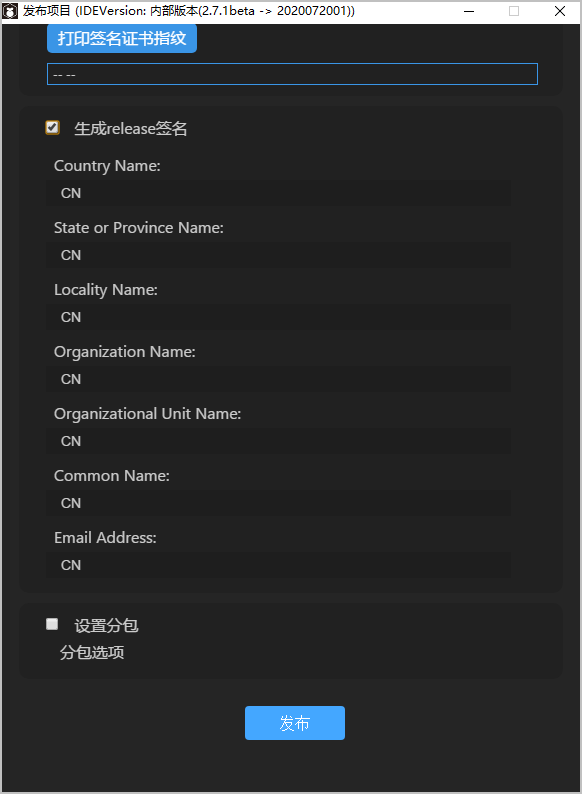
5. 点击发布后，LayaAir IDE会生成签名文件，并放置到Laya项目根目录sign/release文件夹中。

   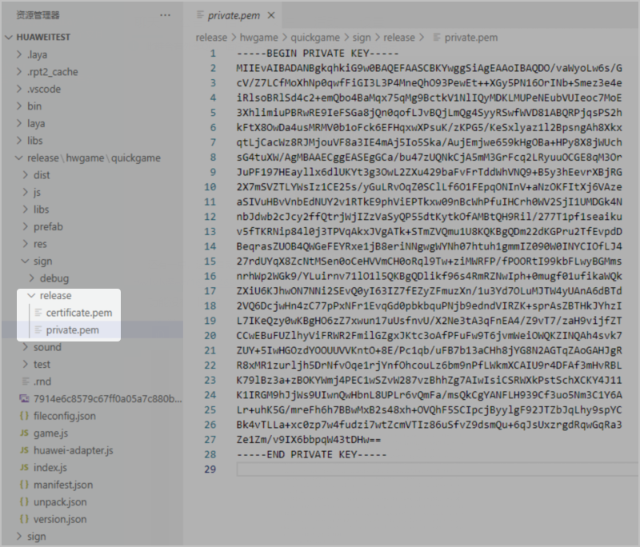
6. 返回发布界面，点击“打印签名证书指纹”，可以查看生成的证书指纹，如下图所示：

   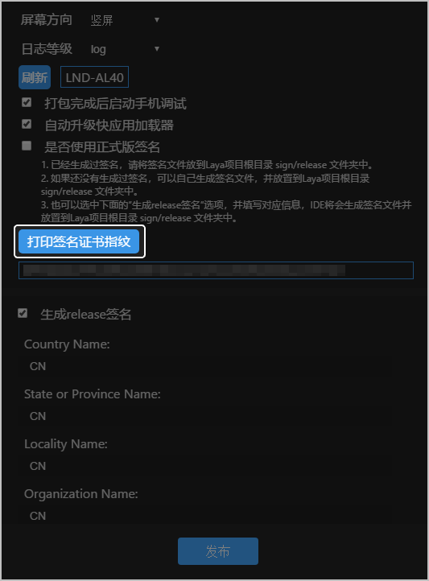

## Cocos引擎

### Cocos快游戏如何处理全局系统事件？

全局系统事件是指与节点树不相关的各种全局事件，由 cc.systemEvent 来统一派发 ，目前支持了以下事件：

* 键盘事件
* 设备重力传感事件

除此之外，鼠标事件与触摸事件请参见“ [节点系统事件](https://docs.cocos.com/creator/3.8/manual/zh/engine/event/event-node.html)”。


目前已经不建议直接使用 cc.eventManager 来注册任何事件，cc.eventManager 的用法也不保证持续性，有可能随时被修改。

键盘、设备重力传感器此类全局事件是通过函数 cc.systemEvent.on(type, callback, target) 注册的。

可选的 type 类型有:

* cc.SystemEvent.EventType.KEY\_DOWN （键盘按下）
* cc.SystemEvent.EventType.KEY\_UP （键盘释放）
* cc.SystemEvent.EventType.DEVICEMOTION （设备重力传感）

**实现键盘事件**

事件监听器的类型设置cc.SystemEvent.EventType.KEY\_DOWN或者cc.SystemEvent.EventType.KEY\_UP。

事件触发后的回调函数：自定义回调函数callback(event)。

回调参数：[KeyCode](https://docs.cocos.com/creator/api/zh/classes/Event.EventKeyboard.html) 和 [Event](https://docs.cocos.com/creator/api/zh/classes/Event.html)。

实现的示例代码如下：

```
cc.Class({
    extends: cc.Component,
    onLoad: function () {
        // add key down and key up event
        cc.systemEvent.on(cc.SystemEvent.EventType.KEY_DOWN, this.onKeyDown, this);
        cc.systemEvent.on(cc.SystemEvent.EventType.KEY_UP, this.onKeyUp, this);
    },
    onDestroy () {
        cc.systemEvent.off(cc.SystemEvent.EventType.KEY_DOWN, this.onKeyDown, this);
        cc.systemEvent.off(cc.SystemEvent.EventType.KEY_UP, this.onKeyUp, this);
    },
    onKeyDown: function (event) {
        switch(event.keyCode) {
            case cc.macro.KEY.a:
                console.log('Press a key');
                break;
        }
    },
    onKeyUp: function (event) {
        switch(event.keyCode) {
            case cc.macro.KEY.a:
                console.log('release a key');
                break;
        }
    }
});
```

**实现设备重力传感事件**

事件监听器的类型设置cc.SystemEvent.EventType.DEVICEMOTION。

事件触发后的回调函数：自定义回调函数callback(event)。

回调参数：[Event](https://docs.cocos.com/creator/api/zh/classes/Event.html)。

实现的示例代码如下：

```
cc.Class({
    extends: cc.Component,
    onLoad () {
        // open Accelerometer
        cc.systemEvent.setAccelerometerEnabled(true);
        cc.systemEvent.on(cc.SystemEvent.EventType.DEVICEMOTION, this.onDeviceMotionEvent, this);
    },
    onDestroy () {
        cc.systemEvent.off(cc.SystemEvent.EventType.DEVICEMOTION, this.onDeviceMotionEvent, this);
    },
    onDeviceMotionEvent (event) {
        cc.log(event.acc.x + "   " + event.acc.y);
    },
});
```

### Cocos快游戏如何使用计时器 schedule？

Cocos Creator 为组件提供了方便的计时器schedule，这个计时器源自于 Cocos2d-x 中的 cc.Scheduler，Cocos Creator 中适配了基于组件的使用方式。

相比 setTimeout 和 setInterval，schedule更强大灵活，和组件也结合得更好。

下面是组件中所有关于计时器schedule的具体使用方式。

* schedule (函数, interval) ：每隔interval秒启动一次计时器。

  示例代码如下：

  ```
  component.schedule(function() {
  // 这里的 this 指向 component
  this.doSomething();
  }, 5);
  ```
* schedule(函数, interval, repeat, delay)：在delay秒后开始计时，每interval秒执行一次回调，执行 repeat + 1 次。

  示例代码如下：

  ```
  // 以秒为单位的时间间隔
  var interval = 5;
  // 重复次数
  var repeat = 3;
  // 开始延时
  var delay = 10;
  component.schedule(function() {
  // 这里的 this 指向 component
  this.doSomething();
  }, interval, repeat, delay);
  ```
* scheduleOnce(函数, interval)：在interval秒后执行一次回调，然后就停止计时。

  示例代码如下：

  ```
  component.scheduleOnce(function() {
       // 这里的 this 指向 component
       this.doSomething();
   }, 2);
  ```
* unschedule (函数)：取消单个计时器。

  示例代码如下：

  ```
  this.count = 0;
  this.callback = function () {
       if (this.count === 5) {
           //使用回调函数本身，在第6次执行回调时取消这个计时器。
           this.unschedule(this.callback);
       }
       this.doSomething();
       this.count++;
   }
   component.schedule(this.callback, 1);
  ```
* unscheduleAllCallbacks()：取消这个组件的所有计时器。

  示例代码如下：

  ```
  this.unscheduleAllCallbacks();
  ```


组件的计时器调用回调时，会将回调的 this 指定为组件本身，因此回调中可以直接使用 this。

## 其他

### 如果快游戏需要加载较大的本地资源文件，如何处理？

该功能适用不需要接入华为账号和支付的场景，主要用于海外版本快应用，如果快游戏要接入账号和支付，参见“[开发指导](/docs/dev/game-dev/games-quickgame-dev-runtimegame-guide-0000002317894824)”。

### 快游戏进入游戏后出现闪屏，如何处理？

此问题一般是由帧率导致的，建议将所有场景的帧率调整为60帧。

### 快游戏保存快捷方式到桌面，图标显示为快应用默认图标，而非快游戏自身图标，如何处理？

检查manifest里的icon参数路径和文件名是否为快游戏图标的信息。

### 快游戏支持云调试&云测试吗？

支持。详细内容参见“[云调试开发文档](https://developer.huawei.com/consumer/cn/doc/AppGallery-connect-Guides/agc-clouddebug-introduction-0000001057034023)”和“[云测试开发文档](https://developer.huawei.com/consumer/cn/doc/AppGallery-connect-Guides/agc-cloudtest-introduction-0000001083002880)”。

### 快游戏require引入js时，报module is not defined？

快游戏引擎是使用的V8 JavaScript虚拟机的标准，不支持Node.js中的module.export标准。

### 快游戏支持游戏引擎图片资源的哪些格式？

目前仅支持etc1，s3tc，pvrtc。

### 快游戏如何适配刘海屏？

游戏画面需要正常填充刘海屏区域，但刘海屏区域不要放按键或者文字，避免用户无法点击、阅读。

### 如何在外部应用中引导玩家进入华为快游戏？

可以通过deeplink方式拉起华为快游戏。

### 调用deeplink引导到快游戏，如果快游戏下架了，deeplink链接还可以打开游戏吗？

不可以，会出现应用不在服务区或者已下架之类的提示。
