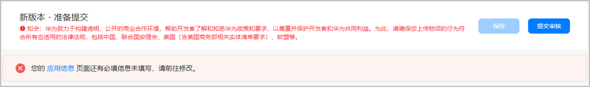
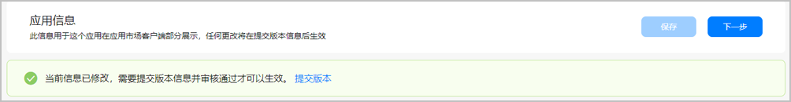
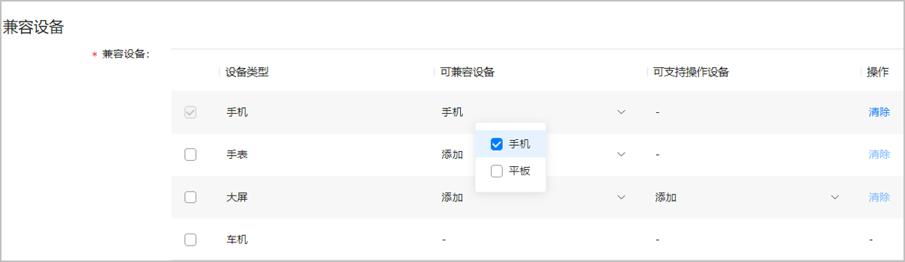
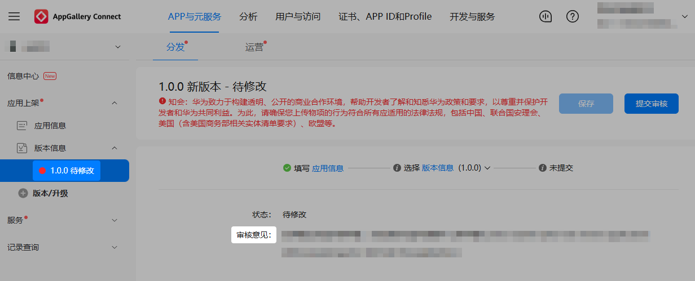
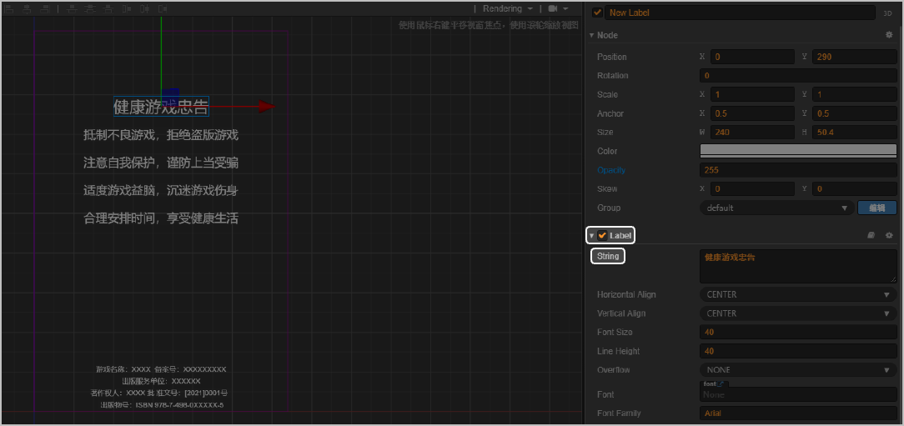
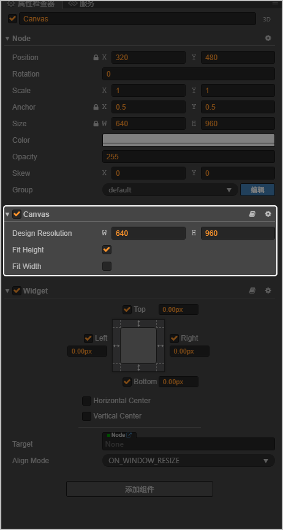
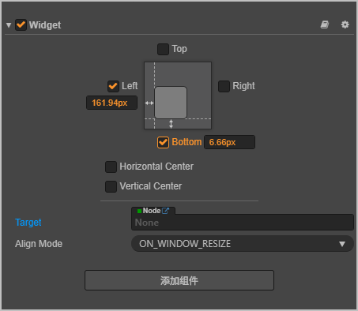
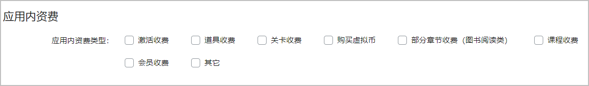

## 提交审核

### 快游戏提交审核后需要审核多久？

审核时间一般为1-2个工作日，登录 [AppGallery Connect](https://developer.huawei.com/consumer/cn/service/josp/agc/index.html) 可查看对应快游戏的审核结果。审核结束后，系统将自动下发审核结果至开发者预留的邮箱，请注意及时查看。

### 开发者可以自己手动操作应用上架的时间吗？

不可以，目前仅支持立即上架和指定上架时间两种方式。

若指定上架时间，审核通过后，如果尚未到达生效时间，依然可以更改上架时间，更改上架时间的操作无需再次经过人工审核。

### 提交审核时版权资料暂时无法提供，是否可以先审核游戏包？

不可以，上架游戏要求必须资质齐全，流程上只有在资质审核通过后才能审核游戏包。

### 游戏文案、更新信息、详情页信息、应用描述、游戏主界面、世界频道主动广播等位置，是否可以含客服联系方式、QQ群、微信、微博、官网、二维码等信息？

不可以。

### 提交应用提示应用信息未填写完整，但是应用信息页面又提示内容已修改，需提交版本生效，如何处理？

在提交游戏时，出现如下提示信息：



返回应用信息又出现如下提示信息：



一般对已有应用进行升级时，会出现此类问题。这是由于后台未能读取历史版本的“兼容设备”信息，所以进入应用信息页面，重新修改“兼容设备”信息后，再次保存，然后就能顺利提交了。



### 开发者联盟登录弹出需要开发者进行安全评估并提交报告，这个报告要在哪里提交？

请在开发者联盟更新游戏版本，在“应用版权证书或代理证书”处上传报告，如果5个格子已经上传内容，可以将已有内容和报告拼接成一个图片上传，拼接的图片请必须保证内容清晰。

### 如何查看快游戏的审核结果？

1. 登录 [AppGallery Connect](https://developer.huawei.com/consumer/cn/service/josp/agc/index.html) ，选择“APP与元服务”。
2. 点击需要查看审核结果的游戏。
3. 点击“版本信息”下需要查看的版本信息，查看审核意见。



### 提交审核时，提示存在同名应用，如何处理？

根据华为应用市场开发者社区应用上架标准，应用名称需具有唯一性，不得和其他在架应用存在相同名称。如果您发现在架应用侵犯了您的合法权益，可参见“[华为应用市场侵权投诉通知和反通知流程](https://developer.huawei.com/consumer/cn/doc/50120)”对于应用存疑的侵权内容进行投诉。

### 提交审核时，提示当前上传的rpk包名和已上架的rpk包名不一致，如何处理？

请检查rpk包manifest.json文件中的包名是否与在AppGallery Connect创建快游戏时提交的包名一致，如果不一致，请修改。

### 提交审核时，提示包名不符合免安装应用规范要求，如何处理？

请检查rpk包manifest.json文件中的包名是否含有空格以及特殊字符。 包名推荐格式：com.xx.xx，建议全部是小写字母。

## 审核驳回

### 快游戏驳回信息为：你提交的应用文件处理失败，请撤销后重提，如何处理？

1. 检查上传的rpk包中是否存在多个manifest.json文件，如果存在，请删除其他目录下的manifest.json文件，仅保留根目录下的。
2. 检测manifest.json文件中的参数类型是否合法，如versionCode，minPlaformVersion是否按要求填写整数，icon路径是否正确等。

### 快游戏驳回信息为：快游戏著作权人、出版单位、审批文号，出版物号、健康游戏忠告显示不全或者不正确，如何处理？

游戏上架需要提供版权和版号，并且在游戏启动时，在进入游戏界面前完整展示游戏著作权人、出版单位、批准文号（新广出审）、出版物号（ISBN）、健康游戏忠告等信息，而且展示场景停留时间不宜过短，一般不少于2s。

具体实现方法以Cocos快游戏为例：

1. 设计一个过渡场景，添加相应的label标签，写上对应的内容，如下图：

   
2. 根据游戏本身的设计宽高，来选择等高还是等宽，适配所有机型。如下图是选择等高适配，在设计尺寸的宽高比与手机宽高比不同时，除了需要设置文本水平居中外，有时还需要缩小字体来适配不同宽高比的手机。

   
3. 除了上述步骤，有些元素还需要在对应的元素节点上添加 Widget 组件，使其相对于父容器（一般是canvas）间隔多少像素或者百分比。

   
4. 布局设计完成后，在该过渡场景上添加定时器方法，展示2s~3s后跳转下一个场景。

   ```
    start () {
       //定时器schedule
       this.scheduleOnce(function() {
           // 这里使用鸿蒙接口切换游戏场景
           cc.director.loadScene("SecondScene");
       }, 3);
   },
   ```

运行效果如下：

|  |  |
| --- | --- |
|  |  |

### 快游戏驳回原因为：游戏内含有观看视频广告控件，但是游戏实际没有广告，如何处理？

可能游戏未正确配置广告，请删除或者正确接入华为广告服务。激励视频广告请参见“[接入广告服务](https://developer.huawei.com/consumer/cn/doc/games-guides/games-quickgame-runtime-ad-kit-0000002351933661)”。

### 快游戏驳回原因为：存在风险广告插件，如何处理？

应用存在风险广告插件是指所含的广告插件可能存在下列情况：读取用户通话记录、读取用户通讯录、读取用户短信记录、获取用户手机号码、通知栏推送广告等，请规避此类广告插件。

### 快游戏驳回原因为：游戏“XXX”模块含有广告控件，如何处理？

接入广告的游戏，需要先提交给广告PPS进行广告审核通过后，才可以提交给应用市场上架审核，未通过PPS验收通过的游戏不允许接入广告。

### 快游戏驳回原因为：游戏经检测含有第三方弹窗广告，如何处理？

请删除第三方广告信息，如需接入华为广告服务，请参见“[接入广告服务](https://developer.huawei.com/consumer/cn/doc/games-guides/games-quickgame-runtime-ad-kit-0000002351933661)”。

### 快游戏驳回原因为：游戏在未登录华为账号的手机上，弹出登录界面，点击返回，反复拉起华为账号登录界面，用户无法正常退出，如何处理？

请修改为用户点击返回后可在游戏界面停留，需用户点击才可再次弹出华为账号登录界面。

### 快游戏驳回原因为：游戏内弹出登录界面，点击返回，返回游戏后，无法再次拉起华为账号登录界面，如何处理？

需要修改为用户取消华为账号登录时，返回游戏主界面，在游戏初始界面提供再次调用登录华为账号的按钮，用户点击后可再次弹出华为账号登录界面。

### 快游戏驳回原因为：游戏在未登录华为账号的手机上，启动游戏后，点击登录，提示用户令牌获取失败，无法拉起华为账号登录界面，如何处理？

请检查是否正确调用快游戏的账号登录接口，请勿调用快应用的账号登录接口。快游戏账号登录接口请参见[快游戏登录接口](https://developer.huawei.com/consumer/cn/doc/games-references/games-api-quickgame-runtime-account-0000002365996984)。

### 快游戏驳回原因为：在刘海屏手机显示有误，部分信息被遮挡在刘海后方，如何处理？

请优化刘海屏手机适配，确保游戏每个场景信息能全部显示，更多刘海屏接入信息请联系[华为客服](https://developer.huawei.com/consumer/cn/customerService/#/bot-dev-top/faq-top/faq-talk-top)。

### 快游戏驳回原因为：在华为应用市场已存在同名apk游戏，且快游戏内容与货架apk包版本游戏内容不一致，如何处理？

目前审核要求如果线上存在同名apk游戏时，快游戏的内容必须与apk游戏保持一致。

### 快游戏驳回原因为：含有非法支付渠道，如何处理？

可能是运营商渠道号使用了非华为许可的渠道号，需要删除违规的渠道号。更多渠道号信息可联系[华为客服](https://developer.huawei.com/consumer/cn/customerService/#/bot-dev-top/faq-top/faq-talk-top)。

### 快游戏驳回原因为：获取多余用户权限，如何处理？

游戏中获取了过高的权限，可能存在读取用户通话记录、读取用户通讯录、读取用户短信记录、获取用户手机号码、通知栏推送广告等情况，不符合华为应用市场审核标准。请勿获取无需使用的用户权限。

### 快游戏驳回原因为：存在敏感词，如何处理？

华为应用市场对敏感词有严格控制。后续我们将会在游戏驳回原因中增加敏感字的说明，开发者可以参考驳回意见进行修改。

### 快游戏驳回原因为：应用名称不得广义归纳类、普遍且不具有识别性的词汇来命名，如何处理？

请勿以诸如：电话、邮件、日历、汽车、证券、期货等广义归纳类词汇作为快游戏的名称。

### 快游戏驳回原因为：游戏存在功能异常问题，如何处理？

出现此问题一般是游戏运行期间存在异常，常见问题有黑屏，卡死，无法打开游戏等。请参考审核驳回意见，修复游戏代码问题后重新提交审核。

### 快游戏驳回原因为：游戏图标/游戏名称与安装至手机/添加快捷方式至手机端显示的游戏图标/游戏名称不一致，如何处理？

请检查游戏rpk包里manifest文件中的icon图片是否和在AppGallery Connect创建快游戏时提交的图片保持一致。

### 快游戏驳回原因为：游戏与“XXX”游戏相同或相似，但并未提供相关授权文件，如何处理？

请提交相关版权资质或相关授权文件，或者修改游戏图标和内容。

### 快游戏驳回原因为：游戏选择花币进行充值，输入密码后提示“wrong signature，amount！”，充值不成功，如何处理？

支付接口中的amount参数的值需要设置为保留小数点两位，比如6元，必须写成6.00。

### 快游戏驳回原因为：游戏“XXX”模块内含有测试数据如何处理？

请确认提审的应用为正式发布版本，请勿包含内测或众测数据，例如支付时需要为真实价格。

### 快游戏驳回原因为：游戏一句话介绍、详细描述、更新描述、游戏截图含有“XXX”活动内容，但该活动已结束，如何处理？

请删除已经过期的活动内容，更新相关描述后重新提交审核。

### 快游戏驳回原因为：游戏启动场景以及在游戏提审平台的游戏图标含有热门动漫元素，如何处理？

请提供相关热门动漫的授权证明信息。

### 快游戏驳回原因为：游戏无法登录，如何处理？

请确认游戏是否有白名单限制，如果有限制请联系华为客服获取华为游戏服务端的IP，并加入白名单。如果问题仍然存在，请将游戏服务端地址提供给华为客服。

### 快游戏驳回原因为：游戏开始前显示的著作权人信息与您所提交的《计算机软件著作权登记证书》资质上的信息不符，如何处理？

请必须确保著作权人信息与《计算机软件著作权登记证书》资质上的信息保持一致。

### 快游戏驳回原因为：游戏内无付费购买项，但应用内付费属性选择为“是”，与游戏实际内容不符，如何处理？

请登录AppGallery Connect提交申请时，根据游戏实际情况在“应用内资费”区域勾选对应的应用内资费类型。



### 快游戏驳回原因为：游戏在提审平台中的未提交隐私策略链接，需提交与隐私策略相关内容，如何处理？

请登录AppGallery Connect提交页面，在“版本信息”下修改版本页面的“隐私声明”区域重新提供隐私策略链接，并对用户数据使用作出详细说明。

### 快游戏驳回原因为：游戏未提交《网络游戏出版物号（ISBN）核发单》或关于同意出版运营移动网络游戏《\*\*\*\*》的批复，如何处理？

请提交审核时，补充提交《网络游戏出版物号（ISBN）核发单》或关于同意出版运营移动网络游戏《\*\*\*\*》的批复。

### 快游戏驳回原因为：游戏在未登录华为账号情况下可进入游戏，如何处理？

详情请参见[快游戏登录接口](https://developer.huawei.com/consumer/cn/doc/games-references/games-api-quickgame-runtime-account-0000002365996984)。

### 快游戏驳回原因为：游戏IP存在多重授权，且二重授权书未注明转授权，如何处理？

请重新上传信息完整的《IP授权书》，IP所有人非直接授权情况下，第一重IP授权书必须注明可再次授权，同时上传中间IP授权书，IP授权书均应有授权方、被授权方、授权IP名称、授权期限、授权细则及授权方公章日期，请确保IP授权链条清晰完整。

### 快游戏驳回原因为：游戏的隐私政策未以明示同意的方式征得用户同意，如何处理？

应用的隐私政策需以明示同意的方式征得用户同意。例如：提供主动勾选按钮或点击“同意”按钮。

### 快游戏驳回原因为：游戏内隐私政策的开发者名称与上传游戏的开发者名称信息不一致，如何处理？

请确认[AppGallery Connect](https://developer.huawei.com/consumer/cn/service/josp/agc/index.html)上提交的[隐私政策网址](https://developer.huawei.com/consumer/cn/doc/distribution/app/agc-help--release-fastapp-0000001099836868#section1173103711112)内注明的游戏名称和开发者名称，是否与您提交的[游戏名称](https://developer.huawei.com/consumer/cn/doc/app/agc-help--release-fastapp-0000001099836868#section94111352985)和上传游戏的[开发者名称](https://developer.huawei.com/consumer/cn/doc/app/agc-help--release-fastapp-0000001099836868#section928085914517)一致。

### 快游戏驳回信息为：需要有隐私政策提示框，来告知用户游戏可能涉及到的隐私和使用的权限说明，如何处理？

按照审核要求，需要实现一个弹框页面，首次启动游戏时向用户提供隐私政策协议。

具体实现功能如下：

* 用户点击用户协议和隐私政策时可以跳转到具体隐私协议界面或网址。
* 用户点击弹框中的同意按钮可进入游戏，退出游戏后再次进入时不显示该弹框。
* 用户点击弹框中的取消按钮会退出游戏。

具体实现方法以Cocos快游戏为例，可以在显示游戏版权、健康公告信息之后设计一个弹框场景，该弹框由一个精灵sprite，一个标题label，一个富文本richtext和两个按钮button组成。

在登录华为账号前，通过[localStorage](https://developer.huawei.com/consumer/cn/doc/games-references/games-api-quickgame-runtime-localstorage-0000002399796701)接口的flag属性控制隐私政策弹框的显示与隐藏。主要逻辑如下：

1. 在游戏版权场景中判断flag属性，如果flag值为true，则不会弹出隐私政策提示框，游戏进入下一个场景；否则弹出隐私政策提示框。

   ```
   cc.Class({
       extends: cc.Component,
       properties: {
       },
      //在显示游戏版权、健康公告信息页面通过localStorage中flag的值判断是否需要弹出隐私政策提示框
       start () {
          //如果flag值不为true，则弹出隐私政策提示框
          if((cc.sys.localStorage.getItem("flag"))!=="true"){
               this.alter();
          } else {
           this.scheduleOnce(function() {
                cc.director.loadScene("NextScene");
           }, 3);

       },
       alter: function() {
           this.scheduleOnce(function() {
               // 这里使用鸿蒙接口切换游戏场景
               cc.director.loadScene("PrivacyPolicy");
           }, 3);
       },
   });
   ```
2. 点击富文本中的用户协议和隐私政策，调用[Deeplink](https://developer.huawei.com/consumer/cn/doc/games-references/games-api-quickgame-runtime-deeplink-0000002366156948)接口跳转至游戏隐私协议网址。

   ```
   //用户点击富文本中的用户协议，跳转至游戏隐私协议网址
   onUserProtocolClicked: function() {
       qg.openDeeplink({
           uri: 'https://developer.huawei.com/consumer/cn/doc/development/quickApp-Guides/quickgame-introduction-0000001159070205',
           params: {
             ___PARAM_LAUNCH_NATIVE_FLAG___: 'newTask'
           }
       });
   },
   //用户点击富文本中的隐私政策，跳转至游戏隐私协议网址
   clickme: function() {
       qg.openDeeplink({
           uri: 'https://developer.huawei.com/consumer/cn/doc/50104',
           params: {
             ___PARAM_LAUNCH_NATIVE_FLAG___: 'newTask'
           }
       });
   },
   ```
3. 进入隐私政策提示框页面，如果用户点击同意按钮，给flag赋值为true，游戏继续进入下个场景；如果用户点击取消按钮，游戏在5秒后退出。

   ```
   //用户点击同意按钮
   test: function() {
         cc.sys.localStorage.removeItem("flag");
         cc.sys.localStorage.setItem("flag","true");
         cc.director.loadScene("NextScene");
   },
   //用户点击取消按钮
   cancel: function() {
         cc.sys.localStorage.removeItem("flag");
         cc.sys.localStorage.setItem("flag","false");
         setTimeout( function() {
             qg.exitApplication({
                 success : function () {
                         console.log("exitApplication success" );
                 },
                 fail:function(){
                         console.log("exitApplication fail");
                 },
                 complete:function() {
                         console.log("exitApplication complete");
                 }
             });
         },5000);
   },
   ```

运行效果如下：

|  |  |
| --- | --- |
|  |  |

### 快游戏驳回原因为：原生广告中没有广告来源，如何处理？

如果广告onLoad接口返回了source字段，那么需要将该字段的信息展示在广告中。

### 快游戏驳回原因为：原生广告展示时，纵向有缩放，如何处理？

广告中可以对源图大小进行等比缩放，但是不能部分缩放，会导致展示失真。

### 快游戏驳回原因为：原生广告点击home退出后，再次进入游戏界面，广告展示没有上报事件，如何处理？

游戏界面展示广告时，点击home键隐藏到后台之后，再次进入前台时，只要广告处于展示中就需要继续调用上报接口上报一次。

### 快游戏驳回原因为：激励视频未达到预加载的效果，如何处理？

激励视频需要提前请求广告，请求到广告并加载后再展示广告入口，避免打开广告视频尚未加载完的情况。
