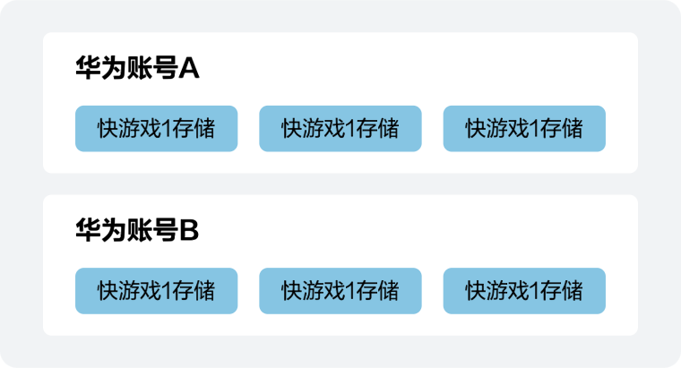

文件系统是华为快游戏提供的一套以游戏和用户维度隔离的存储以及一套相应的管理接口。通过qg全局对象可以获取到全局唯一的文件系统管理器，所有文件系统的管理操作通过qg调用，相关接口[qg.getFileSystemManager()](https://developer.huawei.com/consumer/cn/doc/games-references/games-api-quickgame-runtime-file-0000002399676805#section10341171144119)。

文件主要分为两大类：

* 代码包文件：是指在游戏开发项目中添加的文件。
* 本地文件：通过调用接口本地产生，或通过网络下载，存储到本地的文件。

其中本地文件又分为两种：

* 本地临时文件：临时产生，随时会被回收的文件。不限制存储大小。
* 本地用户文件：快游戏通过接口把本地临时文件缓存后产生的文件，允许自定义目录和文件名。除非用户主动删除快游戏，否则不会被删除。单个快游戏共计最多可存储200MB文件。

## 代码包文件

由于代码包文件大小有限制，代码包文件适用于放置首次加载时需要的文件，对于内容较大或需要动态替换的文件，不推荐添加到代码包中，推荐在快游戏启动之后再用下载接口下载到本地。

代码包文件访问路径：

* 从游戏包根目录开始的相对文件路径，不支持不是从游戏包根目录开始的相对路径写法。
* 可以使用绝对路径，绝对路径的根是游戏包根目录。

## 本地文件

本地文件是指快游戏加载后，会有一块独立的文件存储区域，以华为账号用户维度隔离。即同一台手机，每个华为账号不能访问到其他登录的华为账号的文件，同一个用户不同游戏之间的文件也不能互相访问。



### 本地临时文件

本地临时文件只能通过调用特定接口产生，不能直接写入内容。本地临时文件产生后，仅在当前生命周期内有效，重启之后即不可用。因此，不可把本地临时文件路径存储起来下次使用。如果需要下次使用，可通过[FileSystemManager.saveFile()](https://developer.huawei.com/consumer/cn/doc/games-references/games-api-quickgame-runtime-file-0000002399676805#section177563353918)或[FileSystemManager.copyFile()](https://developer.huawei.com/consumer/cn/doc/games-references/games-api-quickgame-runtime-file-0000002399676805#section133093296490)接口把本地临时文件转换成本地用户文件。

### 本地用户文件

华为快游戏提供了一个用户文件目录给开发者，开发者对这个目录有完全自由的读写权限。通过qg.env.USER\_DATA\_PATH可以获取到这个目录的路径。

## 读写权限

| 文件类型 | 是否可读 | 是否可写 |
| --- | --- | --- |
| 代码包文件 | 是 | 否 |
| 本地临时文件 | 是 | 否 |
| 本地用户文件 | 是 | 是 |

## 示例代码

```
const fs = qg.getFileSystemManager();
fs.writeFile({
    filePath: `${qg.env.USER_DATA_PATH}/${fileName}`,
    data: "Hello world",
    encoding: "utf8",
    success: successCb,
    fail: failCb
});
```
