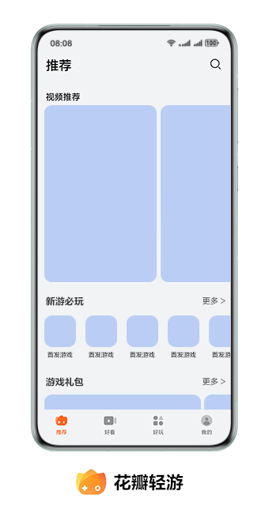
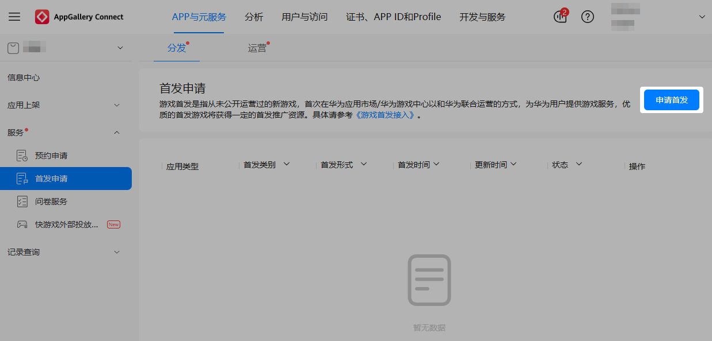
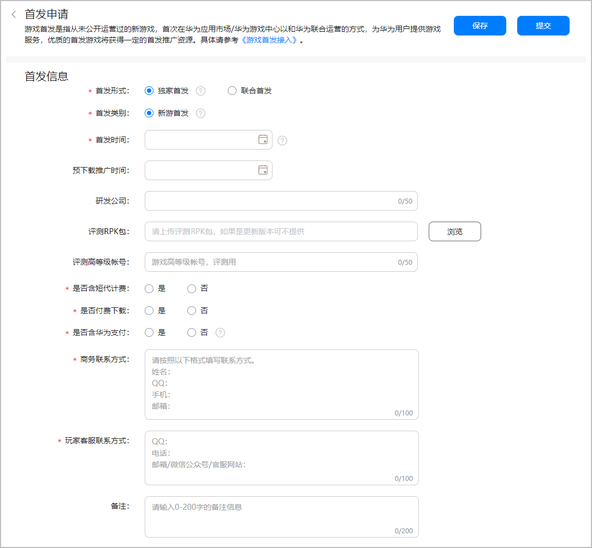
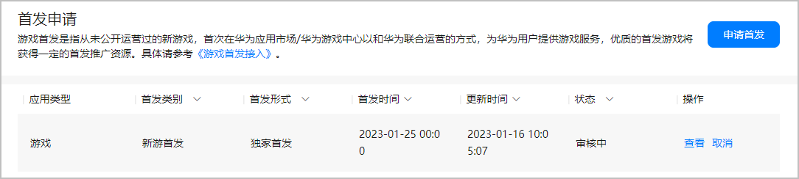
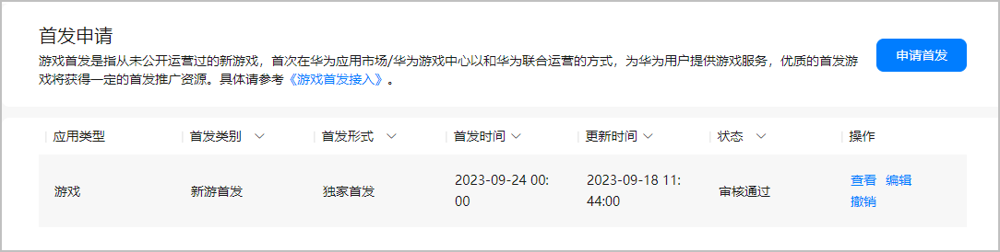
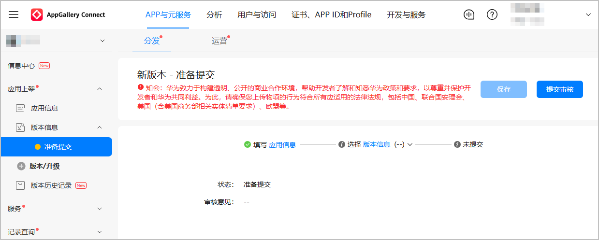

快游戏首发是指您的快游戏首次在华为渠道正式上架。华为渠道将为首发游戏提供推广资源，这可以让新游戏在第一时间获得相应的曝光量，并在短期内为您带来一定的用户量，若是优质的快游戏将获得更好的首发推广资源。

## 首发资源位

快游戏首发后展示在“花瓣轻游”客户端“新游必玩”榜单。

## 前提条件

* 已[注册并认证开发者账号](/docs/dev/game-dev/games-quickgame-registration-account-0000002351933629)。
* 已[创建项目和快游戏](/docs/dev/game-dev/games-quickgame-create-quickgame-0000002317894816)。
* 快游戏已完成[配置应用基本信息](https://developer.huawei.com/consumer/cn/doc/app/agc-help--release-fastapp-0000001099836868#section19724459249)。
* 为了提升快游戏首发包的通过率，您需要提前自检游戏接入参数、游戏登录体验等。

## 提交首发申请

请至少提前7天提交首发申请。

1. 登录[AppGallery Connect](https://developer.huawei.com/consumer/cn/service/josp/agc/index.html#/)，点击“APP与元服务”，在应用列表页面点击需要提交首发申请的快游戏。
2. 选择“分发 &gt; 服务 &gt; 首发申请”，在页面右上角点击“申请首发”。

   
3. 在“首发申请”页面根据提示填写信息，完成后点击“提交”。

   

   | 字段信息 | 必填(M)/选填(O) | 说明 |
   | --- | --- | --- |
   | 首发形式 | M | 请选择快游戏上架渠道：  * 独家首发：仅在华为渠道上架。 * 联合首发：上架至包含华为在内的多个渠道。 |
   | 首发类别 | M | 仅支持游戏首次上架。 |
   | 首发时间 | M | 请填写快游戏正式上架时间。  说明：  若上架时间发生变更，请尽早更新首发申请，避免错过快游戏首发。 |
   | 预下载推广时间 | O | 您可以填写快游戏的推广时间。 |
   | 研发公司 | O | 您可以填写企业/个人开发者的名称，不超过50个字符。 |
   | 评测RPK包 | O | 您可以提交本地RPK游戏试玩包。 |
   | 评测高等级账号 | O | 您可以提供登录游戏试玩包的高等级账号，高等级账号可直接跳过新人指导环节，为游戏审核人员节省时间，加快审核进度。 |
   | 是否含短代计费 | M | 快游戏是否包含运营商短信计费功能。 |
   | 是否付费下载 | M | 下载快游戏是否需要付费。 |
   | 是否含华为支付 | M | 快游戏是否接入华为应用内支付。  说明：  网络游戏必须接入华为应用内支付。 |
   | 商务联系方式 | M | 请根据模板填写联系方式。 |
   | 玩家客服联系方式 | M | 请根据模板填写联系方式。 |
   | 备注 | O | 您可以补充额外信息，不超过200个字符。 |
4. 成功提交首发申请后，华为工作人员预计需要1~2个工作日完成审核，请耐心等待，审核结果可在“状态”栏查看。

   
5. 快游戏的首发申请通过审核后，将在指定的“首发时间”正式上架。

   

## 提交首发包

提交首发申请后，请尽快提交快游戏的首发包。

1. 登录[AppGallery Connect](https://developer.huawei.com/consumer/cn/service/josp/agc/index.html#/)，点击“APP与元服务”，在应用列表点击需要提交首发包的快游戏。
2. 选择“分发 &gt; 应用上架 &gt; 版本信息”，配置快游戏的版本信息，详情请参见[发布应用（RPK）](https://developer.huawei.com/consumer/cn/doc/distribution/app/agc-help--release-fastapp-0000001099836868)，完成后点击“提交审核”。

   
3. 成功提交快游戏的首发包后，华为工作人员预计需要1~3个工作日完成审核，审核结果可在版本信息页面或[互动中心](https://developer.huawei.com/consumer/cn/doc/distribution/app/agc-help-interaction-center-0000001146518763)查看。审核通过后，将根据设定的首发时间上架快游戏。

   

   若快游戏临时出现突发情况，可以申请加急审核，您需要在[互动中心](https://developer.huawei.com/consumer/cn/service/josp/agc/index.html#/interactive)详细描述加急审核的原因，华为工作人员将尽快安排审核。

## 上架快游戏

快游戏的首发申请与首发包均通过审核，且到达首发时间时，您的快游戏将在“花瓣轻游”客户端正式上架。快游戏正式首发前，请必须做好公告提醒，避免用户投诉。

* 到达首发时间时，若您的首发申请未通过审核但版本审核已通过，您的快游戏正常上架，但不会获得首发推广资源。
* 若版本审核未通过但首发申请已通过审核：
  + 若还未到首发时间，建议您及时调整首发时间或取消首发申请。
  + 若已超过首发时间，表示您已错过新游首发，再次提交首发申请将会被拒绝。建议您及时调整首发时间，避免错过首发。
