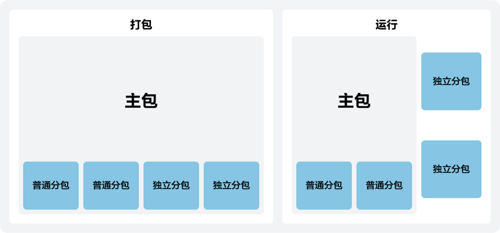

独立分包是一种特殊类型的分包，可以独立于主包和其他分包运行。以独立分包路径启动快游戏时，仅会下载独立分包并启动快游戏，而不会下载主包，以实现部分场景下快游戏的快速启动。您可以根据需求将某些玩法片段或有一定功能独立性的页面配置到独立分包中，达到快速打开的效果。当前独立分包能力主要用于[快游戏试玩分包](https://developer.huawei.com/consumer/cn/doc/games-guides/games-quickgame-playable-subpackage-0000002351893469)的制作。



## 注意事项

* 一个快游戏可以有多个独立分包。
* 独立分包属于分包的一种，因此普通分包的所有限制都对独立分包有效。
* 独立分包不能依赖主包和其他分包中的内容，包括js文件和资源文件。
* 独立分包的类型分为Web版和Runtime版，通过独立分包的后缀名称区分。
* 独立分包不具有网络能力，仅可使用包内文件。
* 独立分包请勿使用fetch方法。如果因为引擎框架引入了fetch方法，请参考如下方式使用XMLHttpRequest进行替换：

  ```
  <script>
      function fetchLocal(url) {
        return new Promise(function (resolve, reject) {
          var xhr = new XMLHttpRequest
          xhr.onload = function () {
            console.log("fetchLocal", url, xhr.status);
            resolve(new Response(xhr.response, {
              status: xhr.status
            }))
          }
          xhr.onerror = function () {
            reject(new TypeError('Local request failed'))
          }
          xhr.open('GET', url)
          xhr.responseType = "arraybuffer";
          xhr.send(null)
        })
      };
      window.fetch = fetchLocal;
  </script>
  ```

## 开发指导

独立分包通过在subpackages中对应的分包配置项中定义independent字段，声明对应分包为独立分包。“false”表示当前分包不是独立分包，“true”表示当前分包为独立分包，默认值为“false”。

### 配置manifes.json

快游戏独立分包的目录结构以如下为例：

```
├── assets
├── image
     └── icons.png
     └── 1.png
├── jsb-adapter
├── src
├── subpackages              // 分包文件夹
      └── moduleA    // 普通分包
             └── game.js     // 普通分包入口文件，且分包入口文件只能命名为game.js
             └── main.js
      └── moduleB    // Web版本独立分包
             └── assets
             └── src
             └── index.html     // Web版本独立分包入口文件
             └── main.js
      └── moduleC    // Runtime版本独立分包
             └── assets
             └── src
             └── game.js     // Runtime版本独立分包入口文件
             └── main.js
├── game.js                  // 主包入口文件
├── manifest.json            // 配置文件
```

manifest.json文件中独立分包对应的配置项如下：

```
{
   ...
   "subpackages": [
     {
        "name": "moduleA",
        "resource": "subpackages/moduleA"
     },
     {
        "independent": true, // 声明当前分包为独立分包
        "name": "independentSub0.wm", // 当前分包为Web版本的独立分包
        "resource": "subpackages/moduleB"
     },
     {
        "independent": true, // 声明当前分包为独立分包
        "name": "independentSub1.rt", // 当前分包为Runtime版本的独立分包
        "resource": "subpackages/moduleC"
     }
   ]
   ...
}
```


独立分包的命名格式为：independentSub+编号+“.”+后缀。独立分包的编号从“0”开始。后缀区分独立分包的版本，“wm”为Web版本独立分包，“rt”为Runtime版本独立分包。
