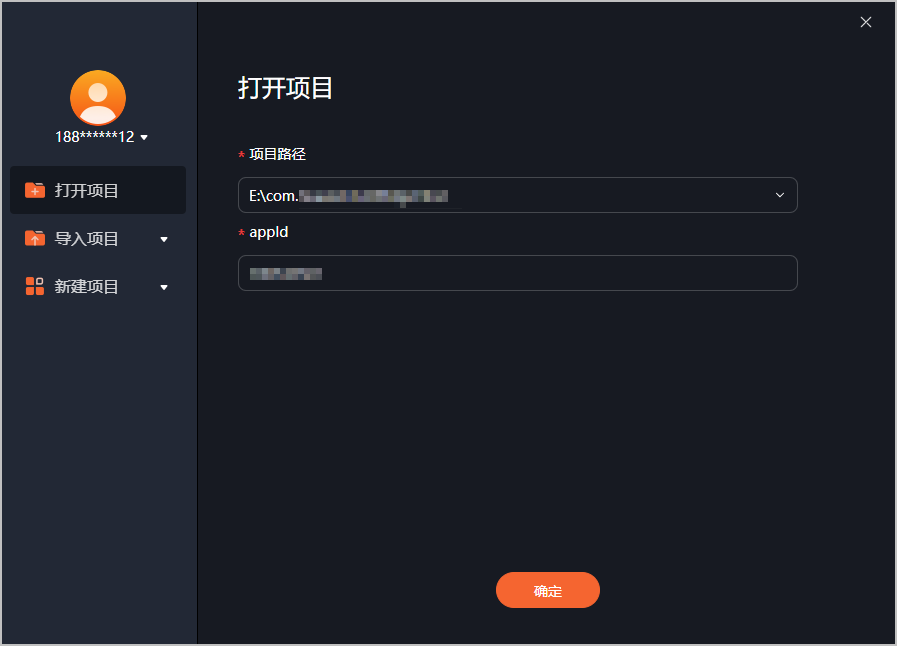
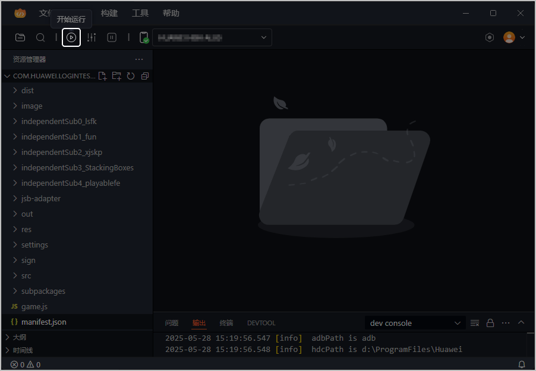
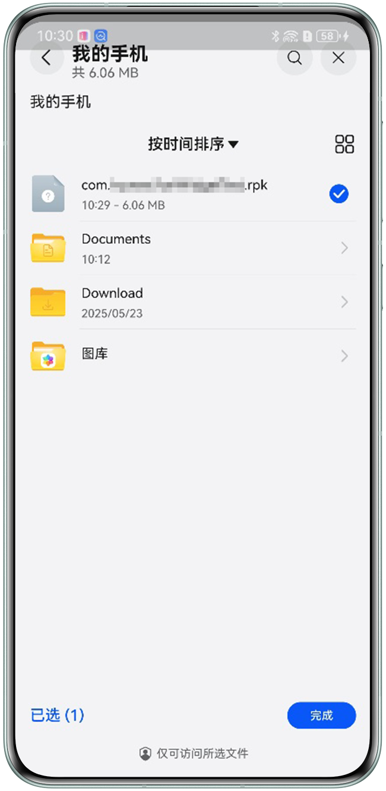
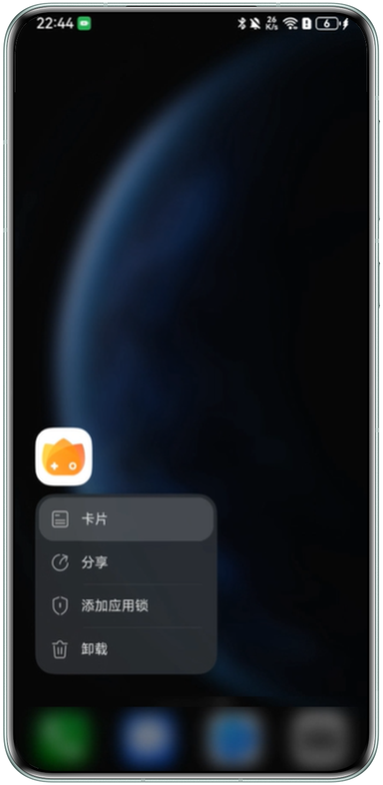
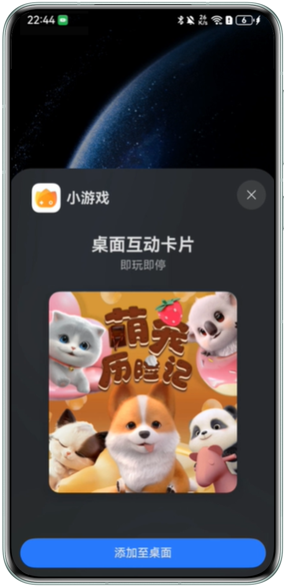
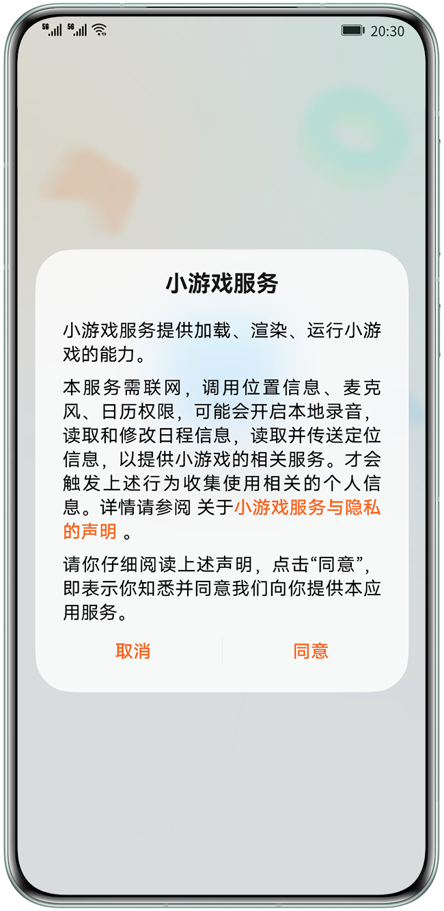
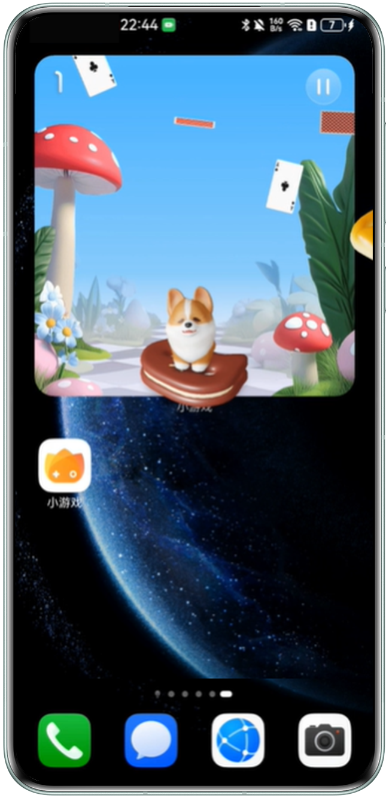

## 准备工作

* [下载](/docs/dev/game-dev/games-quickgame-tool-download-0000002351893589)并安装最新的快游戏开发者工具。
* 准备HarmonyOS 6.0.0 Release及以上版本的手机设备，且要求手机设备登录已实名认证的华为账号。
* 提前将带有互动卡片入口的HarmonyOS 5.0及以上游戏安装在手机设备上。

## 操作步骤

快游戏开发者工具支持运行创新互动卡片，具体步骤如下：

1. 请使用登录手机设备相同的华为账号登录快游戏开发者工具。
2. 在工具界面左侧点击“打开项目”，选择工程项目后，点击“确定”。

   
3. 快游戏开发者工具连接手机后，点击“开始运行”，工具将编译快游戏，并向手机推送快游戏rpk包。

   
4. 完成推送后，手机弹出文件管理界面，选择rpk包后点击“完成”。

   |  |  |  |  |
   | --- | --- | --- | --- |
   |  |  |  |  |
5. 在手机桌面长按HarmonyOS 5.0及以上游戏的图标，在弹出的提示框中选择“卡片”。

   |  |  |  |  |
   | --- | --- | --- | --- |
   |  |  |  |  |
6. 在弹出的窗口中点击“添加至桌面”，创新互动卡片添加至桌面。

   |  |  |  |  |
   | --- | --- | --- | --- |
   |  |  |  |  |
7. 在桌面上点击互动卡片。

   |  |  |  |  |
   | --- | --- | --- | --- |
   |  |  |  |  |
8. 首次打开创新互动卡片将弹出隐私协议授权窗口，点击“同意”。

   

   若当前华为账号同意过该隐私协议，后续使用该华为账号登录的游戏将不会再弹出隐私协议窗口。

   |  |  |  |  |
   | --- | --- | --- | --- |
   |  |  |  |  |
9. 在卡片上完成游戏内容的交互。若玩家关闭卡片后再想重新打开卡片，需从快游戏开发者工具中重新推送rpk包至手机端。

   |  |  |  |  |
   | --- | --- | --- | --- |
   |  |  |  |  |
10. 确保运行效果符合预期后，在顶部菜单栏点击“构建 &gt; 打包正式包”生成用于上架华为应用市场的RPK包，具作打包步骤请参见[打包正式版本](/docs/dev/game-dev/games-quickgame-tool-build-formal-0000002317894976)。
